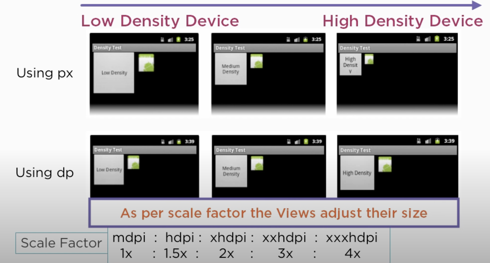

# 안드로이드

- 의문
- 개요
  - AndroidManifest.xml
- 앱 레이아웃 개발
  - pixel vs dp vs sp vs dpi
  - 뷰의 레이아웃
  - 뷰를 사용하여 반응형/적응형 디자인 만들기

## 의문

## 개요

- Activity
  - 개요
    - 안드로이드 앱에서 하나의 화면을 나타냄
- Fragment
  - 개요
    - 하나의 activity안에서 독립적으로 관리되는 UI fragment
    - activity내에서 화면을 구성하는 작은 모듈
- Lifecycle Listener
  - 개요
    - 앱의 activity나 fragment등의 수명 주기 이벤트를 감지하고 처리하는 인터페이스 또는 콜백 메서드들
  - 종류
    - `onCreate()`
      - activity나 fragment가 생성될 때 호출
    - `onStart()`
      - ...가 사용자에게 보여지기 시작할 때 호출
        - 상호작용을 하지 않고, 보여질 때 호출
    - `onResume()`
      - ...가 사용자와 상호작용할 수 있을때 호출
    - `onPause()`
      - ...가 다른 ...에 의해 가려질 때 호출
    - `onStop()`
      - ...가 더 이상 사용자에게 보여지지 않을때 호출
        - activity가 다른 activity로 전환되거나, 앱이 홈버튼을 통해 미리보기로 들어갈 때 해당됨
    - `onDestroy()`
      - ...가 소멸될 때 호출

### AndroidManifest.xml

```xml
<manifest xmlns:android="http://schemas.android.com/apk/res/android"
    package="com.example.myapp">
    <!-- manifest: 앱의 기본 설정과 허가 사항, 기타 필수 정보를 포함하는 최상위 요소입니다.
         xmlns:android: XML 네임스페이스를 정의, Android XML 파일을 위한 것임을 나타냄.
         package: 앱의 고유 패키지 이름, 앱을 유일하게 식별하는 식별자. -->

    <application
        android:icon="@mipmap/ic_launcher"
        android:label="@string/app_name"
        android:roundIcon="@mipmap/ic_launcher_round"
        android:supportsRtl="true"
        android:theme="@style/AppTheme">
        <!-- application: 앱의 모든 구성 요소를 포함하는 컨테이너 역할.
             android:icon: 앱 아이콘 지정, 앱 설치 및 실행 시 표시될 아이콘.
             android:label: 앱의 이름이나 타이틀을 문자열 리소스 ID를 사용하여 정의.
             android:roundIcon: 둥근 모양의 아이콘 지정, 일부 기기나 상황에서 기본 아이콘 대신 사용될 수 있음.
             android:supportsRtl: 'true'로 설정 시, 앱이 RTL (오른쪽에서 왼쪽으로 읽는 언어 지원) 레이아웃을 지원한다는 것을 나타냄.
             android:theme: 앱에 적용할 전역 테마를 지정. -->

        <activity
            android:name=".MainActivity"
            android:exported="true"
            android:label="@string/title_activity_main">
            <!-- activity: 사용자와의 상호작용을 제공하는 화면(액티비티)을 선언.
                 android:name: 액티비티의 클래스 이름, 해당 액티비티를 구현하는 Java 또는 Kotlin 클래스.
                 android:exported: 다른 앱 또는 시스템에서 이 액티비티를 시작할 수 있는지 여부를 나타냄, 'true'는 접근을 허용함.
                 android:label: 액티비티의 타이틀을 문자열 리소스를 사용하여 정의. -->
            <intent-filter>
                <action android:name="android.intent.action.MAIN" />
                <category android:name="android.intent.category.LAUNCHER" />
                <!-- intent-filter: 액티비티, 서비스, 브로드캐스트 리시버가 처리할 수 있는 인텐트 유형을 정의.
                     action: 이 인텐트 필터가 반응하는 액션을 정의.
                     category: 이 인텐트 필터가 속하는 카테고리, 'LAUNCHER'는 홈 화면에서 앱 아이콘을 통해 직접 시작될 수 있음을 의미. -->
            </intent-filter>
        </activity>

        <service android:name=".ExampleService" />
        <!-- service: 백그라운드에서 장기 실행 작업을 수행할 수 있는 컴포넌트를 선언.
             android:name: 서비스의 클래스 이름. -->

        <receiver android:name=".ExampleReceiver">
            <!-- receiver: 앱이 특정 브로드캐스트 메시지를 받기 위해 사용하는 컴포넌트를 선언.
                 android:name: 브로드캐스트 리시버의 클래스 이름. -->
            <intent-filter>
                <action android:name="com.example.myapp.SOME_ACTION" />
                <!-- intent-filter: 이 리시버가 반응하는 특정 액션을 정의. -->
            </intent-filter>
        </receiver>

        <provider
            android:name=".ExampleProvider"
            android:authorities="com.example.myapp.provider"
            android:exported="false" />
        <!-- provider: 앱의 데이터를 공유하거나 다른 앱에 제공하는 컴포넌트를 선언.
             android:name: 콘텐츠 제공자의 클래스 이름.
             android:authorities: 콘텐츠 제공자에 대한 고유 권한, URL 형식의 식별자로 데이터 제공자를 지정.
             android:exported: 다른 앱에서 이 콘텐츠 제공자에 접근할 수 있는지 여부를 나타냄, 'false'는 내부적으로만 사용됨을 의미. -->

    </application>

    <uses-permission android:name="android.permission.INTERNET" />
    <!-- uses-permission: 앱이 필요로 하는 시스템 권한을 선언.
         android:name: 요청하는 권한의 이름, 여기서는 인터넷 사용 권한. -->
</manifest>
```

### API version vs compileSdkVersion vs targetSdkVersion vs minSdkVersion

Q) 만약, compileSdkVersion이 34이고, targetSdkVersion이 33이면, 기존 코드에서 34version에서만 사용가능한 API를 도입했을 경우, 코드가 어떻게 backwardCompatible하게 동작하는가?

A) backwardCompatible하게 동작하지 않으므로, targetSdkVersion과 compileSdkVersion을 매칭시키는 것이 바람직함

- API version
  - 안드로이드 OS의 버전을 나타내는 숫자
  - e.g)
    - android10 -> API version 29
    - android11 -> API version 30
- compileSdkVersion
  - 컴파일 시 사용되는 Android API 버전
- targetSdkVersion
  - 앱이 기기에서 동작하는 런타임에 사용되는 Android API 버전
  - targetSdkVersion > OS version
    - 이 경우엔 OS 버전 베이스로 동작하게 됨
- minSdkVersion
  - 해당 앱을 구동할 수 있는 최소 커트라인
  - 플랫폼의 OS 버전이 minSdkVersion보다 낮을 경우 앱이 설치되지 않음

## 앱 레이아웃 개발

### pixel vs dp vs sp vs dpi

2x2 Pixel 예시(서로 다른 디바이스에서 다른 크기)


dp(Density-independent Pixel) 예시(서로 다른 디바이스에서 같은 크기)


- 물리적 디바이스의 pixel 밀도에 관계없는 pixel단위
  - 모든 디바이스에서 같은 크기로 보임

sp(Scale-independent Pixel)

- 개요
  - 텍스트에서만 사용되며, dp와 같으나, 유저 폰의 font size에 기반해서 resize해줌(dp 개념 + 유저 세팅 개념)

dpi(Dots Per Inch - Screen Density) - 화면 밀도


- 개요
  - 물리적 디바이스에서 같은 dp요소가 밀도에 따라 다른 수의 픽셀로 변환되는 것을 나타냄
  - `px = dp * (dpi / 160)`
    - MDPI 기기에서 1dp는 몇 픽셀인가? => `px = 1dp * (160dpi / 160) = 1px`
    - HDPI 기기에서 1dp는 몇 픽셀인가? => `px = 1dp * (240dpi / 160) = 1.5px`
- 종류
  - ldpi (low density): 약 120 dpi : 0.75x(scale factor)
  - mdpi (medium density): 약 160 dpi : 1x
  - hdpi (high density): 약 240 dpi : 1.5x
  - xhdpi (extra-high density): 약 320 dpi : 2x
  - xxhdpi (extra-extra-high density): 약 480 dpi : 3x
  - xxxhdpi (extra-extra-extra-high density): 약 640 dpi : 4x
- e.g) 런타임
  - mdpi 디바이스에서 `android:layout_height="100dp"`인 경우, 160dpi이므로 최종적으로 100px로 변환됨
  - xhdpi 디바이스에서 `android:layout_height="100dp"`인 경우, 320dpi이므로 최종적으로 200px로 변환됨

레이아웃에 px를 사용했을때 vs dp를 사용했을 때



### 뷰의 레이아웃

뷰의 계층구조


- 레이아웃
  - 개요
    - View(위젯) 및 ViewGroup(레이아웃) 객체의 계층 구조를 사용하여 빌드됨
      - View
        - `TextView`, `Button`, `CheckBox` 등
      - ViewGroup
        - `LinearLayout`, `RelativeLayout`, `FrameLayout` 등
  - 선언 방식
    - XML
      - `res/layout/filename.xml` -> 파일이름이 리소스 id
    - 런타임에 View, ViewGroup 객체 만들고 프로그래매틱 방식으로 속성 조작
- XML 쓰기
  - 정확히 하나의 루트 요소(View or ViewGroup 객체)
- XML 리소스 로드

```kotlin
fun onCreate(savedInstanceState: Bundle) {
    super.onCreate(savedInstanceState)
    setContentView(R.layout.main_layout) // main_layout.xml
}
```

- 속성
  - 개요
    - 모든 `View`및 `ViewGroup`객체는 고유한 XML 속성을 지원함
  - 종류
    - ID
      - xml파일에서 id 속성의 문자열이지만, 컴파일시 정수로 참조됨
      - `android:id="@+id/my_button"`
      - 트리 부분 내에서만 고유하면 되지만, 트리 전체에서 고유하게 하는 것이 바람직
    - 레이아웃 매개변수
      - `layout_something` 이라는 XML 레이아웃 속성
      - 모든 뷰 그룹에는 `layout_width`및 `layout_height`를 이용하여 너비와 높이가 포함되며 각 뷰는 이를 정의해야 함
        - `wrap_content` 콘텐츠에 필요한 크기로 자체 크기를 조절하도록
        - `match_parent` 상위 뷰 그룹이 허용하는 한 최대한으로 커지도록

### 뷰를 사용하여 반응형/적응형 디자인 만들기

- 반응형 디자인
  - `wrap_content`
    - 뷰가 포함된 콘텐츠에 맞게 크기를 설정
  - `match_parent`
    - 뷰가 상위 뷰 내에서 최대한 크게 확장
  - `0dp`
    - 뷰의 제약 조건 내에서 사용 가능한 모든 공간 차지
- 적응형 디자인

```xml
<?xml version="1.0" encoding="utf-8"?>
<androidx.slidingpanelayout.widget.SlidingPaneLayout
    xmlns:android="http://schemas.android.com/apk/res/android"
    xmlns:app="http://schemas.android.com/apk/res-auto"
    xmlns:tools="http://schemas.android.com/tools"
    android:layout_width="match_parent"
    android:layout_height="match_parent"
    tools:context=".MainActivity">

    <androidx.recyclerview.widget.RecyclerView
        android:id="@+id/recycler_view"
        android:layout_width="280dp"
        android:layout_height="match_parent"
        android:layout_gravity="start" />

    <androidx.fragment.app.FragmentContainerView
        android:id="@+id/nav_host_fragment"
        android:name="androidx.navigation.fragment.NavHostFragment"
        android:layout_width="300dp"
        android:layout_height="match_parent"
        android:layout_weight="1"
        app:defaultNavHost="true"
        app:navGraph="@navigation/item_navigation" />

</androidx.slidingpanelayout.widget.SlidingPaneLayout>
```

- `SlidingPaneLayout`에 포함된 두 뷰의 `layout_width`및 `layout_weight`속성이 `SlidingPaneLayout` 동작을 결정함
  - 창이 두 뷰를 모두 표시할 만큼 충분히 크면(너비 최소 580) => 창은 나란히 표시
    - 창 너비가 580dp보다 크면, `layout_weight`값을 사용하여 두 창의 크기를 비례적으로 조절 가능
      - 목록창은 항상 280dp
      - 세부정보창은 항상 580dp를 초과하는 가로공간을 채움
  - 창 너비가 580dp보다 작으면 => 개별적으로 전체 앱 창을 차지
