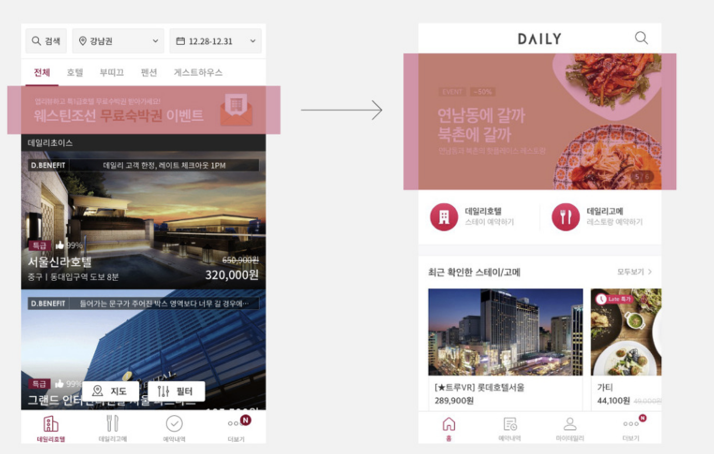
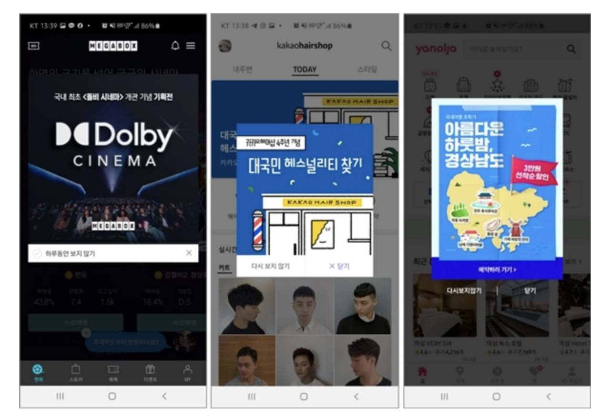
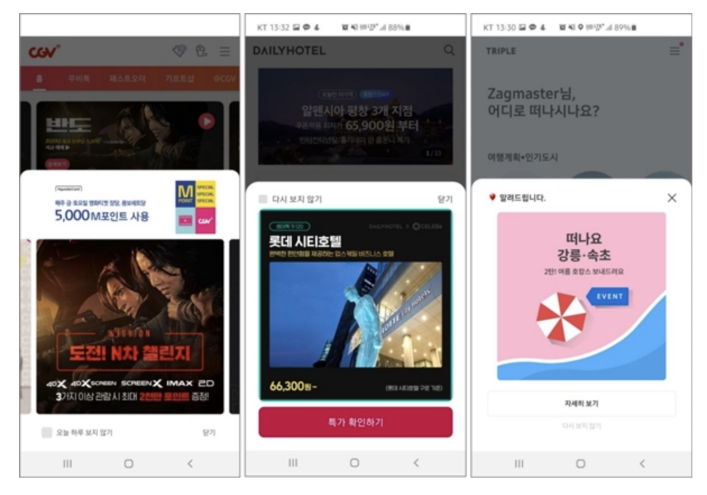
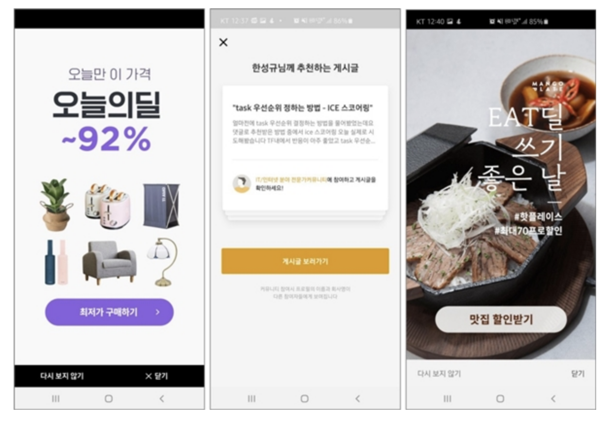
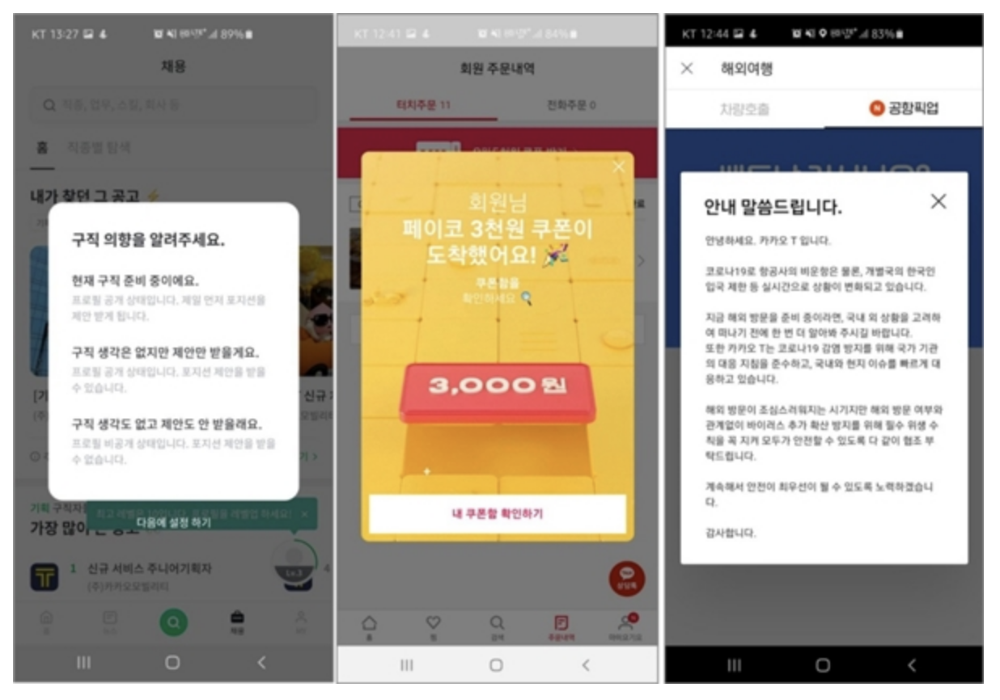
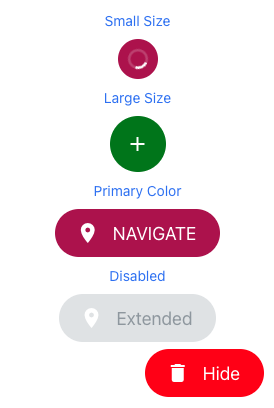

# Component

- 개요
- Notification
  - In-App Notification
  - 배너 vs 팝업
- Button
  - FAB

## 개요

- 각종 모바일에서 사용되는 컴포넌트의 명칭과 생김새를 정리함

## Notification

푸시 예시

- Push Notifications
  - 유저의 디바이스로 앱이 오픈되어있지 않아도 보내지는 노티
  - 종류
    - Standard
      - 유저의 디바이스에 팝업이나 배너로 메시지를 보여줌
    - Rich
      - 이미지나 비디오나 버튼같은 내용을 포함할 수 있음
    - Silent
      - 유저에게는 아무것도 보여주지 않고, 앱의 액션을 이끌어냄(백그라운드 업데이트)
    - Geolocation-Based
      - 유저의 지역 기반으로 정보나 프로모션을 제공
    - Scheduled
      - 일정 시간에 유저에게 메시지를 전송
    - Personalized
      - 유저의 선호에 따른 푸시 메시지 전송
- In-App Notifications
  - 앱 안에서 보여지는 노티
    - 주로 팝업 배너로 보여짐
- SMS Notifications
  - 유저의 핸드폰으로 텍스트 메시지를 보내는 노티
- Badge Notifications
  - 앱의 뱃지로 보여지는 노티
- Email Notifications
  - 유저의 이메일에 보내지는 노티
- Sound Notifications
  - 노티를 받으면 소리를 울림
- Light Notifications
  - 노티를 받으면 디바이스에 플래시가 비춰짐

### In-App Notification

- toast message
  - 개요
    - 모바일 앱 스크린의 위나 아래에 나오는 작으며 논 블로킹 노티
    - 유저의 특정 행동이 성공적이거나, 에러가 나왔을때 유저의 태스크를 방해하지 않고 짧은 피드백이나 정보를 줄 때 사용됨
- 팝업 message
  - 개요
    - 현재 유저의 앱 스크린 앞으로 새로운 컨텐츠나 노티가 노출되는 방식
- 배너 message
  - 개요
    - 현재 유저의 앱 스크린 안에서 특정 섹션에 컨텐츠나 노티가 노출되는 방식

### 배너 vs 팝업

배너

팝업 - 정중앙

팝업 - 바텀시트

팝업 - 전면

팝업 - 특정 시점

## Button

### FAB(Floating Action Button)

