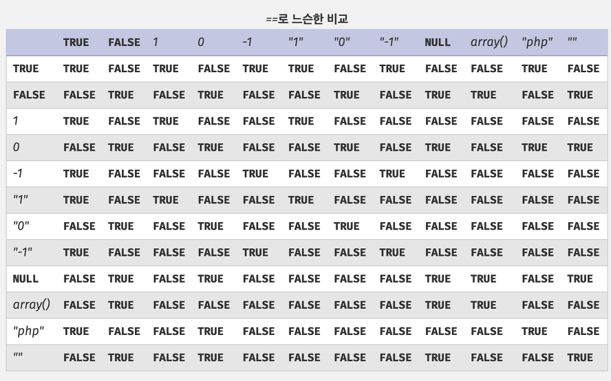

# 워게임에서 배운 것들

- 참고 사이트
- 웹
  - 클라이언트
- PHP
- SQL 인젝션
- 암호

## 참고 사이트

- [Luckeex.com - 해킹공부 사이트 모음](https://luckeex.tistory.com/80)

## 웹

### 클라이언트

- uglify 되어있는 스크립트도 beautify로 읽을 수 있게 변환 가능

## PHP

- `==`제발 이거 쓰지말자 `===`쓰자
  - ~~충격과 공포~~

## SQL 인젝션

- 값 추출
  - 개요
    - 기본적으로 escape가 되어있지 않다는 전제로 출발
  - 테크닉
    - union injection
      - 테이블의 필드 개수 알아내기
        - `union select 1,2,3,4,5 #` union 쿼리문을 이용해서 값이 리턴이 되는, 해당 필드의 개수가 같게 되는 칼럼선택이 존재하면 그 개수만큼 해당 테이블의 칼럼이 존재하는 것임
        - **앞으로 해당 target table에 대해서 같은 개수의 칼럼만 select injection 해야함에 주의**
      - 테이블 이름 알아내기
        - 인젝션이 가능한 경우
        - `union select 1,2,table_name,4,5 from information_schema.tables`
          - `table_name`이라는 칼럼의 위치를 변경해가면서 데이터가 출력되도록 함
          - 현재 injection하고 있는 테이블의 칼럼 개수가 5개일 경우
      - 테이블 칼럼 알아내기
        - `union select column_name, 1,2,3,4 from information_schema.columns`
          - *`where table_name = "???"` 이 안통하는 경우도 있다. 왜지?*
      - 테이블 칼럼 값 알아내기
        - `union select column_name, 1,2,3,4 from target_table`
    - where injection
      - where case insensitive
        - MySQL에서는 where에서 값을 찾아줄 때, case insensitive이다.
          - *다른 DB에서는?*
      - 특수문자 처리
        - 특수문자를 많이 넣어보자
          - `/`
      - where 값 필터 주석화
        - `'admin#`
          - sql이 이스케이프가 되어있지 않으면 `#`뒤의 모든 쿼리문이 주석처리됨
      - where 값 조회
        - `' or '값' #` or `' or 1=1 #`
          - 이런식으로 WHERE 뒤의 구문을 입력시켜주면 escape되지 않은 경우 모든 row값을 다 돌려줌
          - php md5함수에서 16비트 binary를 TRUE로 설정하면 특정 값을 입력했을 때, `'or'값`이 나타남
- 값 삽입
  - 개요
  - case
    - insert에서 데이터 길이가 `char(36)`과 같이 지정되어있을 때, insert값이 36을 넘어버리면 에러가 아니라, 36글자를 잘라내고 그 잘라낸 값이 삽입이 됨
- 방어
  - parameterized queries
    - 값을 SQL문에 직접 넣으나, 지정된 특수문자는 escape됨
    - 이렇게 되면 아직까지는 union injection에는 취약하지 않은가?
      - '도 이스케이프 우회로 직접 삽입할 수 있는것으로 암
  - **bind parameters(dynamic parameters)**
    - 값을 SQL문에 직접 넣는 대신, `?`와 `:name`나 `@name`과 같은 플레이스 홀더를 이용해서 **SQL문과 값의 제공을 따로 하는 방식**
    - 장점
      - Security
        - SQL injection 방지
        - 예시
          - `String sql = prepare("SELECT * FROM ? WHERE ?");`
          - `sql.execute('employees', 'employee_id = 1');`
      - Performance
        - SQL Server / Oracle DB 에서는 문장의 내용이 완전 같은경우 execution plan을 재사용
        - bind parameters에서는 SQL 문장이 플레이스홀더를 이용해서 완전 같아지므로 재사용 캐시를 사용함

## 암호

- 해싱
  - MD5의 취약점
    - hash collision이 일어남
