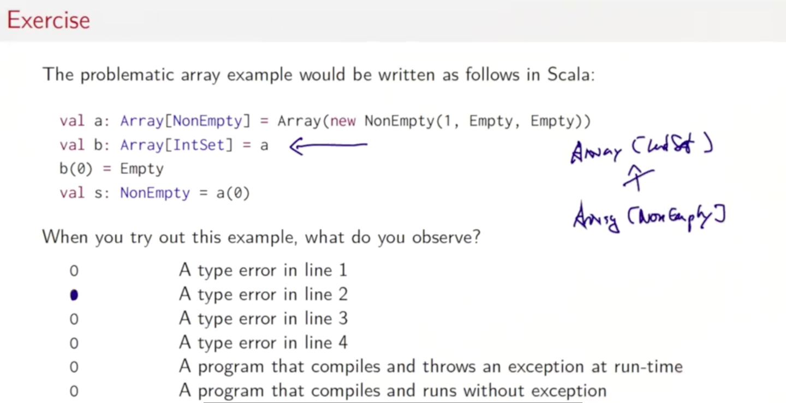
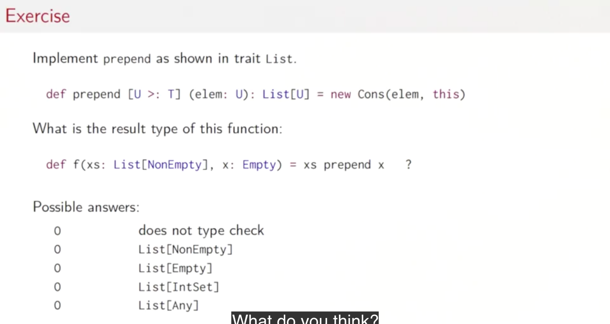
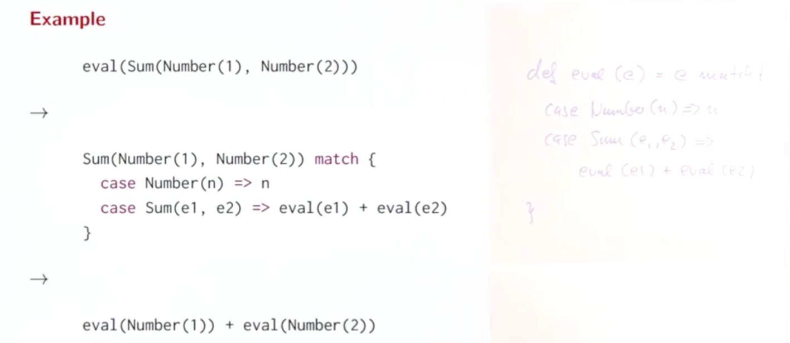
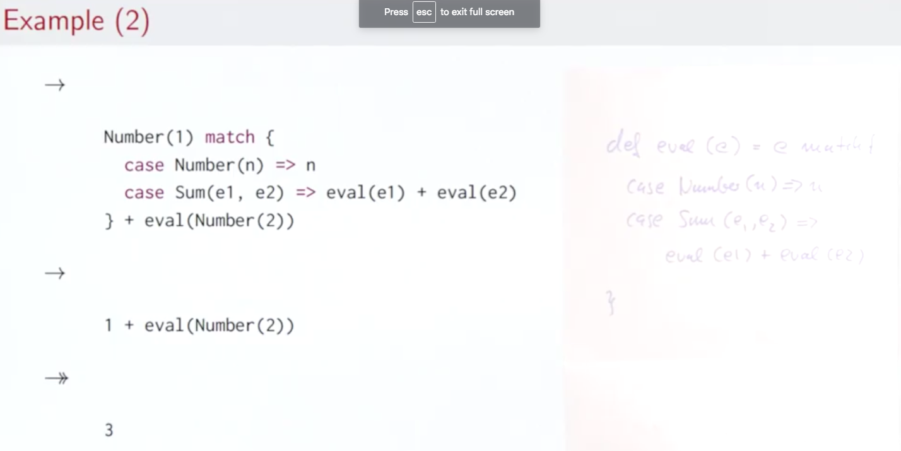
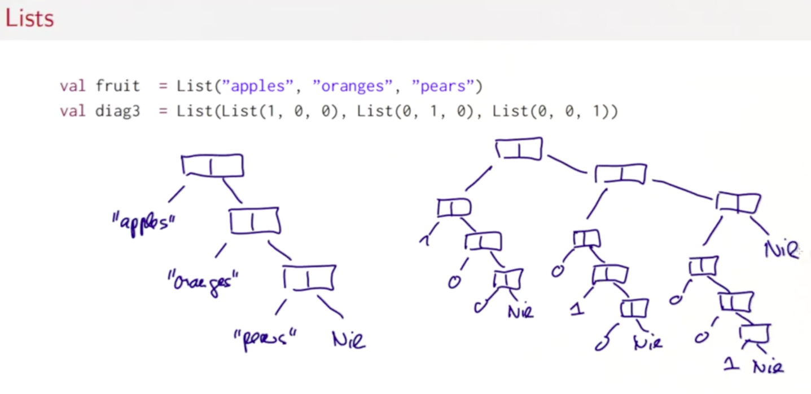

# Types and pattern matching

- 원시타입, 함수, 클래스 타입이 반드시 필요한가?
- 이러한 유형을 클래스로 표현이 가능한가?

## 목차

- Objects Everywhere
- Functions as Objects
- Subtyping and generics
- Variance
- Decomposition
- Pattern Matching

## 4.1 Objects Everywhere

원시 타입이 어떻게 클래스로 나타내어지는가

### 순수 객체 지향

- 순수 객체지향 언어는 모든 값이 객체
- 언어가 클래스에 기반한다면, 이는 각각의 값도 클래스라는 것
- 스칼라는 어떠한가?
  - 원시 타입들과 함수들은?

### 표준 클래스

- 개념적으로, Int, Boolean과 같은 타입들은 스칼라에서 특별한 조치를 받지 않음. 그것들은 다른 클래스들과 같이, `package scala`에 정의되어 있음
  - 일반적인 클래스의 오브젝트와 같이 취급 가능
- 효율성의 이유로 인해서, 스칼라 컴파일러는 scala.Int를 32비트 정수로 표현, 그리고 scala.Boolean의 값을 자바의 Booleans로 표현

### 순수 불린

- 불린 타입은 JVM의 원시 타입 boolean에 매핑됨
- 그러나, 원칙적으로 이를 클래스로 정의할 수 있음

```scala
package idealized.scala // not same as notmal original scala

abstract class Boolean {
  // if (cond) t else e
  // == cond.ifThenElse(t, e)
  def ifThenElse[T](t: => T, e => T): T

  def && (x: => Boolean): Boolean = ifThenElse(x, false)
  def || (x: => Boolean): Boolean = ifThenElse(true, x)
  def unary_!: Boolean = ifThenElse(false, true)

  def == (x: Boolean): Boolean = ifThenElse(x, x.unary_!)
  def != (x: Boolean): Boolean = ifThenElse(x.unary_!, x)

  def < (x: Boolean): Boolean = ifThenElse(false, x)
  ...
}
```

### 불린 정수

Boolean에 있어서의 사용자 정의된 true와 false

```scala
package idealized.scala

object true extends Boolean {
  def ifThenElse[T](t: => T, e: => T) = t
}

object false extends Boolean {
  def ifThenElse[T](t: => T, e: => T) = e
}
```

### 정수 클래스

```scala
class Int {
  // overloading compiler knows it
  def + (that: Double): Double
  def + (that: Float): Float
  def + (that: Long): Long
  def + (that: Int): Int // same for -, *, /, %

  def << (cnt: Int): Int // same for >>, >>>, */

  def & (that: Long): Long
  def & (that: Int): Int // same for |, ^ */

  def == (that: Double): Boolean
  def == (that: Float): Boolean
  def == (that: Long): Boolean // same for !=, <, >, <=, >=
  ...
}
```

이는 원시 타입 int를 사용하지 않고 나타낼 수 있는가?

원시 타입없이 클래스와 함수만으로 모든 언어적 요소를 표현할 수 있는가?

### 자연수 클래스 구현해보기

```scala

package example

import scala.io.Source

object Hello {
  def main(args: Array[String]): Unit = {
    val one: Nat = Zero.successor
    val one2: Nat = Zero.successor
    println(one + one2 + one - one) // 2
    println(Zero - Zero + one) // 1
  }
}

// peano number
abstract class Nat {
  def isZero: Boolean
  def predecessor: Nat
  def successor: Nat = new Succ(this)
  def + (that: Nat): Nat
  def - (that: Nat): Nat

  def toInt: Int
  def toString: String
}

class Succ(n: Nat) extends Nat {
  def isZero: Boolean = false

  def predecessor: Nat = n

  def +(that: Nat): Nat =
    if (that.isZero) this
    else (this + that.predecessor).successor

  def -(that: Nat): Nat =
    if (that.isZero) this
    else (this - that.predecessor).predecessor

  override def toString: String =
    this.toInt.toString

  override def toInt: Int =
    if (this.isZero) 0
    else 1 + this.predecessor.toInt
}

object Zero extends Nat {
  def isZero: Boolean = true

  def predecessor: Nat = throw new Error("0.predecessor")

  def +(that: Nat): Nat = that

  def -(that: Nat): Nat =
    if (that.isZero) that
    else throw new Error("0 - Nat")

  override def toString: String = "0"

  override def toInt: Int = 0
}

```

위와 같이, 원시 타입들도 클래스로 나타낼 수 있음

## 4.2 Functions as Objects

- 함수 타입이 클래스와 어떠한 관계가 있는가
- 함수값이 오브젝트와 어떠한 관계가 있는가

### 오브젝트로서의 함수

- 스칼라의 숫자 타입들과 불린 타입은 평범한 클래스로 구현될 수 있음
- 함수들은?
- 함수값은 스칼라에서 객체로 간주됨
- 함수 타입 A => B
  - 위는 이와 같음 scala.Function[A, B]
- 함수
  - **apply메서드가 있는 객체**
  - traits Function2, Function3 더 많은 매개변수를 위한 트레잇

```scala
package scala
trait function[A, B] {
  def apply(x: A): B
}
```

### 함수 값의 확장

```scala
(x: Int) => x * x

// expanded

{
  class AnnonFun extends Function1[Int, Int] {
    def apply(x: Int) = x * x
  }
  new AnnonFun
}

// more simplified way
// anonymous class

new Function1[Int, Int] {
  def apply(x: Int) = x * x
}
```

### 함수 호출의 확장

- 함수 호출, `f(a, b)`에서 f는 클래스타입의 값은 다음고 같이 확장됨
  - `f.apply(a, b)`

```scala
val f = (x: Int) => x * x
f(7)

// 위와 같음
val f = new Function1[Int, Int] {
  def apply(x: Int) = x * x
}
f.apply(7)
```

함수는 객체로 표현되는데, 메서드는 어떨까?

메서드 자신이 객체일까?

만일 위에서 apply가 객체라면, apply의 결과값은 같은 함수 클래스를 갖는 apply를 갖는 객체일 것이고 ...(무한반복) 이기때문에 아님

### 함수와 메서드

메서드 그 자체는 함수값이 아님

하지만, 메서드가 함수 타입이 예측되는 곳에서 사용되면, 이는 자동적으로 함수값으로 변환

```scala
def f(x: Int): Boolean = ...

// 변환(eta-expansion(람다 계산))
(x: Int) => f(x)

new Function1[Int, Boolean] {
  def apply(x: Int) = f(x)
}
```

## 4.3 Subtyping and Generics

- 서브타이핑과 제네릭의 합성에 의한 다형성(polymorphism)

### 다형성

- 서브타이핑
- 제네릭
- 이번에는 저 위의 둘의 상호작용을 배움
  - 바운스(bounds)
  - 바리안스(variance)

### 타입 경계(Type bounds)

- 다음과 같은 특징을 갖는 `assertAllPos`
  - IntSet을 갖음
  - 만일 모든 요소가 양수면 Intet을반환
  - 그렇지 않으면 예외를 발생
- `def assertAllPos(s: IntSet): IntSet`
  - 단순히 위의 코드만으로는
    - EmptySet이 인자로 왔을때는 Empty를 반환
    - NonEmptySet이 인자로 왔을때는 NonEmptySet혹은 예외발생
  - 위의 경우의 수를 타입으로 나타낼 수 없음
- 만일 `assertAllPos`가 위의 동작을 나타내도록 표현하기 위해서는
  - `def assertAllPos[S <: IntSet](r: S): S = ...`
  - `<: IntSet`은 타입 매개변수 S의 위쪽 경계(upper bounds)를 나타냄
    - S는 오직 IntSet에 호응해서 인스턴스화 되는 것을 의미
- 타입경게의 표현
  - `S <: T`
    - 상한
    - S는 T의 서브타입
  - `S >: T`
    - 하한
    - S는 T의 수퍼타입이거나 T는 S의 서브타입
  - `S >: NonEmpty <: IntSet`
    - S를 NonEmpty와 IntSet사이의 임의의 타입으로 제한함

### Covariance

- `NonEmpty <: IntSet`이면 `List[NonEmpty] <: List[IntSet]`이라고 할 수 있는가?
  - 직감적으로는 그렇다: non-empty 집합은 임의의 집합의 특수 케이스
  - 이러한 관계를 갖는 타입들을 `covariant`라고 부름. 그 이유는 그들의 서브타이핑 관계가 타입 매개변수에 의해서 달라지므로
  - `covariance`는 리스트 타입 이외에 다른 모든 타입도 마찬가지로 적용되는가?

### Arrays

- T 요소의 배열은 `T[]`로 작성된다(자바)
- 스칼라에서는 `Array[T]`를 이용해서 타입을 매개변수화 할 수있음
- **스칼라에서는 배열은 covariant가 아님**
- `NonEmpty[] <: IntSet[]`
  - 문제

```ja
// java code
NonEmpty[] a = new NonEmpty[]{new NonEmpty(1, Empty, Empty)}
IntSet[] b = a
b[0] = Empty // ArrayStoreException
NonEmpty s = a[0]
```

- 마지막 줄에서 `Empty` 집합을 타입 `NonEmpty`에 넣은 것으로 되어 버림
- 무엇이 잘못되었는가?
  - 3번쨰 줄에서 ArrayStoreException이 발생
  - 스칼라에서는 모든 배열에 대해서 타입 태그를 붙임(어떠한 타입으로 생성되었는지를 알 수 있음)
- 왜 JAVA는 애초에 covariant를 허락했는가?
  - sort(objarray []a)

### Liskov Substitution Principle



- 타입이 다른 타입의 서브 타입이 될 수 있는 경우
  - `A <: B`이고, 타입 B가 모두 할 수 있는것을 타입 A가 할 수 있어야 함
  - `A <: B`이고, `q(x)`가 오브젝트 B타입의 x에 대한 증명할 수 있는 속성일때, `q(y)`오브젝트 타입A의 y에 대한 증명할 수 있어야 한다.

## 4.4 Variance(Optional)

서브타이핑과 제네릭의 관계

- covariant가 되는 타입과 되지 않는 타입
  - 요소가 가변이 되는것을 허락 -> covariant아님
  - 요소가 불변 -> covariant

### Variance의 정의

`C[T]`가 매개변수화된 타입이고, A, B가 `A <: B`인 타입이라고 하면, 일반적으로, `C[A]`에 대해서 세가지 가능한 관계가 존재함

- `C[A] <: C[B]`
  - covariant
  - `class C[+A] {...}`(스칼라 표기)
- `C[A] >: C[B]`
  - contravariant
  - `class C[-A] {...}`
- 서로가 서로의 서브타입이 아님
  - `class C[A] {...}`
  - nonvariant


*Q A는 리턴 타입으로 non-empty타입을 못갖지 않는가??*

### 함수에 있어서의 타입 규칙

- 만일 `A2 <: A1`이고 `B1 <: B2`이면
  - `A1 => B1 <: A2 => B2`
  - A2타입의 인자를 A1에도 전달할 수 있음
  - 그리고 함수 A1은 B1타입의 값을 반환하는데 이는 B2타입의 서브타입
  - 이는 `A2 => B2`가 Liskov Substitution Principle에 의해서 `A1 => B1`이 할 수 있는 모든 특성을 갖을 수 있으므로 수퍼타입이 됨

### 함수 트레잇 선언

- 함수는 그 인자의 타입에 대해서 contravariant이며, 결과 타입에 대해서 covariant이다.
- 이는 `Function1` 트레잇에 대한 다음의 정의로 이끈다.

```scala
package scala
trait Function[-T, +U] {
  def apply(x: T): U
}
```

- 앞서 array의 예시에서와 같이, covariance와 어떠한 동작은 잘 맞지 않는다는 것을 보았음
- 이번 경우, 문제의 동작은 업데이트 동작이었다.
- 문제
  - covariant타입 매개변수 T
  - 메서드 업데이트의 매개변수 위치에 나타나는

```scala
class Array[+T] {
  def update(x: T) ...
}
```

- 스칼라 컴파일러는 클래스를 컴파일할때, variance 어노테이션이 문제가 있는지 없는지 체크함
- 대개
  - covariant타입 매개변수는 메서드 결과에만 나타날 수 있음
  - contravariant타입 매개변수는 메서드 매개변수에만 나타날 수 있음
  - invariant타입은 어디에든 나타날 수 있음
  - 보다 정확한 룰은 따로 있으나, 스칼라 컴파일러가 알아서 다뤄줌

### 함수 트레잇 선언

함수들은 그들의 인자 타입에 contravariant이고, 결과 타입에 대해서 covariant이다

### variance와 리스트

Nil을 오브젝트로 드는게 더 바람직함

```scala
package example

import scala.io.Source

object Hello {
  def main(args: Array[String]): Unit = {
    val x: List[String] = Nil
  }
}

trait List[+T] { // covariant
  def isEmpty: Boolean
  def head: T
  def tail: List[T]
}

class Cons[T](val head: T, val tail: List[T]) extends List[T] {
  def isEmpty = false
}

object Nil extends List[Nothing] { // Nothing is subtype of String
  def isEmpty: Boolean = true
  def head: Nothing = throw new NoSuchElementException("Nil.head")
  def tail: Nothing = throw new NoSuchElementException("Nil.tail")
}
```

### 클래스를 covariant로 두기

List클래스에 prepend메서드의 추가

```scala
trait List[+T] {
  def prepend(elem: T): List[T] = new Cons(elem, this)
}
```

- 위의 코드는 동작하지 않는다!
- Liskov Substitution Principle에 위반
  - List[IntSet]에서 다음과 같은 조작을 할 수 있음
    - `xs.prepend(Empty)`
  - 하지만 List[NonEmpty]에서즌 타입 에러가 남
    - `ys.prepend(Empty)`
  - 그러므로, List[NonEMpty]는 List[IntSet]의 서브타입이 될 수 없음

타입의 하한을 설정해줘서 원하는 동작을 할 수 있도록 함

```scala
def prepend[U >: T](elem: U): List[U] = new Cons(elem, this)
```

- covariant 타입 매개변수들은 메서드 타입 매개변수의 하한에서 나타날 수 있음
- contravariant 타입 매개변수들은 메서드의 상한에 나타날 수 있음



- 답은 4번

## 4.5 Decomposition

### Decomposition(분해)

- 수식을 위한 작은 인터프리터를 작성한다고 하자
- 간단히 하기 위해서 숫자와 덧셈만으로 제한
- 식들은 클래스 계층으로 나타낼 수 있음
  - 기본 트레잇 `Expr`과 두개의 서브클래스 `Number`그리고 `Sum`
- 식을 다루기 위해서, 식의 형태와 컴포넌트를 알아야 함
- 이는 다음과 같은구현을 야기함

### 식

```scala
trait Expr {
  def isNumber: Boolean
  def isSum: Boolean
  def numValue: Int
  def leftOp: Expr
  def rightOp: Expr
}

class Number(n: Int) extends Expr {
  def isNumber: Boolean = true
  def isSum: Boolean = false
  def numValue: Int = n
  def leftOp: Expr = throw new Error("Number.leftOp")
  def rightOp: Expr = throw new Error("Number.rightOp")
}

class Sum(e1: Expr, e2: Expr) extends Expr {
  def isNumber: Boolean = false
  def isSum: Boolean = true
  def numValue: Int = throw new Error("Sum.numValues")
  def leftOp: Expr = e1
  def rightOp: Expr = e2
}
```

- 문제
  - 이러한 분류와 접근 함수를 작성하는 것이 매우 지루한 작업이 됨

다음과 같은 평가 함수의 작성이 가능함

```scala
def eval(e: Expr): Int = {
  if (e.isNumber) e.numValue
  else if (e.isSum) eval(e.leftOp) + eval(e.rightOp)
  else throw new Error("Unknown expression " + e)
}
```

하지만 위와 같이 계속 같은 것을 작성하는게 지루해짐

### 새로운 형식의 식 추가

```scala
class Prod(e1: Expr, e2: Expr) extends Expr // e1 * e2
class Var(x: String) extends Expr // Variable 'x'
```

분류와 모든 클래스에 접근하기 위한 메서드가 필요함

### Non-Solution: 타입 테스트와 타입 캐스트

- 다소 해킹적 요소가 있음

```scala
def isInstanceOf[T]: Boolean // 이 오브젝트가 타입 T에 순응하는지 확인
def asInstanceOf[T]: T // 타입 'T'의 인스턴스의 하나로 다룸

x.isInstanceOf[T] // 타입 테스트
x.asInstanceOf[T] // (T) x 타입 캐스팅
```

**하지만 위의 방법은 스칼라에서 추천되지 않음**

#### 타입 테스트와 타입 캐스트를 가진 평가함수

```scala
def eval(e: Expr): Int =
  if (e.isInstanceOf[Number])
    e.asInstanceOf[Number].numValue
  else if (e.isInstanceOf[Sum])
    eval(e.asInstanceOf[Sum].leftOp) +
    eval(e.asInstanceOf[Sum].rightOp)
  else throw new Error("Unknown expression " + e)
```

- 이 해결방식의 장점
  - 메서드를 분류할 필요가 없음. 값이 정의된 클래스에만 메서드 접근함
- 단점
  - 너무 낮은 레벨의 프로그래밍
  - 잠재적으로 안전하지 않음(unsafe)
  - 타입 캐스팅을 보장하기 위해서 타입 테스트를 하고 있으나, 이는 일반화 하기 힘들다.(코드의 중복 발생)

### 해결 방식 1

```scala
trait Expr {
  def eval: Int
}

class Number(n: Int) extends Expr {
  def eval: Int = n
}

class Sum(e1: Expr, e2: Expr) extends Expr {
  def eval: Int = e1.eval + e2.eval
}
```

- 하지만 지금의 식을 표현하기 위해서는?
- 모든 서브 클래스에 새로운 메서드를 정의해야만 함

#### OO 분해의 한계

```
a * b + a * c -> a * (b + c)
```

위의 식을 단순화 하고 싶으면 어떻게 해야하는가?

- 문제
  - 이는 비 지역 단순화임(sum 클래스로도, number클래스로도 다룰 수 없음). 이는 하나의 객체의 메서드로 캡슐화 될 수 없음
  - 모든 다른 서브클래스에 메서드를 정의 하고 테스트해야함

## 4.6 Pattern Matching

패턴 매칭으로 분해를 쉽게 멋지게 해보자.

- 과제
  - 일반적이고 편리한, 확장된 클래스 계층에서 오브젝트를 접근하는 방법?
- 이전 방법
  - 분류와 접근 메서드
    - 메서드의 수가 기하급수적으로 늘어남(n^2)
  - 타입 테스트와 캐스팅
    - 안전하지 못하고, 너무 저레벨임
  - 오브젝트 지향 분해
    - 항상 적용 가능하지 않음
    - 모든 클래스에다가 메서드를 추가할 필요가 있음

### 해결 방식 2

- 관찰
  - 테스트와 접근 함수들은 생성 프로세스를 뒤집기 위함
    - 어떠한 서브 클래스가 사용되었는가?
    - 생성자의 인자는 무엇인가?
  - 이러한 상황은 너무 흔해서 많은 함수형 언어는 이를 쉽게 할 수있는 방식 도입

#### 케이스 클래스

- 일반 클래스 정의와 비슷함. `case` 수정자가 앞에 오는것 빼고.

```scala
trait Expr
case class Number(n: Int) extends Expr
case class Sum(e1: Expr, e2: Expr) extends Expr
```

- 암묵적으로 컴페니언 오브젝트를 `apply`메서드와 함꼐 정의
  - 그래서 `new Number(1)`대신 간단하게`Number(1)`로 쓸 수 있음

```scala
object Number {
  def apply(n: Int) = new Number(n)
}

object Sum {
  def apply(e1: Expr, e2: Expr) = new Sum(e1, e2)
}
```

#### 패턴 매칭

- C/Java의 `switch`문을 클래스 계층으로 일반화한 것
- 스칼라에서 `match`라는 키워드를 사용해서 표현됨

```scala
def eval(e: Expr): Int = e match {
  case Number(n) => n
  case Sum(e1, d2) => eval(e1) + eval(e2)
}
```

#### 매칭 문법

- `match`는 cases의 연속의 다음에 위치 `pat => expr`
- 각각의 케이스는 식 expr를 패턴 pat를 동반함
- 선택자에 대한 패턴 매칭이 이루어지지 않으면(매칭이 되지 않으면) `MatchError` 예외가 발생

#### 패턴의 형식

- 패턴 생성
  - **생성자**
    - Number(n), Sum(n)
  - 변수
    - n, e1, e2
  - 와일드카드 패턴
    - _
  - 정수
    - 1, true
- 변수는 항상 소문자로 시작
- 같은 변수 이름은 패턴에서 한번만 나타날 수 있음 그러므로, `Sum(x, x)`는 올바른 패턴이 아님
- 정수는 대문자부터 시작함(null, true, false를 제외하고)

#### 평가 매칭 식

```scala
e match { case p1 => e1 ... case pn => en }
```

- 선택자 e의 값을 패턴 p1 ... pn과 작성 순서대로 매칭시켜나감
- 모든 매칭 식은 선택자 e와 처음으로 매칭되는 패턴의 오른쪽 식으로 치환됨
- 패턴 변수로의 참조는 선택자의 대응되는 부분으로 대체됨

#### 패턴 매칭은 무엇을 하는가?

- 생성자 패턴 `C(p1, ... pn)`은 패턴 p1, .... pn을 매칭하는 모든 타입 C 혹은 서브 타입의 값을 매칭함
- 변수 패턴 x는 어떠한 값이든 매칭하고, 변수의 이름을 이 값으로 **바인딩함**
- 상수 패턴 c는 c와 같은 값을 매칭함(==의 개념으로)





#### 패턴 매칭과 메서드

```scala
trait Expr {
  def eval: Int = this match {
    case Number(n) => n
    case Sum(e1, e2) => e1.eval + e2.eval
  }
}
```

- 오브젝트 지향 분해 방식과 장단점 비교
  - 둘다 괜찮음. 스타일 차이
  - 보다 많은 서브클래스를 만드는가? 아니면 메서드를 만드는가?
    - 서브클래스를 만드는 경우가 많으면 오브젝트 지향 분해 방식이 보다 나음
    - 메서드가 많이 늘어나고, 클래스 계층이 안정적이면 패턴 매칭이 나음

```scala
package example

import scala.io.Source

object Hello {
  def main(args: Array[String]): Unit = {
    println(Sum(Sum(Number(3), Number(4)), Number(7)).show)
  }
}

trait Expr {
  def eval: Int = this match {
    case Number(n) => n
    case Sum(e1, e2) => e1.eval + e2.eval
  }

  def show: String = this match {
    case Number(n) => n.toString
    case Sum(e1, e2) => s"""${e1.show} + ${e2.show}"""
  }
}

case class Number(n: Int) extends Expr
case class Sum(e1: Expr, e2: Expr) extends Expr
```

## 4.7 Lists

높은 추상화와 불변의 컬렉션

### 리스트



- 함수형 프로그래밍에서 기본적인 데이터 구조
- x1, ... xn의 요소를 갖는 리스트를 `List(x1, ..., xn)`이라 한다.
- 리스트와 배열의 차이
  - 리스트는 불변
    - 리스트의 요소는 변화할 수 없음
  - 리스트는 재귀적이나 배열은 일차원적(flat)

### 리스트 타입

- 리스트는 모든 요소의 타입이 다 같음(homogeneous)
- 타입 T의 요소를 갖는 리스트의 타입은 `scala.List[T]`혹은 줄여서 `List[T]`임

```scala
val fruit: List[String] = List("apples", "oranges", "pears")
val empty: List[Nothing] = List()
```

모든 리스트는 다음으로부터 생성됨

- 빈 리스트 `Nil`
- 생성 연산자 `::` (cons)
  - x :: xs 는 첫 요소가 x인 새로운 리스트를 생성

```scala
fruit = "apples" :: ("oranges" :: ("pears" :: Nil))
nums = 1 :: (2 :: (3 :: (4 :: Nil)))
empty = Nil
```

### 오른쪽 연관성

- `:`로 끝나는 연산자는 오른쪽에 associate한다.
- 그러므로, 괄호를 생략 가능
  - `val nums = 1 :: 2 :: 3 :: 4 :: Nil`
  - 이는 위와 같음 `Nil.::(4).::(3).::(2).::(1)`

### 리스트 연산

- head
  - 리스트의 첫번쨰 요소
- tail
  - 리스트의 첫번째를 제외한 나머지 요소 전체
- isEmpty
  - 리스트가 비어있으면 `true`, 아니면 `false`

### 리스트 패턴

리스트를 패턴 매칭을 이용해서 분해하는 것이 가능

- Nil
  - Nil 정수
- p :: ps
  - head가 p이고, tail이 ps와 매칭되는 패턴
- List(p1, ..., pn)
  - p1 :: ... :: pn :: Nil 과 같음

```scala
1 :: 2 :: xs // 1 과 2로 시작하는 리스트
x :: Nil // 길이가 1인 리스트
List(x) // x :: Nil과 같음
List() // Nil과 같음
List(2 :: xs) // 2로 시작하는 다른 리스트만 갖고있는 리스트
```

### 리스트 정렬

오름차순으로 리스트를 정렬하고 싶다고 하자

1. List(7, 3, 9, 2)의 tail을 정렬한다.
2. head인 7을 알맞는 자리로 배치한다.

이는 삽입 정렬과 같음

```scala
def iSort(xs: List[Int]): List[Int] = xs match {
  case List() => List()
  case y :: ys => insert(y, iSort(ys))
}

def insert(x: Int, xs: List[Int]): List[Int] = xs match {
  case List() => List(x)
  case y :: ys => {
    if (y < x) y :: insert(x, ys)
    else x :: xs
  }
}
```
