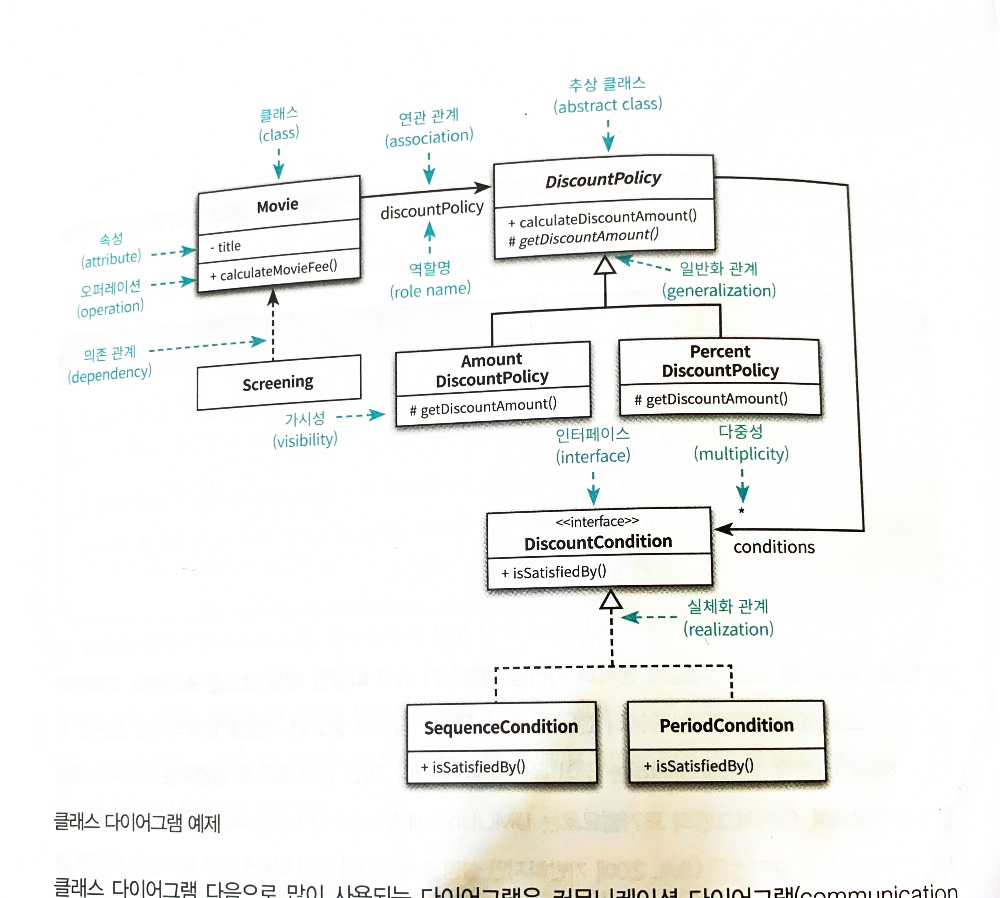
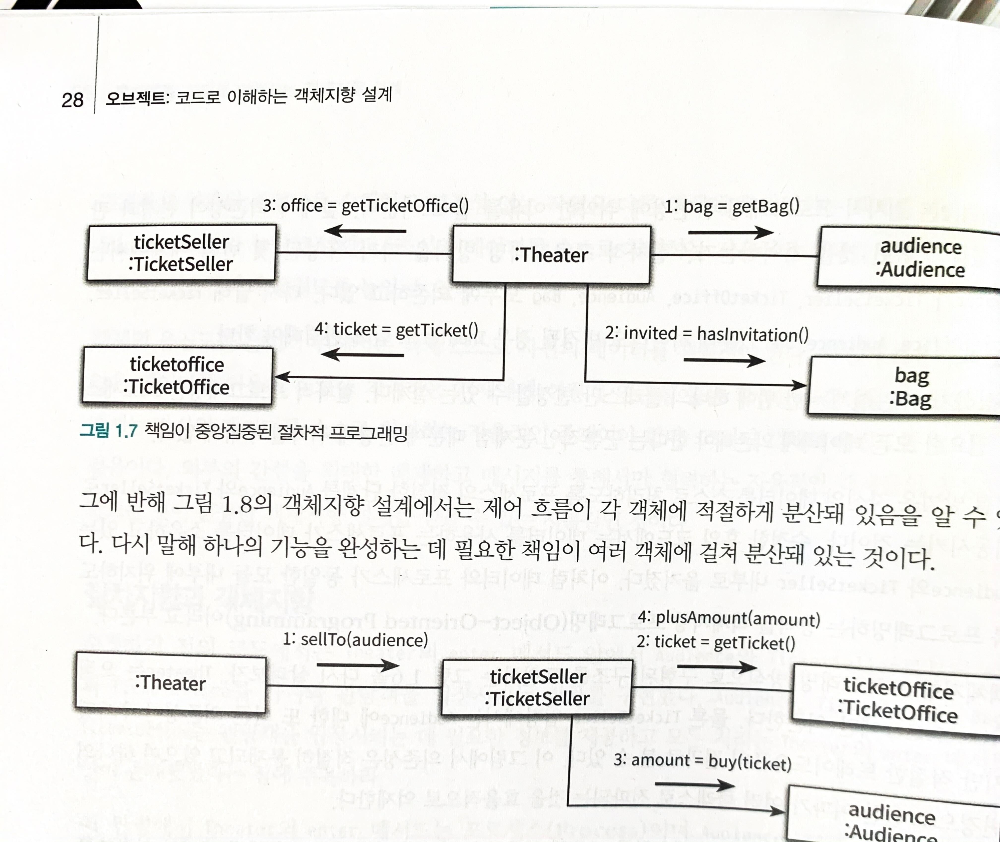

# 오브젝트

- 의문
- 응용
- 각종 표현법
- 용어
  - 도메인
  - 메시지 vs 메서드
- 팁
- 개요
- 1 객체, 설계
  - 1.1 훌륭한 설계
  - 1.2 객체 지향 설계 원칙
  - 1.3 절차지향 vs 객체지향
- 2 객체지향 프로그래밍
  - 2.1 협력, 객체 클래스
  - 2.2 객체
  - 2.4 상속과 다형성
  - 2.5 추상화와 유연성
- 3 역할, 책임, 협력
  - 협력
  - 책임
  - 역할

## 의문

## 핵심 내용

- 훌륭한 설계
  - 1 기능을 온전히 수행 가능
  - 2 쉽게 변경 가능
  - 3 읽기 쉬운 코드
- 객체 지향
  - 객체들의 협력으로 애플리케이션의 기능을 구현
    - 협력에 참여하기 위해 적절한 역할을 부여받고, 책임을 수행
- 객체 지향 설계 원칙
  - 1 자율성을 높이자
  - 2 캡슐화를 적극 도입하고, 응집도를 높이자
  - 3 적절한 객체에 적절한 책임을 할당
- 협력 설계
  - 시스템이 사용자에게 제공하는 기능을 시스템이 담당할 하나의 책임으로 바라봄
  - 시스템의 책임을 완료하는 데 필요한 더 작은 책임을 찾아내고 이를 역할(객체들)로 할당하는 반복적인 과정을 통해 모양을 갖춰감
    - 객체 할당은 정보 전문가에게 맡기기(해당 책임을 하기에 가장 정보를 많이 갖고 있는 객체)
  - **이런식으로 결정된 메시지가 객체의 퍼블릭 인터페이스를 구성함**

## 응용

- 현재의 시스템을 OOP적으로 재조립 해보자
  - Ride, Rider, Driver, DiscountPolicy, Coupon, ...
- business logics과 여타 로직의 분리?
  - service레이어에서 validation을 하지말자(Do.require)
    - 이미 그것은 controller level에서 끝내자
      - 그런데, 그렇게 되면, 같은 쿼리를 두번날려야하니까 비효율적?
      - 우리에게 최적화 보다는 생산성
      - 최적화는 나중에 생각해보자

## 각종 표현법

클래스 다이어그램

- 연관관계
  - 협력을 위해 필요한 탐색 구조
    - 데이터 관점에서 참조 관계 구현(FK)
- 의존관계
  - 협력을 위해 일시적으로 필요한 의존성(파라미터, 리턴타입, 지연변수)
    - 의존성과 의존관계는 다름

## 용어

- 도메인
  - 문제를 해결하기 위해 사용자가 프로그램을 사용하는 분야
- 메시지 vs 메서드
  - 메시지
    - 다른 객체와 상호작용할 때, 다른 객체의 인터페이스에 공개된 행동을 수행하도록 요청하기위한 매개체
      - e.g)
        - `Screening`이 `Movie`에게 `calculateMovieFee`메시지를 전송한다(o)
          - 메시지를 수신한 `Movie`가 스스로 적절한 메서드를 선택함
          - 메시지를 처리하는 방법은 `Movie`스스로의 문제
        - `Screening`이 `Movie`의 `calculateMovieFee`메서드를 호출한다(x)
  - 메서드
    - 수신된 메시지를 처리하기 위한 자신만의 방법

## 팁

- 2장 객체지향 프로그래밍
  - 의미를 좀 더 명시적이고 분명하게 표현할 수 있다면 객체를 사용해서 해당 개념을 구현
    - e.g) `Double`대신, `Money`타입
  - 협력의 관점에서 어떤 객체가 필요한지를 결정, 공통 상태와 행위를 구현하기 위해서 클래스를 작성

## 개요

**하지만 은총알은 없다**

- 패러다임
  - 개요
    - 한 시대의 사회 전체가 공유하는 이론과 방법, 문제의식 등의 체계
  - 예
    - 천동설, 지동설, 절차지향 프로그래밍, 객체지향 프로그래밍
- 프로그래밍 패러다임
  - 개요
    - 개발자 공동체가 동일한 프로그래밍 스타일과 모델을 공유할 수 있게 하는 것
      - 불필요한 의견 충돌 방지
      - 동일한 규칙과 방법을 공유하는 개발자로 성장
  - 특징
    - 언어가 어떤 패러다임을 지원하느냐에 따라서도 다름
  - 쿤의 패러다임과의 차이
    - 쿤
      - 상이한 두 패러다임은 함께 존재할 수 없음
      - 혁명적
    - 프로그래밍
      - 서로 다른 패러다임이 하나의 언어에서 공존할 수 있음
      - 발전적

## 1. 객체, 설계

절차지향 설계 vs 오브젝트 지향 설계

### 1.1 훌륭한 설계

**훌륭한 설계를 항상 머릿속에 염두해두면서 코드를 읽자**

- 개요
  - **1 기능을 온전히 수행 가능**
  - **2 쉽게 변경 가능(= 이해하기 쉬운 코드)**
    - 코드를 변경할 때 버그가 자주 발생하므로, 그것을 미연에 방지하는 것이 중요
  - **3 읽기 쉬운 코드**
- 특징
  - 훌륭한 설계는 적절한 트레이드오프의 결과물, 모두를 만족시키는 설계를 만들 수는 없다
- 방법
  - 개요
    - 훌륭한 설계를 실현하기 위한 다양한 방법이 존재할 수 있다
  - 종류
    - 절차지향적 방법
      - ...
    - 객체지향적 방법
      - 협력하는 객체들 사이의 의존성을 적절하게 조절함으로써, 변경에 용이한 설계를 만드는 것
    - 함수형 방법
      - ...

### 1.2 객체 지향 설계 원칙

위의 훌륭한 설계를 '객체 지향' 패러다임에서 실현하기 위한 방법

**자율적인 객체들이 낮은 결합도와 높은 응집도를 가지고 협력하도록 최소한의 의존성만을 남기는 것**

- **1 자율성을 높이자**
  - 객체 자신이 자율성을 갖고 처리를 할 수 있게 변경
    - 훌륭한 객체지향 설계란 소프트웨어를 구성하는 모든 객체들이 자율적으로 행동하는 설계
  - **객체지향의 세계에는 모든 것이 능동적이고 자율적인 존재(의인화)**
    - 소프트웨어를 생물로 생각하자. 모든 생물처럼 소프트웨어는 태어나고, 삶을 영위하고, 그리고 죽는다
- **2 캡슐화를 적극 도입하고, 응집도를 높이자**
  - 복잡한 의존성으로 인한 복잡도를 제어하기 위함
    - 의존성
      - 변경에 대한 영향(하나의 객체가 변경될 때, 그 객체에 의존하는 다른 객체도 함꼐 변경될 수 있음)
        - 변경에 취약한 코드의 원인
      - 의존성이 강하다 = 결합도가 높다
  - 캡슐화
    - 객체 내부의 상태를 감추고 객체 간에 오직 메시지를 통해서만 상호작용하도록 만드는 것
      - 불필요한 의존성을 제거할 수 있음
      - 몰라도 되는 세부사항을 객체 내부로 감춤
  - 응집도
    - 밀접하게 연관된 작업만을 수행하고, 연관성 없는 작업은 다른 객체에 위임하는 객체를 가리켜, 응집도(cohesion)가 높다고 함
    - 객체는 자신의 데이터를 스스로 처리하는 자율적인 존재여야 함
    - **외부 간섭을 최대한 배제** 하고 메시지를 통해서만 협력하는 자율적인 객체들의 공동체를 만드는 것이 훌륭한 객체지향 설계를 얻을 수 있는 지름길
- **3 적절한 객체에 적절한 책임을 할당**
  - 각 객체에 책임이 적절하게 분배되어야 함
    - 자신을 스스로 책임짐
    - 다른 객체와 협력함

### 1.3 절차지향 vs 객체지향

- 절차지향
  - 개요
    - 프로세스와 데이터를 별도의 모듈에 위치시키는 방식
    - 책임이 한곳에 집중
- 객체지향
  - 개요
    - 데이터와 프로세스가 동일한 모듈 내부에 위치하도록 프로그래밍하는 방식
      - 단순화 한 정의

## 2. 객체지향 프로그래밍

- 객체지향이란 객체를 지향하는 것
  - 객체지향 패러다임의 중심에는 객체가 위치
  - 객체지향에서 가장 중요한 것은, 애플리케이션의 기능을 구현하기 위해 협력에 참여하는 개체들 사이의 상호작용
  - 객체들은 협력에 참여하기 위해 역할을 부여받고, 역할에 적합한 책임을 수행
- 객체지향 설계의 핵심
  - 적절한 협력을 식별
  - 협력에 필요한 역할을 정의
  - 역할을 수행할 수 있는 적절한 객체에게 적절한 책임을 할당
- 클래스 / 상속과 같은 프로그래밍 개념은 구현하는 그저 방법임

예시: 영화 예매

### 2.1 협력, 객체 클래스

- 객체지향 프로그래밍의 설계의 본질
  - 1 어떤 **객체** 들이 필요한지 고민
    - 어떤 객체들이 어떤 상태와 행동을 가지는지를 먼저 결정
      - 클래스(x)
  - 2 객체를 독립적인 존재가 아니라, 기능을 구현하기 위해 **협력** 하는 공동체의 일원으로 보라
    - 객체를 협력에 참여하는 협력자로 바라봐야 함
  - 3 객체들을 타입으로 **분류** 하고, 이 타입을 바탕으로 클래스 구현

### 2.2 객체

- 객체에 대한 객체지향에서의 개요
  - 1 **상태와 행동** 을 가지는 복합적인 존재
  - 2 객체가 스스로 판단하고 행동하는 **자율적인 존재**
    - 무생물도 객체지향 패러다임에서는 자율적인 존재로 간주
  - 3 **캡슐화**
    - **객체라는 단위 안에, 데이터와 기능을 한 덩어리로 묶음으로써, 문제 영역의 아이디어를 적절하게 표현할 수 있게 하는 것**
      - 절차 지향에서는, 데이터와 기능이라는 독립적인 존재로 엮어서 프로그램을 구성
    - 접근 제어 메커니즘 제공
      - 접근을 통제하는 이유는, **객체를 자율적인 존재로 만들기 위함**
        - **외부 간섭 최소화**
- 객체 협력
  - 객체끼리 상호작용하는 유일한 방법은, **메시지를 전송** 하는 것 뿐
  - 메서드
    - 수신된 메시지를 처리하기 위한 자신만의 방법
  - c.f) 메시지 vs 메서드
    - 메시지 != 메서드

### 2.4 상속과 다형성

- 유연한 설계의 트레이드 오프
  - 설계가 유연 => 코드를 이해하고 디버깅하기는 점점 더어려워짐
  - 유연성을 억제 => 코드를 이해하고 디버깅하기 쉬워짐
- 상속
  - 개요
    - 클래스를 하나 추가하고 싶은데, 그 클래스가 기존의 어떤 클래스와 매우 흡사한 경우
    - 재사용해서 새로운 클래스를 만들면 좋음
    - 그것을 가능하게 해주는 방법이 상속
      - 코드의 공유
  - 특징
    - **차이에 의한 프로그래밍**
      - 부모클래스와 다른 부분만을 추가해서 새로운 클래스를 쉽고 빠르게 만드는 방법
  - 진정한 가치
    - **부모 클래스가 제공하는 모든 인터페이스를 자식 클래스가 물려받을 수 있음**
      - 인터페이스는 객체가 이해할 수 있는 메시지의 목록
      - 인터페이스 상속을 위해 사용해야 함
  - 단점
    - 캡슐화를 위반
      - 부모클래스의 구현이 자식 클래스에게 노출
        - 부모클래스의 변경시, 자식 클래스도 함께 변경될 확률이 높아짐
    - 설계를 유연하지 못하게 만듬
      - 부모 클래스와 자식 클래스 사이의 관계를 컴파일 시점에 결정
        - 런타임에 객체의 종류 변경 불가
  - 업캐스팅
    - 개요
      - 자식 클래스가 부모 클래스를 대신하는 것
- 다형성
  - 개요
    - 동일한 메시지를 전송하지만, 실제로 어떤 메서드가 실행될 것인지는 메시지를 수신하는 객체의 클래스가 무엇이냐에 따라 다른 것
    - 동일한 메시지를 수신했을 때, 객체의 타입에 따라 다르게 응답할 수 있는 능력
  - 구현
    - 지연 바인딩(동적 바인딩)
      - 실행 시점에 메시지와 메서드를 바인딩하는 것
    - vs 초기 바인딩(정적 바인딩)
      - 컴파일 시점에 실행될 함수나 프로시저를 결정하는 것

### 2.5 추상화와 유연성

- 추상화
  - 장점
    - **상위 정책을 쉽고 간단하게 표현 가능**
      - e.g) 영화 예매 요금은, 최대 하나의 할인 정책과 다수의 할인 조건을 이용해 계산할 수 있다
      - 기본적인 애플리케이션의 협력 흐름을 기술한다는 것
        - 디자인 패턴, 프레임워크 모두 상위 정책을 정의하는 객체지향의 매커니즘을 따름
    - **기존 구조를 수정하지 않고도 새로운 기능을 쉽게 추가하고 확장할 수 있음**
        - e.g) 영화 예매시, `NonDiscountPolicy`를 추가해서 아에 할인이 없는 영화 생성 가능
  - **모든건 트레이드 오프**

## 3. 역할, 책임, 협력

- 객체 지향 패러다임의 관점에서의 핵심
  - **협력**
    - 객체들이 애플리케이션의 기능을 구현하기 위해 수행하는 상호작용
  - **책임**
    - 객체가 **협력에 참여하기 위해** 수행하는 로직
      - 셋 중 가장 중요함
  - **역할**
    - 객체가 어떤 특정한 협력 안에서 수행하는 책임의 집합
    - *객체들이 협력 안에서 수행하는 책임들이 모여 객체가 수행하는 역할을 구성함*
      - 이건 무슨 뜻이지?
- 객체지향의 본질
  - 협력하는 객체들의 공동체 창조
    - 클래스와 상속은 객체들의 책임과 협력이 어느 정도 자리를 잡은 후에 사용할 수 있는 구현 메커니즘
      - 부가적인 것

### 협력

- 정의
  - 객체들이 애플리케이션의 기능을 구현하기 위해, 어떤 객체가 다른 객체에게 무엇인가를 요청하는 것
    - 객체 사이의 협력을 설계할 때는 객체를 서로 분리된 인스턴스가 아닌, 협력하는 파트너로 인식해야 함
- 개요
  - 협력은 객체지향 세계에서 기능을 구현할 수 있는 유일한 방법
  - 메시지 전송
    - **객체 사이의 협력을 위해 사용할 수 있는 유일한 커뮤니케이션 수단**
      - 다른 객체의 상세한 내부 구현에 직접 접근이 불가능하기 때문
  - **책임과 역할을 중심으로 협력을 바라보는 것이 변경과 확정이 용이한 설계로 나아가는 첫걸음**
    - 애매한 경우는 객체로 시작하고, 반복적으로 책임과 협력을 정제해가면서 필요한 순간에 객체로부터 역할을 분리해내는 것이 가장 좋음
      - 명확하면 역할로 시작하는게 좋음
- 협력 설계의 출발점
  - 시스템이 사용자에게 제공하는 기능을 시스템이 담당할 하나의 책임으로 바라봄
  - 시스템의 책임을 완료하는 데 필요한 더 작은 책임을 찾아내고 이를 객체들에게 할당하는 반복적인 과정을 통해 모양을 갖춰감
  - 예시) 영화 예매
    - 예매하라라는 이름의 메시지로 협력을 시작
      - 정보 전문가에게 책임을 할당
      - 예매할때에는 상영 시간과 기본 요금을 알아야 하고, 이 정보를 소유하고 있거나 해당 정보를 잘 아는 전문가인 Screening에게 맡김
    - 영화를 예매하기 위해서는 예매 가격을 계산해야 함
    - Screening은 가격 자체에 대해서는 정보 전문가가 아니므로, 외부 객체에게 가격 계산을 요청해야 함
    - 가격을 계산하는데 필요한 정보(가격, 할인 정책)를 가장 많이 알고 있는 전문가인 Movie를 선택함
    - Movie는 할인 요금을 계산하는 데 적절한 정보 전문가가 아니므로, 할인 요금을 계산하는 메시지를 다른 객체로 보내야 함
  - **이런식으로 결정된 메시지가 객체의 퍼블릭 인터페이스를 구성함**
- 정리
  - 자율적인 객체는 자신에게 할당된 책임을 수행하던 중에, 필요한 정보를 알지 못하거나, 외부의 도움이 필요한 경우 적절한 객체에게 메시지를 전송해서 협력을 요청
  - 메시지를 수신한 객체 역시 메시지를 처리하던 중에 직접 처리할 수없는 정보나, 행동이 필요한 경우 또 다른 객체에게 도움을 요청
  - 객체들 사이의 협력을 구성하는 일련의 요청과 응답의 흐름을 통해 애플리케이션의 기능 구현

#### 객체가 가질 수 있는상태와 행동을 어떤 기준으로 결정해야 할까?

- 개요
  - **협력이 존재하기 때문에 객체가 존재한다**
    - **협력은 객체를 설계하는 데 필요한 일종의 문맥을 제공한다**
      - *그럼 애초에 처음에 협력은 어떻게 설계하고 구성해야 하는지?*
  - 객체의 행동(책임)을 결정하는 것은, 객체가 참여하고 있는 협력(메시지)
  - 객체의 상태를 결정하는 것은 객체의 행동
    - 객체의 상태는 그 객체가 행동을 수행하는 데 필요한 정보가 무엇인지로 결정됨
    - 객체는 자신의상태를 스스로 결정하고 관리하는 자율적인 존재이므로, 객체가 수행하는 행동에 필요한 상태도 함께 가지고 있어야 함

### 책임

- 정의
  - 협력에 참여하기 위해 객체가 수행하는 행동
    - 객체에 의해 정의되는 응집도 있는 행위의 집합
    - 객체가 유지해야 하는 정보와 수행 할 수 있는 행동에 대해 계략적으로 서술한 문장
  - **협력에 참여하기 위해 무엇을 알고 있는가 / 무엇을 할 수 있는가**
    - 하는 것
      - 객체를 생성하거나 계산을 수행하는 등의 스스로 하는 것
      - 다른 객체의 행동을 시작시키는 것
      - 다른 객체의 활동을 제어하고 조절하는 것
    - 아는 것
      - 사적인 정보에 관해 아는 것
      - 관련된 객체에 관해 아는 것
      - 자신이 유도하거나 계싼할 수 있는 것에 관해 아는 것
- 영화 예매 시스템 예시
  - Screening
    - 영화를 예매하는 것
    - 자신이 상영할 영화를 아는 것
    - 결국 `reserve`라는 메시지를 수신하고, `movie`인스턴스 변수를 포함하는 이유는, 협력 안에서 영화를 예매할 책임을 지고 있기 때문
  - Movie
    - 요금을 계산하는 것
    - 가격, 어떤 할인 정책이 적용됐는지 아는 것
    - 결국 `calculateMovieFee` 메시지를 수신할 수 있고, `fee`와 `discountPolicy`를 속성으로 가지는 이유는 협력 안에서 가격을 계산할 책임을 할당 받았기 때문
- **책임 주도 설계**
  - 정의
    - 책임을 찾고 책임을 수행할 적절한 객체를 찾아 책임을 할당하는 방식으로 협력하는 설계 방법
      - 어떤 책임을 선택하느냐가 전체적인 설계의 방향과 흐름을 결정함
  - 방식
    - 메시지가 객체를 결정한다
      - 최소한의 인터페이스를 갖게 된다
      - 추상적인 인터페이스를 갖게 된다
        - what에 초점을 맞추는 인터페이스를 얻을 수 있음
    - 행동이 상태를 결정한다
      - **객체를 객체답게 만드는 것은 객체의 상태가 아니라, 객체가 다른 객체에게 제공하는 행동이다**
        - 객체의 행동이 객체가 협력에 참여할 수 있는 유일한 방법
        - 행동이 결정되어야만이, 상태가 결정될 수 있음
          - *그럼 사실, RDB에서 ER모델링을 먼저하는게 OOP에서는 안티패턴일 수도 있겠네..*
            - *그럼 OOP를 적용하는 경우는, OOP설계 이후에 ER다이어그램을 그리는것이 나을지도?*
      - 객체의 행동을 고려하기 위해서는 항상 **협력**의 문맥 안에서 객체를 생각해야 함

### 역할

- 정의
  - **객체가 어떤 특정한 협력 안에서 수행하는 추상화된 책임의 집합**
    - 객체를 바꿔낄 수 있는 슬롯같은 것
    - e.g) 할인 요금 계산(amount, percent 둘이 따로가 아니라)
  - 실제로 협력을 모델링 할때는, 특정한 객체가 아니라, 역할에게 책임을 할당한다고 생각하는게 좋음
    - e.g) 영화 예매
      - 예매하라 라는 메시지를 처리 -> 영화를 예매할 수 있는 적절한 역할이 무엇인지 찾음 -> 역할을 수행할 객체로 Screening 인스턴스를 선택
    - 이유
      - 불필요한 중복 코드의 제거
        - 여러 협력을 하나로 통합
      - 협력의 유연성(추상화)
    - 그래도 애매한 경우는 그냥 객체부터 설계를 시작하자
- 개요
  - 다양한 종류의 객체를 수용할 수 있는 일종의 슬롯이자, 구체적인 객체들의 타입을 캡슐화하는 추상화
    - 역할은 객체를 추상화해서 객체 자체가 아닌, 협력에 초점을 맞출 수 있게 함
  - **역할은 객체가 협력에 참여하는 잠시동안에만 존재하는 일시적인 개념**
    - **객체도 여러 협력에 참여하면서 다양한 역할 수행 가능**
- 장점
  - 협력이 유연하고, 재사용 가능해짐
- 역할과 추상화
  - 구현법(역할의 구현 방법)
    - 추상 클래스
      - 책임의 일부를 구현해 놓은 것
    - 인터페이스
      - 책임의 집합만을 나열
- 객체 대 역할
  - 객체와 역할의 구별
    - 협력에 적합한 책임을 수행하는 대상이 한 종류라면 간단하게 객체로 간주
    - 여러 종류의 객체들이 참여할 수 있다면 역할
  - 협력, 역할, 객체, 클래스의 관계
    - 협력 -> reference -> 역할 -> select from -> 객체 -> instance of -> 클래스
- 역할과 추상화
  - 추상화는 상황을 단순화 한다
  - 역할은 협력을 추상화한다
  - 프레임워크나 디자인 패턴과 같이 재사용 가능한 코드나 설계 아이디어를 구성하는 핵심적인 요소가 바로 역할
