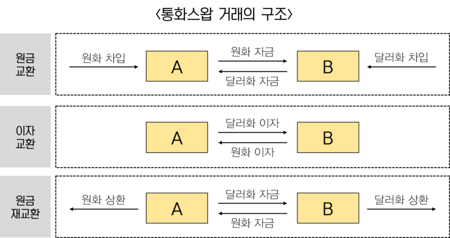

# 금융에 관한 다양한 용어의 의미를 알아보자.

- 롱 포지션 / 숏 포지션
- 파생상품
  - 정의
  - 종류
  - 운용 목적
  - 거래 증거금 / 레버리지 / 마진 콜
- 헤지

## 롱 포지션 / 숏 포지션

- 롱 포지션
  - 매수 포지션
- 숏 포지션
  - 매도 포지션

## 파생상품(derivatives)

### 정의

- **기초자산의 가치 변동을 바탕으로 파생된 금융상품**
- 특정 자산이나 특정 사건의 일어날 가능성을 거래하는 행위 그 자체를 상품화 한 것
  - 거래의 거래(메타 거래)
  - 파생상품을 기초자산으로 한 새로운 파생상품도 만들 수 있음
    - 거래의 거래의 거래
- 기초자산
  - 주식, 채권, 농산물, 원자재, 석유, 금(실물), 날씨, 주가지수(추상적 개념)
- 반대말은 현물거래
- 제로섬 게임

### 종류

- 기초적 파생상품(plain vanilla)
  - 선물
  - 스왑
  - 옵션

#### 선물

- 특정 자산을 특정 시점에 미리 정한 가격에 사거나 팔 수 있는 권리를 거래하는 것
  - 기초 자산의 거래는 미래에 이루어짐
  - 권리를 거래하는 것이기 때문에, 기초자산의 거래에 필요한 금액 보다는 모자라도 거래가 성립됨
  - 선물 거래 대상 자산을 표준화
  - 금융 시장에서만 거래
  - 증거금 제도
  - 일일 정산 제도
  - 계약불이행 위험을 제도적으로 막아줌
- 청산 방법
  - 인수도결제(담보자산 직접 배달)
  - 현금결제(차액을 돈으로 해결)
- 특징
  - 제로섬 게임
    - 거래 쌍방 중 일방의 손실 이 정확히 다른 쪽의 수익이 됨
  - 콘탱고(contango) / 백워데이션(backwardation)
    - 콘탱고
      - 선물 가격이 현재 현물 가격보다 비싼 경우
    - 백워데이션
      - 선물 가격이 현재 현물 가격보다 싼 경우
      - 보유비용이 음수
      - 드문경우

#### 스왑

- 계약조건 등에 따라 일정 시점에 자금교환을 통해 이루어지는 금융기법
  - 사전에 정해진 가격, 기간에 둘 이상의 당사자가 보다 유리한 자금 조달을 위해 서로 부채와 같은 자산을 교환하며 위험을 회피하는 금융기법
  - 통화스왑은 자산이 '통화'라는 기초자산

##### 통화 스왑

- 원리
  - 차입비용(이자)의 절감
  - 국내 기업이 더 신용도가 높아서 낮은 이율로 통화를 대여받을 수 있음
    - 이 빌린돈을 해외 기업에게 빌려줌
  - 그리고 그 해외 기업역시 낮은 이율로 통화를 대여받고 국내 기업에게 빌려줌
  - 이자는 서로 상대방의 이자를 내줌(보다 낮은 이율)
  - 마지막에 상환할때는 서로 빌렸던 돈을 돌려줌
- 종류
  - 기업간 통화 스왑
    - 차입비용의 절감
    - 환 리스크 헤지(공매도 역할)
      - 한국 기업이 미국 국채를 달러로 구입하면 수익을 보장금리로 일정하게 하기 위해서 기업간 통화 스왑을 시전해서 같은 가치의 달러화 차입후 바로 판매(공매도)
      - 국채만기때 국채의 원금과 이자를 달러로 받는데, 이때에 스왑도 상환함(한국돈으로 달러를 사야함)
        - 달러 가치가 상승하면: 국채로인한 이득도 증가하나, 스왑으로 인한 손실로 인해서 `국채이자 - 스왑` 이자 만큼의 이득을 봄
        - 달러 가치가 하락하면: 국채로인한 이득이 감소하나, 스왑으로 인한 이득으로 인해서 `국채이자 - 스왑` 이자 만큼의 이득을 봄
      - 고정된 `국채이자 - 스왑` 만큼의 이득을 볼 수 있음
- 국가간 통화 스왑
  - 두 나라의 중앙은행간에 체결
  - 자국의 외화 유동성 문제에 대비하기 위한 목적

### 운용 목적

- **위험 회피**
  - 나의 리스크를 다른 사람에게 떠넘기는 것
  - 경우에 따라서는 파생상품의 리스크를 근원 자산의 리스크 보다 수천배까지 올릴 수 있다.
  - 아래에 나오는 헤지에서 자세한 설명
- 수익 추구

### 거래 증거금 / 레버리지 / 마진 콜

- 레버리지 효과로 인한 리스크의 증폭
  - KOSPI200의 최소 상품 1개를 사는 경우 1억원의 가치를 가지는데, 여기서 1억을 한번에 거래 하기 힘드니, 소액의 거래 증거금을 제시. 보통은 15%내외로 입금
  - 1500만원으로 1억원의 상품 거래.
    - 1억원에서 20% 수익이 남으면 2000만원을 얻음
    - 1억원에서 20% 손실이 발생하면 1500 - 2000으로, -500이 되어 500만원의 부채가 발생
    - 보통은, 마이너스로 떨어지기 전에 하락폭이 증거금 보다 클 경우 추가 증거금 납부를 요구하고 그것을 이행하지 않을경우, 거래를 강제로 청산시킴. **마진 콜**

## 헤지(Hedge)

- 정의
  - **울타리. 즉, 자산을 가치하락이라는 리스크로부터 보호하는 역할**
  - **현재 포지션과 반대의 포지션을 파생상품에서 취하는 것**
    - 보유자산을 팔아버리는 것은 아에 현재의 포지션이 존재하지 않게 됨
- 특징
  - 선물의 경우 유동이 크기 떄문에 언제든지 청산 가능
- 예시
  - A주식을 현재 1주에 10원씩 100주 보유하고 있음(총 1000원)
  - 이 주식의 가격이 장래에 떨어질 것 같아서 파생상품을 이용한 헤지를 사용
  - 숏 포지션으로 100주 매도
  - 1달뒤 가격이 5원으로 떨어짐
    - 현물: 500원으로 가치가 하락, 500원 손실
    - 선물: 이미 1000원으로 공매도했는데, 500원으로 같은 주식 100주를 보상해주면 되므로 500원 이익 발생
    - 주식 자산의 가치하락은 피할 수 없었으나, 전체 자산(현금 포함)에서는 손해가 존재하지 않음
