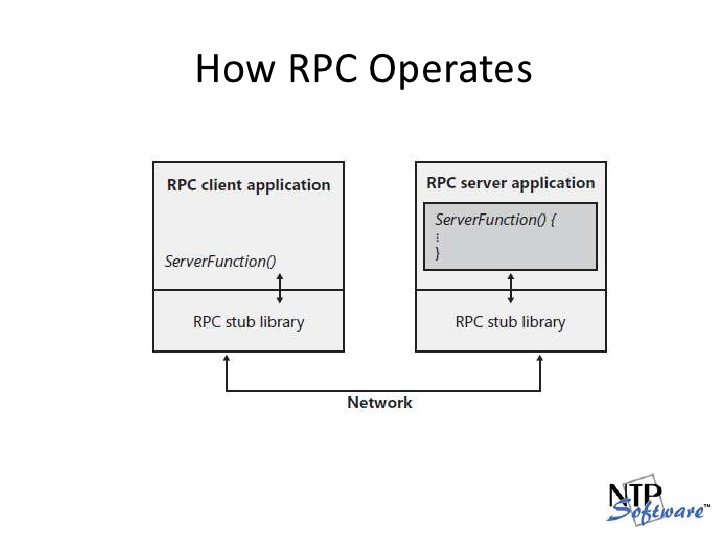
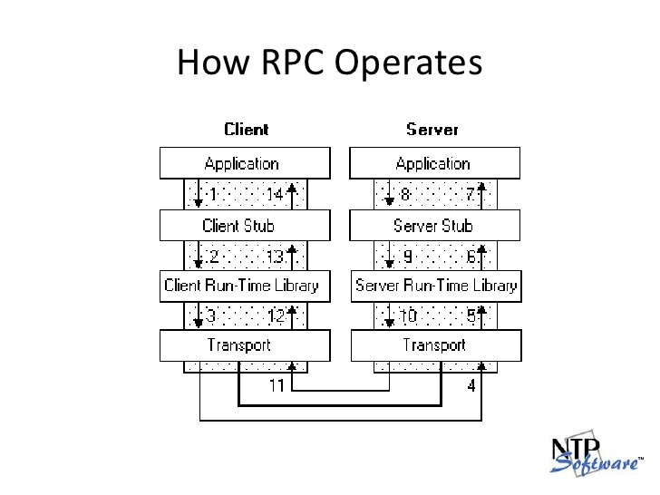

# RPC

## RPC 작동방식





RPC stub library를 통해서 RPC client는 서버에서 준비한 함수를 쉽게쉽게 사용하는 느낌?

서버에서 준비한 procedure를 사용하니까 remote procedure call이라는 이름이 붙은것 같다.

**클라이언트는 서버가 갖고 있는 메소드를 마치 자신이 갖고 있는것 처럼 쉽게 쉽게 불러다 쓸 수 있다.**

RPG시스템은 그들의 parameters와 return type와 함께 원격으로 사용할 수 있는 메소드를 정의한다.

서버: 클라이언트의 요청에 대응할 수 있는 인터페이스 정의

클라이언트: 서버에 메소드 제공

클라이언트와 서버가 다른 언어로 만들어져 있어도 전혀 상관 없다.

## Protocol buffer를 사용한 시스템

### 데이터의 정의

Protocol buffer: xml과 같은 연속적인 구조화된 데이터. 더 작고 빠르고 간단하다.

데이터의 스키마를 한 번 정의해두면(`.proto`), 생성된 코드로 쉽게 쓰고 읽을 수 있다.

```

message Person {
  required string name = 1;
  required int32 id = 2;
  optional string email = 3;

  enum PhoneType {
    MOBILE = 0;
    HOME = 1;
    WORK = 2;
  }

  message PhoneNumber {
    required string number = 1;
    optional PhoneType type = 2 [default = HOME];
  }

  repeated PhoneNumber phone = 4;
}

```

각각 메세지의 타입은 하나나 그 이상의 numbered fields를 갖는다.

각각의 필드에는 name과 value type을 갖는다.

### 데이터의 호출

어플리케이션의 언어에 따라서 그에 맞는 컴파일러가 `.proto`파일에 데이터를 접근할 클래스를 만들어준다.

이 클래스는 간단한 accessors과 whole parse등을 할 수 있는 클래스를 생성한다.

아래와 같은 코드를 쓸 수 있다.

```cpp

// 데이터 부른 후 파일로 만들기

Person person;
person.set_name("John Doe");
person.set_id(1234);
person.set_email("jdoe@example.com");
fstream output("myfile", ios::out | ios::binary);
person.SerializeToOstream(&output);

// 파일로 만든 데이터를 다시 불러오기

fstream input("myfile", ios::in | ios::binary);
Person person;
person.ParseFromIstream(&input);
cout << "Name: " << person.name() << endl;
cout << "E-mail: " << person.email() << endl;

```

### XML과의 비교

더 가볍고 빠르고 간편하고 명확하다.

~~왜 json과의 비교는 없는걸까~~

```xml
<person>
  <name>John Doe</name>
  <email>jdoe@example.com</email>
</person>

cout << "Name: "
     << person.getElementsByTagName("name")->item(0)->innerText()
     << endl;
cout << "E-mail: "
     << person.getElementsByTagName("email")->item(0)->innerText()
     << endl;
```

```protocolbuffer

# 단순히 텍스트화 시켜놓은것임. binary이기 때문에 사실은 사람이 봐도 모름

# 그래서 오직 .proto파일이 있을때에만 사용할 수 있으므로 의미를 갖는다.

person {
  name: "John Doe"
  email: "jdoe@example.com"
}

cout << "Name: " << person.name() << endl;
cout << "E-mail: " << person.email() << endl;

```

### 사용 방법

- `.proto`의 정의

```
message Person {
  string name = 1;
  int32 id = 2;
  bool has_ponycopter = 3;
}
```

- protoc컴파일러를 이용해서 data access가능한 class를 원하는 언어로 만들어준다.

- 이하는 gRPC서비스의 코드를 보여준다.

`.proto`에

```
// The greeter service definition
service Greeter {
  // Sends a greeting
  rpc SayHello (HelloRequest) returns (HelloReply) {}
}

// The request message containing the user's name.
message HelloRequest {
  string name = 1;
}

// The response message containing the greetings
message HelloReply {
  string message = 1;
}
```
