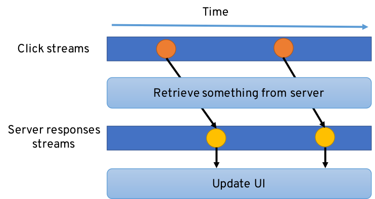
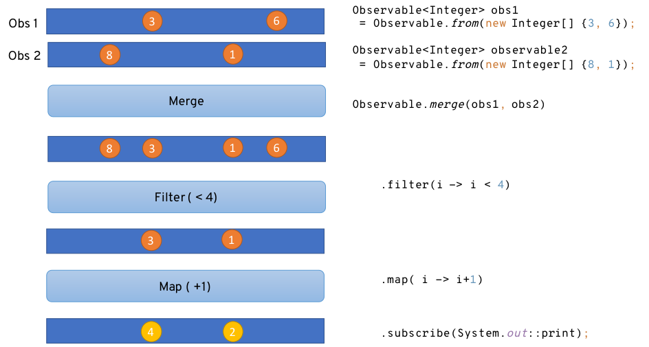
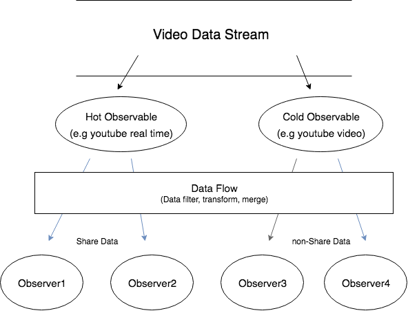

# Reactive Programming

## 의문

## 참고

## Reactive Programming이란?

- 참고
  - [5 Things to Know About Reactive Programming](https://dzone.com/articles/5-things-to-know-about-reactive-programming)

### 1. Reactive Programming Is Programming With Asynchronous Data Streams



- **비동기 복잡성 다루기 + 데이터 주도 개발에 초점을 맞춘 개발 패러다임**
- 데이터 스트림들이 애플리케이션의 핵심
  - 이벤트, 메시지, 호출, 에러들이 데이터 스트림을 통해서 옮겨짐
  - 클릭 이벤트, HTTP 리퀘스트, 이용할 수 있는 것들에 대한 통지, 변수의 변화, 캐시 이벤트, 센서로부터의 측정
    - 변화하거나 일어나는 어떠한 것에 대해서든 데이터 스트림화 가능
  - 본질적으로 asynchronous함
- RX(Reactive eXtension)
  - "observable sequence를 이용하여 비동기적이고 이벤트 기반 프로그램을 합성"이라는 리액티브 프로그래밍 원칙의 구현
  - Observable이라는 데이터 스트림을 코드가 생성하거나 구독함
  - RX는 리액티브 프로그래밍을 도와주는 헬퍼
    - Observer pattern
    - Iterator pattern
    - Functional idioms
      - merge, filter, transform, create data streams



### 2. Observable Can Be Cold or Hot - and it Matters



- Observables(Stream)은 hot, cold로 나뉠 수 있음
- Cold observable
  - lazy
    - 무엇인가가 observing(subscribe)하기 전까지 아무것도 안함
  - 비동기적인 행위를 나타내기 위해서 사용됨
    - 결과 값에 흥미를 나타내는 것이 나타나기 전까지 실행 하지 않음
    - 파일 데이터에 관한 작업을 하기 전까지 데이터를 가져오지 않음
    - observer끼리 데이터 공유도 안됨(같은 데이터를 공유하는게 아님)
  - 예시
    - 일반 VOD
      - 내가 subscribe(시청) 해야지 방송이 진행
- Hot observable
  - active
    - 무엇인가가 observing 하기도 전에 이미 동작중
    - 개별적인 subscriber(observer)에 독립적
    - observer가 hot observable를 subscribe하면 subscribe이후의 모든 방출된 데이터를 가져옴
    - 그 값들은 모든 subscriber에게 공유됨
  - 예시
    - 유튜브 실시간 방송
      - 내가 subscribe하던 안하던 방송이 진행
    - 화면에서 마우스 클릭
      - 내가 subscribe하던 안하던 이벤트가 전송
- 데이터 소비의 차이

### 3. Misused Asynchrony Bites

```java
client.get("/api/people/4")
.rxSend()
.map(HttpResponse::bodyAsJsonObject)
.map(json -> json.getString("name"))
.subscribe(System.out::println, Throwable::printStackTrace);
```

- 비동기성
  - 각각의 실행 흐름이 메인 프로그램과 독립적
  - 데이터 스트림이 새 아이템을 emit하면 코드가 호출됨
  - 키워드
    - 스레드, 블록킹 코드, 부작용
- 비동기성을 유지하기 위한 포인트
  - 순수함수 사용
    - 부작용이 없는 함수
    - 불변성을 유지하는 함수
    - 프로그램의 나머지 부분과 배타적으로 상호작용 가능
    - 부작용을 남용하면 스레드 safe 미션을 달성하기 힘들어짐
  - 적당한 스레드의 개수
    - 어떤 스레드에서 함수가 실행되고 있는지가 매우 중요
    - 너무 많은 스레드를 사용하지 않는것을 권장
      - 싱크로나이징이 매우 힘들어짐 -> 데드록
  - 절대로 블로킹하는 코드를 작성하지 않기
    - 블로킹을 한다면, 다른 데이터가 emit하지 않도록 해야함
      - buffer를 해야함
    - 또한, 언제나 에러는 캐치하자

### 4. Keep Things Simple

- flatmap, retry, debounce, zip등을 너무 체인하지 말자
- readable한 코드를 작성하는 것이 중요
  - 간결하게 간결하게

### 5. Reactive Programming != Reactive System

- 리액티브 프로그래밍으로 리액티브 시스템을 만드는 것이 아님
- 리액티브 시스템
  - reactive manifesto라고 불림
    - responsive distributed systems를 만들 때의 스타일
  - 특성
    - Responsive
      - requests를 합리적인 시간 안에 처리할 수 있어야 함
    - Resilient
      - 에러에도 계속 responsive함을 잃지 말아야 함
      - 에러 핸들링이 중요
    - Elastic
      - 부하가 커져도 충분히 responsive하게 있어야 함
      - 최소의 자원을 사용해서 스케일을 쉽게 올렸다가 줄일 수 있어야 함
    - Message driven
      - 비동기 메시지 통과를 사용해서 리액티브 시스템이 상호작용 할 수 있어야 함
