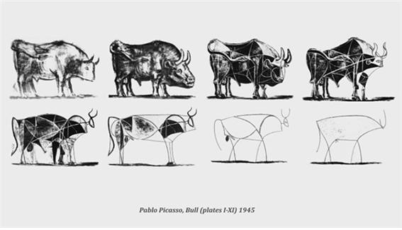
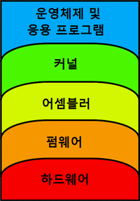

# Active knowledge, Passive knowledge

## 아이디어

- 애초에 **교육** 이란 무엇인가?

## 목차

- 배경
- active knowledge와 passive knowledge란
- 관련 연구

## 배경

### 대한민국의 현실

- 대한민국 학생들은 왜 중 / 고등학교 떄만해도 다른나라에 비해서 학업 성취도가 월등하게 높은데, 대학생이 되어서 질이 높은 논문을 잘 쓰지 못하는가?(? 진짜?)
  - 그것은 어렸을 때 부터 지식을 주입식으로 받아왔기 때문.
  - 이러한 주입식 교육은 지식의 총량을 증가시킬지는 몰라도, 지식의 본질을 학생이 스스로 꺠닫는 것을 방해하게 된다.
  - 그렇게 되면 학문에 흥미를 갖지 못하게 되고, 학문을 깊이있게 음미할 수 없게 된다.
    - 수포자의 양산
  - 이는 대한민국 학문 발전에 치명적. 그 뿐아니라, 국제 경쟁력도 밀리는 결과를 초래
- 교육 현장에서 아무도 이 지식이 어떻게 쓰이고 왜 중요한지 구체적으로 가르쳐 주지 않는다.
  - 대표적으로 수학 교과의 경우, 왜 우리가 원의 넓이를 공부해야하고 삼각비를 공부해야하는지 선생님들이 제대로 설명해주지 않는다.
  - 단순히 입시를 위한 교육이 되기 때문에, 학부모 / 학생 / 선생님 모두 한결같이 좋은 점수만을 바람. 학문의 본질에 대해서는 등한시
  - 장기적인 관점으로 학문을 깊이있게 대하지 않기 때문에 응용력이 부족.
  - 사교육이 활성화 되는 원인(지식의 주입)
- 이러한 대한민국 교육의 현실은 passive knowledge만 맹신하는 풍조가 됨
  - passive knowledge란, 학생의 머리 속에 존재하는 지식 자체를 말함
    - 그래서 물어보면 대답할 수 있고, 어떠한 정형화되고, 어느정도 해당 지식과 관련있다는 것이 명확한 문제를 보면 해결할 수 있음
    - 그러나 해당 지식과 아무런 관련이 있다는 힌트가 없고, 관련성이 가려져 있는경우 그 관련성을 파악하지 못함. 또한,
  - 하지만 문제자체가 학생이 머리에 존재하는 지식과 명시적으로 관련 있다는 것을 알기힘들 경우 그러한 문제들을 풀 수 있게 해주는 응용적인 지식인 active knowledge는 많이 부족함
    - 하지만 대학입시에서는 이러한 active knowledge는 중요하게 취급되지 않음
    - 성적으로 학생의 순위를 매기는 것이 더 중요하기 때문
- 이러한 passive knowledge는 반드시 나쁘다고만 할 수는없음 중요한 것은
  - passive knowledge -> active knowledge를 담당하던 대학이라는 기관 역시 passive knowledge를 주입시키는 기관으로 변절했다는 것.
  - 애초에 처음부터 active knowledge를 학생이 생기게 할 수 없을까?
    - 학생 주도적인 학습 방식을 채택하면 active knowledge를 생기게 할 수 있을듯(refence?)

### 응용력이란

### 추상화

- 정의
  - 컴퓨터 과학 분야에서 주어진 문제나 시스템의 복잡도를 단순화하여 인식하기 쉽게 만드는 개념화 작업
    - 핵심 요소를 잘 파악하여 필요 이상으로 상세, 복잡한 요소들을 결합하거나 단순화하고, 속성의 일부분 만으로 주어진 대상을 간결하고 명확하게 표현한다.
    - 복잡도를 관리하는 핵심 기술이라고 할 수 있다.
    - 예시
      - 라이브러리의 api(내부 구현을 신경쓸 필요가 없음)
      - 컴퓨터 아키텍처가 추상화의 원리로 되어있음(스타크래프트에서 유닛의 공격명령을 내려도 그것이 서버에 데이터를 보내는 등의 처리는 신경쓰지 않아도 됨)
  - 중요한 특징을 찾아낸 후 간단하게 표현하는 것.
    - 여러 가지 요소들을 하나로 통합하는 방향성. 문제 분할과의 반대 개념
    - 추상화를 이용해서 핵심적인 것만을 남겨 표현하게 되면, 복잡한 내용도 한 눈에 알아볼 수 있어서 이해하기 쉬워지는 장점 존재
  - 구체적 사물들의 공통된 / 결합의 특징, 즉 추상적 특징을 파악하여 인식의 대상으로 삼는 행위
  - (그림) 구체적인 자연의 형태를 떠나, 점 / 선 / 형 / 면 / 색 등의 순수 조형 요소만으로 작가의 내면 세계를 드러냄
    - 기계어로 코딩하는 거랑 비슷한 이치?
    - 최초의 추상화 작가는 칸딘스키
    - 자연의 대상을 단순화해서 표현하는 경우도 있음(단순화)
      - 몬드리안 나무 / 피카소의 소
- 종류
  - 사유적 추상화
    - **어떠한 대상을 본질적인 요소만으로 나타내어 자잘한 요소를 가린 것이 추상화**
    - 예) [도형] [네 개의 각] [네 개의 변] 을 사각형이라고 부름
    - 예) 스마트폰의 애플리케이션 아이콘도 그 애플리케이션의 특징을 추상화해서 만든 것
    - 인터페이스가 존재하지 않음
  - 행위적 추상화
    - 인터페이스가 존재하는 추상화
    - **복잡한 구현을 인터페이스로 가린것이 추상화**
    - 예) 자동차의 브레이크 페달을 밟으면 차가 멈추게 된다.
      - **사람**의 관점에서 자동차 내부의 매커니즘을 생각하지 않아도 브레이크 페달을 밟는 행위로 인해서 차가 멈추게 됨
      - 여기서 브레이크 페달은 사람과 자동차를 연결하는 인터페이스
- 특징
  - **추상화에는 두가지 시점이 대척점으로 있음.**
    - `컴퓨터 >>> 추상 레이어 >>> 인간`
      - 기계어는 컴퓨터의 시점에 가까운 추상레이어에 존재
      - 고급 언어는 인간의 시점에 가까운 추상레이어에 존재
      - 데이터는 컴퓨터의 시점에 가까운 추상 레이어에 존재
      - 클래스는 인간의 시점에 가까운 추상 레이어에 존재
    - `사물의 본질 >>> 추상 레이어 >>> 사물의 외형`
      - 피카소의 소는 사물의 본질에 가까운 추상레이어에 존재
      - 정물화의 소는 사물의 외형에 가까운 추상레이어에 존재
    - `비 시각적 인식(감정, 소리) >>> 추상 레이어 >>> 시각적 인식`
      - 몬드리안의 나무 추상화는 비 시각적 인식(몬드리안의 사상, 감정)에 가까운 추상 레이어에 존재
      - 몬드리안의 나무 정물화는 시각적 인식에 가까운 추상 레이어에 존재
- 의문
  - 컴퓨터 공학에서 말하는 추상화와 피카소의 소, 사각형의 예의 차이점은 무엇이고 같은 본질적 공통점은 무엇인가?

## active knowledge와 passive knowledge란

- active knowledge
  - 그 자체의 정확한 이해 뿐 아니라, 탄생 배경에 대한 맥락을 알고, 그 본질에 대해서 자기 나름의 결론을 내릴 수 있으며, 이를 활용하여 현실 세계의 문제도 해결할 수 있는 지식. 즉, 지식의 추상화(지식 자체를 다른 추상 레이어의 무엇인가로 변환할 수 있음)와 환원(어떠한 다른 추상 레이어의 문제나 어떠한 것을 지식이 존재하는 추상 레이어의 문제로 단순화 함)이 자유로운 상태.
    - 그 지식 자체(what)
    - 지식에 대한 깊은 이해
      - 지식의 역시적 배경
      - 지식의 맥락
    - 비유 가능성
    - 응용 가능성
      - 현실 세계
- passive knowledge
  - 그 자체에 대한 정확한 이해만을 가지고 있고, 이와 관련된 단순 명료한 문제를 해결할 수 있는 지식
    - 그 지식 자체(what)
    - 단순 명료한 문제 해결
