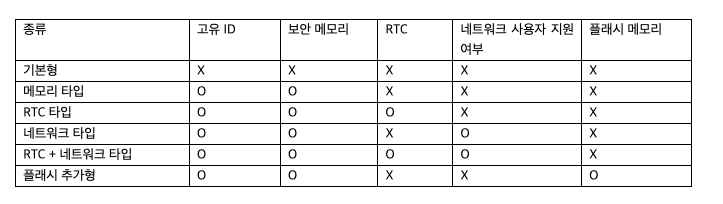

# Dongle

- 의문
- 나의 이해
- 개요
  - software protection dongle
  - 종류
  - 연동 방식
  - 과정
  - 특징
  - 크로스 록킹 기술

## 의문

- *진짜로는 없는데 마치 있는 것 처럼 동글 시뮬레이션을 만들어버린다면?*
- envelope의 경우에는, 동글 제조업체 유틸리티로 파일을 감싸주고, 실행되었을 때, 보안 레이어에서 키락을 확인하고, 디스어셈블러, 해킹 프로그램등이 실행되는 상황을 탐지함
  - *래핑된 친구를 실행할 때에는 동글이 있어야만 가능한것인가? 아니면 그냥 더블클릭하면 알아서 동작하는가?*
    - *더블클릭하면 동작은 하는데, 만약 동글이 없다고 판정되면 그냥 child process를 kill하는 느낌??*
  - *레이어를 덮는다는게 정확히 어떤 의미인가?*
- 라이센스도 동글 자체에서 관리할 수는 없는것인가? 굳이 sdk를 써야만 하는가?

## 나의 이해(?!)

- 어떠한 동글이라도 자기자신의 UID가 존재
- envelope의 경우에는, 애초에 wrapping할 때, 해당 UID를 등록해서 그 UID를 키로 하는 암호화
- SDK를 사용하는 경우에는, 직접적으로 UID를 드라이버 인터페이스를 통하여 SDK를 사용하여 정기적으로 polling해서 동글의 존재와 유효하다는 것을 verify

## 개요

- 소프트웨어 3개월 무료 전략
  - license모듈에 `FreeTrialChecker` class를 만들고, free trial기간 checker의 다양한 동작의 구현체인, `DangleChecker`, `WindowRegistryChecker`등의 클래스 인스턴스를 DI해서 `is_trial_period` 함수를 `FreeTrialChecker`의 메서드 안에서 polymorphism 적으로 확인을 delegate
  - flask위에서 동작해야 하므로, License의 decorator를 새로 작성하면 될듯 FreeTrial or LicenseVarification

### software protection dongle

- 어떠한 소프트웨어가 오직 특정 dongle이 컴퓨터에 연결되어 있어야만(USB같은 형태) 동작하도록 만든 것
  - dongle속에는 license key나 암호학적인 방어 매커니즘이 숨겨져 있음
- software 기능 unlock or content decode
  - The hardware key is programmed with a product key or other cryptographic protection mechanism and functions via an electrical connector to an external bus of the computer or appliance.

### 종류

키락의 종류

- 기본형
  - 가장 단순한 형태의 불법복제만 방지
- 메모리 타입
  - 고유ID: 고객 하나 하나를 구분 가능
  - 보안 메모리: 응용프로그램의 기능을 제한 가능(기능이 A, B, C가 있는데, 보안 메모리에는 A기능 허가 정보만 들어있음)
- RTC 타입
  - 키락 내부에 RTC(Real Time Clock)이 있어서 시간을 제한할 수 있음
    - e.g) 1년 단위 소프트웨어 라이센스
- 네트워크 타입
  - 소프트웨어가 기업 내부에 설치되어, 다수의 사용자가 한 번에 그 소프트웨어를 사용할 떄 유용
    - 한 대의 PC에만 네트워크 타입의 키락을 꽂아 놓으면 5명 모두가 각자 PC에서 소프트웨어 사용 가능
    - *무슨 원리로?*
- 플래시 추가형
  - 키락 보안 메모리와 별도로, 일반적인 플래시 메모리가 추가
  - 개발사가 소프트웨어 자체를 해당 플래시에 저장해 배포하거나, 다른 용도로 큰 저장소가 필요한 경우 사용

### 연동 방식

- API추가 방식
  - 키락과 함께 그것을 사용할 수 있는 API 제공
- **포장 방식(envelope)**
  - 개발이 끝난 프로그램을 한 번 더 래핑해줌
    - 결국 래핑된 IP를 실행하면 core application이 child process화가 되는 것인지?
  - 바이너리에 덧붙여지는 레이어가 disassembly, reverse engineering을 차단
    - *데이터를 암호화 해 줄 뿐 아니라, 주기적으로 동글확인도 해주는 좋은 기능?!*
  - 데이터 자체도 래핑해주면 데이터를 보호할 수 있음
    - 무조건 키락 소프트웨어가 있어야지만 실행가능
  - 단순히 키락업체의 프로그램을 한 번만 실행하면 되기 때문에 매우 간단
  - 참고) Sentinel의 설명
    - The Sentinel Envelope is responsible for checking whether the Sentinel HL key is connected to the host during software runtime.
    - Both the encryption and decryptionmechanisms employ AES 128bit encryption ensuring a fully secured two-way communicationchannel confirming the presence of the key.

### 과정

- 동글은 특정 값이 하드웨어 락키에 기록되어 있음
- 각 동글마다 특정 드라이버(API)를 사용자 컴퓨터에 설치하여, 해당 드라이버를(SDK를 이용하여) 통해 하드웨어 락키와 통신을 하게 함
- 컴퓨터나 전자 제품에 연결
- 동글이 있는지 없는지 확인
- 있다면, 동글 메모리에서 특정 위치의 값을 읽어와서 그 값이 올바른가 아닌가 확인
- 정상적이라면 실행

### 특징

- copy protection & content protection에 사용됨
  - 허가받지 않은 사용과 소프트웨어 카피 문제를 방지
  - 옛날에는 serial port, parallel port같은 것을 사용하다가 요즘은 usb를 사용
- 데이터 파일 보호도 가능
- 기능, 모듈 별 보호 가능
  - 각 기능과 모듈 마다 따로 암호화 키가 존재

### 크로스 락킹 기술

- 보안 레이어로 감싸주는 단계와 라이센싱 단계를 분리(특정 키락의 모델에 의존하지 않음)
  - 장점
    - 특정 키락 모델에 의존하지 않음
    - 개발 업무와 패키징 업무의 분리
      - 개발자가 프로그램을 개발한 후에 envelope를 사용해서 래핑
      - PM이 그뒤에 적용할 라이센스를 정해서(체험판, 기능제한, 평가판, 정식판 등등) 해당 키락에 라이센스만 생성
      - 배포
