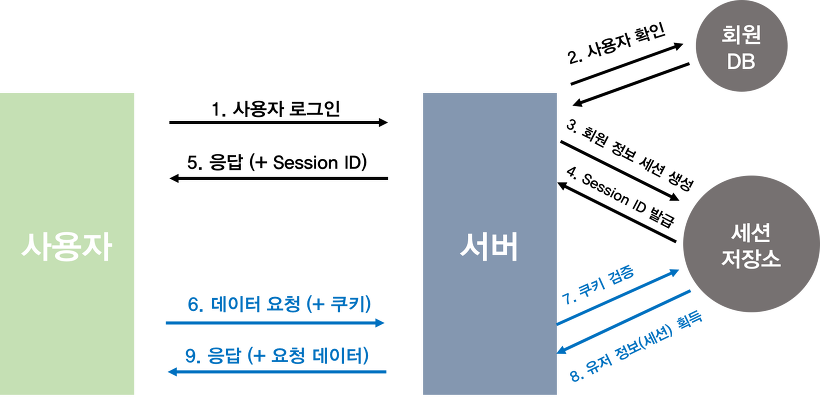
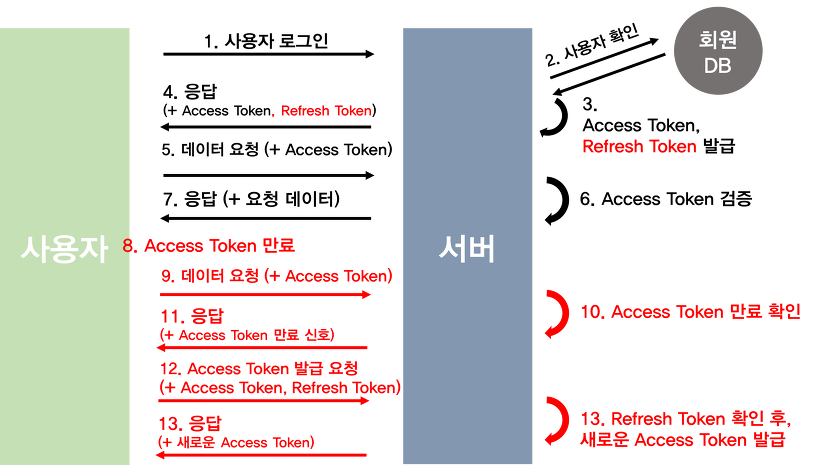
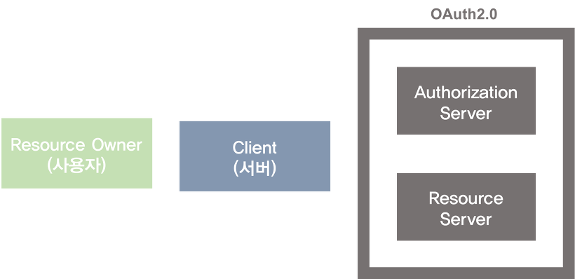
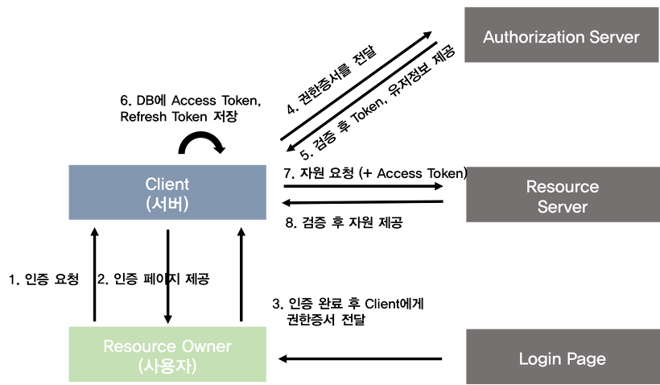
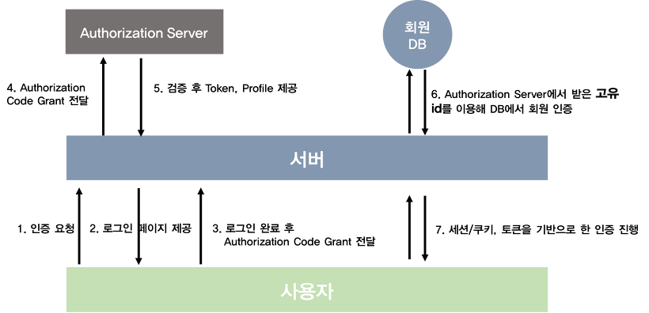

# 웹 인증

- 1 계정정보를 요청 헤더에 넣는 방식
- 2 Session / Cookie 방식
- 3 JWT
  - JWT + Refresh token
  - OAuth와 SNS로그인

기본적으로 HTTP는 stateless의 성질을 갖기 때문에 각 HTTP 요청은 독립적이므로 매번 유저는 자신이 어떤 유저인지 id를 요청과 함께 보내줘야 함

## 1. 계정정보를 요청 헤더에 넣는 방식

- 개요
  - 유저의 id와 비밀번호를 HTTP 헤더에 넣어서 인증
- 단점
  - HTTP의 경우 유저의 기밀 정보가 유출될 가능성이 큼(평문이기 때문)
  - 서버가 유저의 비밀번호를 알게 됨

## 2. Session / Cookie 방식

- 개요
  - Session 방식을 Cookie를 이용해서 구현
    - 모바일 앱의 경우에도 Header의 Cookie 관련 필드의 값을 파싱하고 추상화 하면 구현 가능
- 순서
  - 사용자 로그인
  - 사용자의 고유한 ID값을 부여하여 세션 저장소에 저장
  - 해당 세션ID를 쿠키에 저장하고, 인증이 필요한 요청마다 쿠키를 헤더에 실어서 보냄
  - 서버에서는 쿠키를 받아 세션 저장소에서 대조한 후 대응되는 정보 가져옴
  - 인증 완료 후 사용자에 맞는 데이터 보내줌
- 구현
  - 세션 저장소는 보통 Redis
  - 만일 서버가 다중서버 구성이되어있다면?
    - 세션 저장소를 서버 내부에서 분리
    - CQRS의 원칙에 따라서 세션을 작성하는 처리는 크래시가 나타나지 않도록 job queue를 만들어서 순차성을 담보할 수 있게 함
    - 세션을 단순히 가져오는 쿼리는 queue가 필요 없음
- 장점
  - 쿠키값 자체가 유의미한 값을 갖지 않음
- 단점
  - 쿠키값을 가로채서 특정 사용자로 변장할 수 있음(세션 하이재킹 공격)
    - HTTPS를 반드시 시행
    - 세션에 유효시간을 넣어줌
  - 서버에서 세션 저장소를 사용하므로 추가적인 저장공간을 필요로해지고, 부하가 커짐

## 3. JWT(Jason Web Token)

- 개요
  - 인증에 필요한 정보들을 암호화시킨 토큰
  - 구성
    - Header
      - 암호화할 방식(HS256 / RSA)
      - 타입(JWT)
      - JSON 형태의 객체가 base64로 인코딩 됨
        - `{"alg":"HS256","typ":"JWT"}`
    - Payload
      - 서버에 보낼 데이터, 클래임 형태로 있음(`key: value`)
        - 유저의 ID값
        - 유효기간
      - 클레임 종류
        - 등록된 클레임
          - 토큰에 필요한 정보들을 담기 위하여 이름이 이미 정해진 클레임들
            - 토큰 발급자(`iss`)
            - 토큰 제목(`sub`)
            - 토큰 대상자(`aud`)
            - 토큰의 만료시간(`exp`)
            - 토큰의 활성 날짜(`nbf`)
            - 토큰이 발급된 시간(`iat`)
            - 토큰의 고유 식별자(`jti`)
        - 공개 클레임
          - 충돌이 방지된 이름을 갖고 있어야 함
          - 클레임 이름을 URI형식으로
        - 비공개 클레임
          - 클라이언트 <-> 서버 협의 하에 사용되는 클레임 이름
    - Verify Signature
      - header의 인코딩값과, playload의 인코딩값을 합친 후 주어진 비밀키로 해쉬값을 생성
        - `HMACSHA256(base64UrlEncode(header) + "." + base64UrlEncode(payload), secret)`
      - 그리고 해당 해시값을 base64로 인코딩
  - 최종 토큰
    - 인코딩된 값들을 `.`을 중간자로 합쳐줌
    - `Header인코딩.Payload인코딩.Verify Signature인코딩`
  - c.f) HMAC
    - 송신자와 수신자가 비밀키를 공유할 경우, 메시지가 변조되었는지 확인 가능
    - 원래 데이터를 해시화 해서 토큰속 해시값과 같은지 확인가능
    - HMAC SHA-HS256
      - 비밀 키를 메시지 데이터와 혼합하여 그 결과를 해시 함수로 해시한 다음 해시 값을 다시 비밀 키와 혼합한 후 해시 함수를 한 번 더 적용한다.
    - HMAC MD5
      - 암호화 결점이 있으므로, 파일 무결성 검사용으로 많이 쓰임
- 장점
  - 별도의 저장소의 관리가 필요 없음(유저의 정보가 토큰속에 존재)
    - 서버의 확장과 유지 보수에 유리
  - 확장성이 뛰어남
    - Facebook로그인, Google 로그인 등
- 단점
  - 한 번 발급이 되면 유효기간이 완료될 때 까지 계속 이용이 가능하므로, 토큰이 탈취되면 큰일난다.
    - 유효기간을 짧게 하고 Refresh Token이라는 새로운 토큰 발급
  - Payload 정보가 제한적
    - 금방 디코드될 수 있기 때문
  - JWT 길이가 세션에 비해 훨씬 김

### 3-1. JWT + Refresh token

- 문제
  - JWT의 토큰이 탈취되면 보안에 취약함
- 해결
  - 토큰 분리
    - Access Token
      - 실질적으로 인증에 사용되는 토큰
      - 유효기간이 짧음(1시간)
    - Refresh Token
      - Access Token이 만료되었을 때, 새로 발급받기 위한 토큰
      - 유효기간이 김(2주)
- 장점
  - Access Token만 있을 때 보다 안전해짐
- 단점
  - 프론트엔드 백엔드 둘다 구현이 복잡해짐
  - Access Token이 만료될 때마다 새롭게 발급하는 과정에서 생기는 HTTP 요청의 횟수가 많고, 서버의 자원 오버헤드 발생

### 3-2. OAuth2와 SNS로그인

- 개념
  - OAuth는 외부서비스의 인증 및 권한 부여를 관리하는 범용적인 프로토콜
    - 권한
      - 사용자의 권한에 따라 접근할 수 있는 데이터가 다르도록 설정 가능
  - SNS 로그인 기능을 넣더라도 결국은 세션/쿠키 방식이나 토큰을 활용해 인증을 거쳐야 함
- 특징
  - 모바일 애플리케이션에서도 사용이 용이해짐
  - 반드시 HTTPS를 사용함
  - Access Token의 만료기간이 생김
- 인증 방식
  - Authorization Code Grant
    - 가장 많이 쓰임
    - 이 글에서 설명하는 방식
  - Implicit Grant
  - Resource Owner Password Credentials Grant
  - Client Credentials Grant
- 구성
  - Resource Owner
    - 일반 사용자
  - Client
    - 우리가 관리하는 애플리케이션 서버
  - Authorization Server
    - 권한을 관리하는 서버
    - Access Token, Refresh Token 발급 / 재발급
  - Resource Server
    - OAuth2.0을 관리하는 서버의 자원을 관리하는 서버

- 개요
  - 우리의 애플리케이션 서버를 OAuth에 사전 등록하는 것이 필요
  - 페이스북 인증의 경우, Resource Server를 이용하지 않고 Access Token, Refresh Token도 이용하지 않음. 따라서, Authorization server에서 받는 고유 id값을 활용해서 DB에 회원관리를 진행
- 장점
  - 회원가입이라는 귀찮은 절차를 없애고, 빠르게 회원가입 가능
  - 사용자가 접근 가능한 영역을 확인하고 허락함
