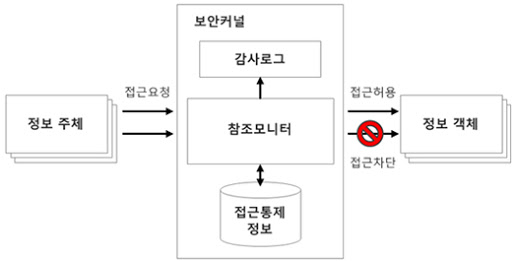

# 12. 보안 운영체제

- 의문
- 12.1 보안 운영체제 개요
- 12.2 보안 운영체제의 주요 제공 기능
- 12.3 보안 운영체제와 보안커널
- 12.4 trusted platform module

## 의문

## 12.1 보안 운영체제 개요

- 운영체제에서의 보안
  - 시스템의 자원을 외부의 침입으로부터 보호
- 보안 운영체제
  - 운영체제상에서 내재된 보안상의 결함으로 인해 발생 가능한 각종 해킹으로부터 시스템을 보호하기 위해 기존의 운영체제 내에 보안기능을 통합시킨 보안커널을 추가로 이식한 운영체제

## 12.2 보안 운영체제의 주요 제공 기능

### 보호 대상 및 방법

- 보호대상
  - 메모리
  - 보조기억장치 상의 파일 또는 데이터의 집합
  - 메모리상에서 실행 중인 프로그램
  - 파일들의 디렉터리
  - 하드웨어 장치
- 보호방법(구현 복잡도 순)
  - 물리적 분리
    - 사용자별로 별도의 장비만 사용하도록 제한
  - 시간적 분리
    - 프로세스가 동일 시간에 하나씩만 실행되도록 하는 방법
  - 논리적 분리
    - 각 프로세스에 논리적인 구역을 지정하는 방법
      - 구역 내에서는 자유, 구역 외는 매우 제한적인 동작만 가능
  - 암호적 분리
    - 내부에서 사용되는 정보를 외부에서는 알 수 없도록 암호화
  - 위의 분리는 다양한 조합으로 운용가능

### 파일시스템 보호

- 파일 보호 기법
  - 개요
    - 파일의 공용문제와 병행하여 고려되어야 함
      - 무작정 보호하기만 하면 자원 낭비가 생김
    - 무자격 사용자가 프로그램 무단 접근을 막기 위해 그 파일 소유자가 보호장치를 만들어 놓은 것
  - 방법
    - 파일 이름 명명
    - 패스워드
      - 각 사용자마다 서로 다른 패스워드를 제공하여 그 패스워드를 알아야만 파일을 이용할 수 있게 하는 방법
    - 암호화
      - 파일 내용 자체를 암호화하여 공유는 자유지만, 인가된 사용자만 그 내용 파악

## 12.3 보안 운영체제와 보안커널

### 보안 운영체제의 보안 기능

- 사용자 식별 및 인증
- 임의적(DAC, Discretionary Access Control)/강제적(MAC, Mandatory Access Control) 접근 통제
  - DAC(= Identity Based Policy)
    - 주체(프로세스, 스레드, 사용자)의 신분 기반 객체 접근 제한
      - 주체
        - 프로세스, 스레드, 사용자
      - 객체
        - 하드웨어 객체: CPU, 메모리, 프린터, 터미널, ...
        - 소프트웨어 객체: 데이터, 파일, 프로그램, 버퍼, ...
  - MAC
    - 객체의 비밀등급과 주체가 갖는 권한에 근거하여 객체에 대한 접근 제한
- 객체 재사용 보호
  - 1 사용자가 새로운 파일을 작성할 때 이를 위한 기억장치 공간이 할당됨
  - 2 할당되는 기억공간에는 이전의 데이터가 삭제되지 않고 존재하는 경우가 많은데, 이를 통해 비밀 데이터 노출 가능
  - 3 보안 운영체제에서는 재할당되는 모든 기억장치 공간을 깨끗하게 지워야 함
- 완전한 조정
  - DAC, MAC이 효과적이기 위해서는, 모든 접근을 통제해야 함
- 신뢰 경로(Trusted Path)
  - 패스워드 설정 및 접근 허용의 변경 등과 같은 보안 관련 작업은 '안전한 경로'라고 불리는 안전한 통신을 보안 운영체제가 제공할 수 있어야 함
- 감사 및 감사 기록 축소
  - 모든 보안 관련 사건은 audit log(감사 기록부)에 기록되어야 하고, 이는 명백히 보호되어야 함

### 보안 커널

- 개요
  - TCB내(Trusted Computing Base - OS, 하드웨어, 펌웨어, 소프트웨어 등이 포함된 컴퓨터 시스템 내의 총체적 보호 매커니즘)에 있는 하드웨어, 소프트웨어, 펌웨어로 구성되며, 참조 모니터 개념을 구현하고 집행
    - 주체와 객체 사이의 모든 접근과 기능을 중재
- 요구사항
  - 참조 모니터 개념을 수행하는 프로세스를 위해 *분리가 제공되고(무슨 소리)*, 프로세서는 변조를 방지할 수 있어야 함
  - 모든 접근 시도에 대하여 실행되어야 하고, 우회 불가능
    - 보안 커널은 완전하고 오류가 발생되지 않는 방식으로 구현되어야 함
  - 완전하고 포괄적인 방식으로 충분히 시험되고 확인되어야 함
- TCB(Trusted Computing Base)
  - 하나의 컴퓨터 시스템(하드웨어, 펌웨어, 소프트웨어)내의 모든 보호 메커니즘의 총체

reference monitor structure

- Reference Monitor(참조 모니터)
  - 정의
    - 주체의 객체에 대한 모든 접근통제를 담당하는 **추상머신**
      - 그것을 **구현** 한 하드웨어, 펌웨어, 소프트웨어로 구성된 것이 보안 커널
      - 이러한 보안 커널로 구성된것은 TCB
    - 승인되지 않은 접근이나 변경으로부터 객체를 보호
  - 규칙
    - 부정조작이 없어야 함
    - 항상 호출되어야 함
    - 모든 동작을 항상 분석과 테스트를 통해 확인 가능해야 함
  - 위반
    - 주체가 참조모니터를 거치지 않고 객체에 직접 접근하는 경우
  - 주체 권한 확인
    - SKDB(Security Kernel Database)를 참조하여 객체에 대한 접근허가 여부를 결정하여야 함

## 12.4 trusted platform module

### TPM(Trusted Platform Module)

- 개요
  - TPM은 TC의 구현을 위한 여러 헬퍼 연산을 지원하기 위한 모듈
    - 일반적으로, 하드웨어모듈이나, 소프트웨어로 구현되기도 함
- 특징
  - 1 tamper protected(훼손 방지)를 위해서 하드웨어칩으로 구현하는 것이 일반적이지만, 소프트웨어로 구현하기도 함
  - 2 칩으로 구현된 TPM은 소프트웨어 방식의 공격과 더불어 물리적인 도난의 경우에도 정보의 노출이 용이하지 않은 장점
  - 3 관련 연산
    - 암호화 키의 생성, 저장
    - 패스워드 저장
    - 무결성 검증
    - 디지털 인증서 관련 신뢰 연산 제공
- 서비스
  - 인증된 부트 서비스
    - 운영체제는 승인된 버전인가
  - 인증 서비스
    - TPM의 private key를 사용하여 설정 정보에 서명함으로써, 디지털 인증 생성 가능
  - 암호화 서비스
    - 특정 기계가 특정 설정으로 되어 있을 때만 그 기계에서 데이터의 복호화를 수행하는 방식으로 데이터 암호화 지원
