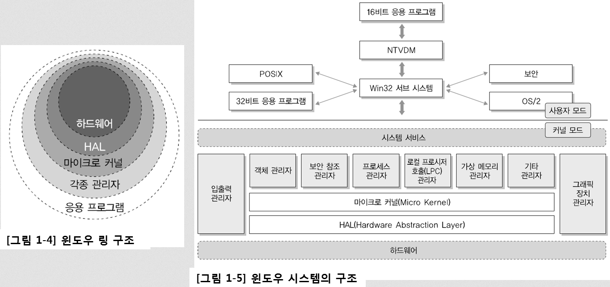
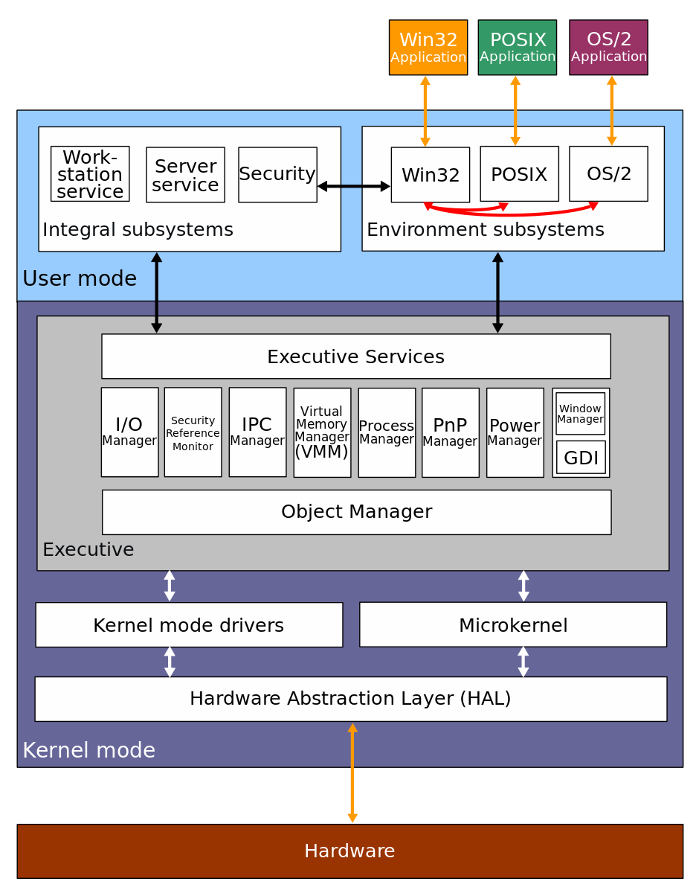
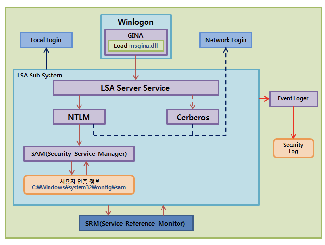

# 14. 윈도우 서버 보안

- 의문
- 14.1 윈도우 개요
  - 윈도우 시스템의 구조
  - 윈도우의 특징
  - 윈도우 파일 시스템
  - 윈도우 부팅 순서
- 14.2 윈도우 보안
  - 윈도우 설치
  - 윈도우 계정, 권한, 인증
  - 공유 자료 관리
  - 암호 기능 사용
  - 레지스트리 활용
  - 윈도우 방화벽
- 14.3 윈도우 서버 보안 설정
  - 계정 관리
  - 서비스 관리
  - 패치 관리
  - 보안 관리
- 14.4 윈도우즈 네트워크 서비스
  -

## 의문

## 14.1 윈도우 개요

### 윈도우 시스템의 구조

Windows 2000 Architecture

- 개요
  - 5개의 링으로 구분
    - Kernel Mode
      - 하드웨어
      - *HAL(Hardware Abstraction Layer)*
        - 드라이버 개발자와 하드웨어 개발자가 따라야 하는 기본 표준
      - *마이크로 커널*
      - *각종 관리자*
    - User Mode
      - 응용 프로그램
  - 참고
    - 윈도우를 사용할 때, 사용자 모드에 문제가 생기면, OS는 해당 응용프로그램 종료하여 문제를 해결
    - 커널에 문제가 생기는 경우, 메모리의 정보를 덤프하고 시스템 재시작함
  - NTVDM(NT Virtual Dos Machine)
    - 개요
      - 다른 os가 이미 존재할 때, 16-bit/32-bit DOS와 16-bit Windows 프로그램을 동작시킬 수 있는 기술

### 윈도우의 특징

|구분|설명|
|--|-----|
|GUI 환경|아이콘이라는 그림 명령을 통하여 쉽게 프로그램에 접근 가능|
|Plug & Play|하드웨어를 새롭게 추가하는 경우, 자동으로 인식하여 환경에 설정해 주는 기능(하드웨어가 Plug & Play를 지원하는 장치여야 함)|
|Short cut 아이콘(바로가기)|프로그램이나 데이터를 빠르고 편리하게 실행시키기 위해서 원하는 위치에 원본 파일을 연결한 아이콘 얻을 수 있음|
|멀티태스킹|한 번에 여러가지 작업 동시 수행|
|OLE(Object Linking Embedding)|프로그램 간에 개체(그림, 표 등) 교환 가능|
|네트워크 기능 향상|다양한 프로토콜을 제공하기 때문에 네트워크 설치나 인터넷 연결 등을 편리하게 할 수 있으며, *netbios* 프로토콜을 사용하여 네트워크 공유가 편리|
|다중 모니터 지원|한 대의 컴퓨터에 최대 8개의 모니터 연결 가능|
|정보의 전송 통합|두 개 또는 그 이상의 응용 프로그램에서 작업하여 상호간의 정보를 한 응용프로그램에서 다른 응용프로그램으로 전송 통합 가능(clipboard)|

### 윈도우 파일 시스템

- FAT16
  - 특징
    - 2^16개의 클러스터를 가질 수 있음
      - *1클러스터 32KB(근데 이게 volume에 따라서 유동적인 값?)*
      - 2GB(2^16 * 32 * 1024 = 2 * 1024 * 1024 * 1024)까지 한 파티션으로 사용 가능(즉, 최대 2GB까지 지원)
    - 너무 적음
- FAT32
  - 특징
    - 2^32개의 클러스터를 가질 수 있음
      - 1클러스터 4KB
    - 한 파일은 최대 4GB까지
    - 접근 제어 사용 불가
    - 현재도 종종 사용됨
- NTFS(NT File System)
  - 특징
    - *HotFixing기능*
      - 결함 관리, 보안에 훌륭
    - 접근 제어 가능
      - 암호화
      - 특정 계정의 사람이 언제 파일을 열거나, 열려다 실패했는지 Audit 기능 제공
  - 디스크 구조
    - MBR(Master Boot Record)
      - 정의
        - 물리적 디스크의 첫 번째 섹터에 위치하는 512B 크기의 영역
      - 구성
        - Boot code
        - Partition table
        - Signature
      - 운영체제가 부팅될 때, BIOS에 의해 POST(Power On Self Test)를 마친 후, MBR의 부트 코드를 호출하고, 부트 코드는 부팅 기능 파티션을 찾아 해당 파티션 VBR의 부트 코드를 호출하여 운영체제가 기동
    - VBR(Volume Boot Record)
      - 정의
        - 윈도우 부팅을 위한 기계어 코드와 볼륨 및 클러스터의 크기, MFT의 시작주소 등 설정 정보를 담고 있으며, 파티션의 가장 마지막 섹터에 VBR 백업본 존재
    - MFT(Master File Table)
      - 정의
        - 볼륨/파일시스템에 존재하는 모든 파일과 디렉터리에 대한 정보를 담고 있는 테이블
      - 구성
        - MFT 엔트리의 집합
        - 엔트리
          - 하나의 파일 또는 디렉터리에 대한 정보를 담고 있는 자료구조
          - 파일 위치, 시간, 크기, 이름 등 다양한 속성들로 구성
    - System File Area
      - MFT를 비롯해 파일 복사나 삭제 과정 중 시스템이 오류를 일으킬 때, 이를 복구하는 데 사용할 디스크 사용에 대한 로그 파일, 디스크 볼륨 이름 등 디스크 자체에 대한 정보를 담는 파일
    - File Area
      - 각 파일에 대한 실제 데이터가 저장
- 디스크 파괴형 악성 코드의 특징
  - 개요
    - MBR또는 VBR 영역을 훼손하여 컴퓨터가 정상적으로 부팅되지 않도록 하는 악성코드
  - 예시
    - MBR영역의 모든 값을 특정 문자나 랜덤한 더미 값을 덮어씌워 운영체제 부팅을 할 수 없도록 하거나, VBR영역을 훼손하여 파일 시스템 복구가 불가능하게 만듬
  - MBR 영역 훼손 복구
    - 부트 코드를 정상적인 디스크에서 복사하고, 각각의 파티션 정보를 수집하여 파티션 테이블을 완성함으로써 복구 가능
  - VBR 영역 훼손 복구
    - 파티션의 가장 마지막 섹터에 있는 VBR 백업본을 덮어써서 복구 가능
      - *공격자가 VBR 백업본 마저 공격한다면?*

|구분|FAT|NTFS|
|--|----|----|
|정점|- 호환성 우수 - 단순성 - 저용량 볼륨의 최적화|- 대용량 볼륨 지원 - 디스크의 효율적 사용 - 강력한 보안 기능 - 자동 압축 및 안전성 - 향상된 파일이름 저장 및 파일길이 지원|
|단점|- 보안 취약 - 대용량 볼륨의 비효율적|- Windows NT계열 운영체제 외에는 호환 불가 - 저용량 볼륨에서 FAT보다 속도 저하|

### 윈도우 부팅 순서

- 윈도우 XP, 윈도우 서버 2000/2003 부팅 순서
  - POST(Power On Self Test) 실행
    - 하드웨어 스스로 시스템에 문제가 없는지 기본 사항 검사
      - power supply, RAM, system bus 등등..
  - BIOS가 CMOS(Complementary Metal-Oxide Semiconductor)에 설정되어 있는 시스템 설정사항 및 부팅과 관련된 여러 가지 정보 읽어 시스템 적용
  - MBR(Master Boot Record) 로드
    - 부팅 매체에 대한 기본 파일 시스템 정보 로드
  - NTLDR(NT Loader) 실행
    - 부팅 파티션에 있는 프로그램으로, 부팅을 위한 간단한 파일 시스템 실행
    - `boot.ini` 파일 내용을 읽어 가능한 부팅 옵션 보여줌
  - NTDETECT.com 실행
    - NTLDR에서 제어권을 위임 받아 시스템에 설치
    - 하드웨어 검사
      - CPU유형, 버스 유형, 비디오 보드 유형, 키보드 마우스 종류, 컴퓨터에 장착되어있는 직렬 포트 병렬 포트, 플로피 드라이브 등
  - ntoskrnl.exe(NT OS Kernel) 실행
    - ntoskrnl은 `HAL.DLL`을 로드
- 윈도우 비스타, 2008, 7의 부팅 순서
  - POST(Power On Self Test) 실행
  - BIOS가 CMOS(Complementary Metal-Oxide Semiconductor)에 설정되어 있는 시스템 설정사항 및 부팅과 관련된 여러 가지 정보 읽어 시스템 적용
  - MBR(Master Boot Record) 로드
  - Windows Boot Manager 실행
    - bootmgr.exe가 실행되고, 부트 설정 데이터를 읽어 실행 가능한 운영체제의 목록 보여줌
  - 윈도우 OS 로더(Winload.exe) 실행
    - NTDETECT와 같이 각종 장치 드라이브 로드하고, ntoskrnl.exe 실행

## 14.2 윈도우 보안

### 윈도우 설치

- 윈도우 설치 시 주의사항
  - 파티션 나누기
    - 파티션
      - 하나의 물리적인 하드디스크에 논리적으로 분할 영역을 만드는 것
      - 하나의 하드디스크를 서로 별개의 하드디스크 처럼 쓰기 위해서 분할하는 것
    - 특징
      - 파티션을 나누면 서로 다른 드라이브로 인식
        - C드라이브에 심각한 오류가 발생해도 D드라이브에 있는 파일들은 안전하게 보존 가능
        - 윈도우를 2개이상 설치해서 사용하는 멀티부팅 가능

### 윈도우 계정, 권한, 인증

- 윈도우의 계정과 권한 체계
  - 기본 사용자와 그룹
    - 사용자
      - SYSTEM
        - 최고 권한을 가진 계정
        - 원격 접속 불가능
        - 사용자 로그인 불가능
      - Administrator
        - 사용자가 사용 가능한 계정 중 가장 강력한 권한을 가짐
      - Guest
        - 매우 제한적인 권한을 가진 계정
        - 기본 설정은 사용 불능
    - 그룹
      - Administrators
      - Account Operators
      - Backup Operators
      - Guests
      - Print Operators
      - Power Users
      - Replicator
      - Server Operators
        - 도메인 서버를 관리할 수 있는 권한을 가진 그룹
        - 로컬 로그인과 시스템 재시작 및 종료 권한 존재
      - Users
        - 도메인과 로컬 컴퓨터를 일반적으로 사용하는 그룹
        - 개개인에 할당된 사용자 환경을 직접 만들 수 있으나, 설정할 수 있는 항목에는 한계가 존재
          - 시스템 서비스 시작 및 종료 권한 없음
          - 디렉터리 공유 설정 불가
  - SID(Security Identifier)
    - 정의
      - 윈도우의 각 사용자나 그룹에 부여되는 고유한 식별번호
    - 확인
      - `whoami /user` 명령
    - 구조
      - `S-1-5-21-1801674531-839522115-1708537768-500`
        - S
          - SID
        - 1
          - revision number(SID 명세의 버전)
        - 5
          - Identifier authority value(48bits, 윈도우 보안 권한)
        - 21-1801674531-839522115-1708537768
          - Sub-authority value
          - 시스템의 고유한 숫자로, 시스템을 설치할 때, 시스템의 특성을 수집하여 생성
        - 500
          - relative ID
          - 기본적으로 생성되는 builtin 계정이 아니라면 1000보다 큰 숫자의 RID 생성
          - Administrator: 500
          - Guest: 501
          - 일반 사용자: 1000 이상 숫자
- *윈도우의 권한 상승*
  - 정의
    - 일반 권한의 사용자가 Administrator와 SYSTEM으로 실행되고 있는 프로세스의 권한을 빼앗는 것
  - 방법
    - **상위 권한으로 수행되고 있는 프로그램의 프로세스에 다른 작업 끼워넣기**
      - *이게 구체적으로 어떻게 가능한건지?*

윈도우 인증 서비스

- 윈도우 인증과 패스워드
  - 윈도우 인증의 구성요소
    - LSA(Local Security Authority = Security Subsystem)
      - 모든 계정의 로그인에 대한 검증
      - 시스템 자원 및 파일 등에 대한 접근 권한 검사(원격, 로컬)
      - 이름과 SID 매칭
      - SRM이 생성한 감사 로그 기록
    - SAM(Security Account Manager)
      - 사용자/그룹 계정 정보에 대한 데이터베이스를 관리
      - 로그인 입력 정보와 SAM 데이터베이스 정보 비교해 인증 여부 결정
      - `%systemroot%/system32/config/sam`에 존재
        - *system32와 같이 32는 무엇을 뜻하는가?*
    - SRM(Security Reference Monitor)
      - SAM이 사용자의 계정과 패스워드의 일치 여부를 확인하여 SRM에 알리면, SRM은 사용자에게 SID를 부여
      - SRM은 SID에 기반하여 파일이나 디렉터리에 대한 접근 을 허용할지 결정하고, 이에 대한 감사 메시지 생성

### 공유자료 관리

- 네트워크 드라이브의 이해
  - 정의
    - 대상 컴퓨터의 드라이브를 내 컴퓨터에서 네트워크 드라이브로 설정하여 내 컴퓨터의 드라이브처럼 사용할 수 있는 기능
  - 설정 방법
    - 내 컴퓨터에서 마우스 오른쪽버튼을 클릭하여 네트워크 드라이브 설정을 클릭
- 파일과 폴더의 보안권한 설정
  - 윈도우 파일/폴더 기본 권한 설정
    - 모든 권한
      - 디렉터리 접근 권한과, 서유권 변경 가능, CRUDX(X는 실행)
    - 수정
      - D
    - 읽기 및 실행
      - RX, 디렉터리나 파일 이동 가능
    - 폴더 내용 보기(폴더만)
      - 디렉터리의 파일이나 서브 디렉터리의 이름을 볼 수 있음
    - 읽기
      - R
    - 쓰기
      - 서브 디렉터리나 파일 C, 소유권이나 접근 권한의 설정 내용 확인 가능
  - 윈도우 표준 권한 할당하기
    - 파일/폴더 오른쪽 마우스 클릭 후 - 속성 - 보안 - 편집 버튼을 클릭해서 그룹 또는 사용자마다 권한 설정 가능
- 디렉터리 및 파일에 대한 접근 권한 설정
  - 규칙1: NTFS 접근 권한은 누적된다
    - e.g) 개별사용자가 여러 그룹에 속한 경우 그룹 A에서 읽기 권한, 그룹 B에서 쓰기 권한을 할당 -> 읽기 쓰기 권한 존재
  - 규칙2: 파일에 대한 접근 권한이 디렉터리에 대한 접근 권한에 우선한다
    - 파일이 더 구체적인 대상이므로 당연한것일지도
  - 규칙3: 허용보다 거부가 우선
    - 규칙1에서 허용과 거부 설정이 중첩되면, 거부가 우선
- 공유 자료 관리
  - 공유 폴더 숨기기
    - 공유 이름 끝에 `$` 기호를 붙임
    - 숨겨진 공유 폴더는 `net share`명령을 치면 됨
  - 윈도우 공유 폴더
    - `C$, D$` 등
      - 위와 같은 기본 공유 폴더를 통해서 인가받지 않는 사용자가 하드디스크 내의 모든 폴더나 파일에 접근 가능
    - `ADMIN$`
      - 윈도우 설치 폴더에 접근하는 관리 목적 공유 폴더
    - `IPC$`
      - *????*
      - *null session*
        - `net use \\ip \IPC$"" /u""`

### 암호 기능 사용

- EFS(Encrypting File System) - 폴더 및 파일 암호화
  - 윈도우 운영체제 Windows XP, Windows Server 2000 이상에서 개별 파일 또는 특정 폴더 안에 들어 있는 모든 파일을 암호화 할 수 있는 기능 제공
  - 파일이나 폴더의 속성 부분을 변경하여 사용할 수 있으며, 인증서 추가/삭제를 통해 EFS가 적용된 파일을 읽을 수 있는 사용자 추가/변경 가능
- BitLocker(볼륨 암호화)
  - Windows 7, Windows Server 2008 이상에서 제공하는 볼륨 단위의 데이터 암호화 기능
    - 볼륨 = 파티션
      - 하드디스크상의 저장소 영역
      - 예시
        - 하나의 하드 디스크가 C드라이브와 D드라이브라는 두개의 볼륨으로 파티션되어 사용됨
    - 컴퓨터 부팅에 필요한 부분을 제외하고 전부 암호화

### 레지스트리 활용

- 레지스트리 개요
  - 개요
    - 윈도우 시스템이 운영되는데 필요한 정보를 담고 있음
    - e.g)
      - 설치된 소프트웨어 정보
      - 환경설정
      - 임시 저장값
      - 등 시스템의 거의 모든 정보
- 레지스트리 편집기 실행
  - 개요
    - 사용자가 레지스트리 편집기를 이용해서 레지스트리 설정을 CRUD가능
    - 윈도우 부팅 시 하이브 파일에서 값을 읽어 들여 구성됨
      - *하이브 파일이 무엇인지*
    - 하이브 파일에서 직접 읽어 들여 구성되는 키를 Master Key라고 하고, Master Key로부터 값을 가져와서 재구성하는 키를 Derived Key라고 함
      - Master Key
        - HKLM(HKEY_LOCAL_MACHINE), HKU(HKEY_USERS)
      - Derived Key
        - HKCU(HKEY_CURRENT_USER)
        - HKCC(HKEY_CURRENT_CONFIG)
        - HKCR(HKEY_CLASSES_ROOT)
      - 위의 다섯가지키는 handle이라고 하며, registry의 root key라고도 함
  - registry root key
    - HKCR(HKEY_CLASSES_ROOT)
      - 시스템에 등록된 파일 확장자와 그것을 열 때 사용할 애플리케이션에 대한 맵핑 정보, 그리고 *COM(Component Object Model) 오브젝트(이게 뭐지)* 등록 정보를 저장
    - HKCU(HKEY_CURRENT_USER)
      - 현재 시스템에 로그인하고 있는 사용자와 관련된 시스템 정보를 저장
      - HKCU > HKU (우선순위)
        - HKCU의 키값이 변경되면 HKU키의 *보안 식별자에 해당되는 키의 내용도 바뀌게 됨(예시?)*
    - HKLM(HKEY_LOCAL_MACHINE)
      - 컴퓨터에 설치된 하드웨어와 하드웨어를 구동시키는 데 필요한 드라이버나 설정 사항에 관련된 정보를 갖고 있음
      - 루트키 중에서 가장 다양한 *하이브* 로 구성됨
      - 주요 서브키
        - `HKML\Hardware`
          - 하이브가 메모리에 위치
          - 부팅시 감지된 모든 하드웨어와 그 하드웨어 장치의 드라이버 매핑 정보들이 보관
        - `HKLM\SAM`
          - `%windows%\System32\Config\Sam`
          - 사용자의 패스워드, 소속 그룹, 도메인 정보와 그룹 정보를 갖음
            - SYSTEM 이외 접근 불가
        - `HKLM\Security`
          - `%windows%\System32\Config\Security`
          - 시스템 범위의 보안 정책과 사용자 권리 할당 정보를 가짐
            - SYSTEM 이외 접근 불가
        - `HKML\Software`
          - `%windows%\System32\Config\software`
          - 시스템 범위의 소프트웨어 목록과 그 환경 설정 정보가 저장
            - 환경 설정 정보에는 이름, 경로, 라이선스 정보, 만료 날짜 등이 포함
        - `HKLM\SYSTEM`
          - `%windows%\System32\Config\System`
          - 시스템이 부팅될 때 필요한 시스템 범위의 환경 설정 정보를 가짐
            - 로드할 device driver, 시작시킬 service 목록 등이 포함
          - 성공적으로 부팅됐을 때의 값을 복사본으로 만들어 두었다가, 시스템이 비정상적으로 종료 되었을 때 복사해둔 정보를 바탕으로 부팅할 수 있는 옵션을 사용자에게 제공
          - `HKLM\SYSTEM\Clone`
            - 메모리
    - HKU(KHEY_USERS)
      - 시스템에 있는 모든 계정과 그룹에 관한 정보 저장
      - 모든 계정의 프로파일이 있다는 것을 제외하고는 HKCU와 동일
      - 윈도우 사용하는 사용자가 한 명일 경우, 모든 설정 사항이 HKCU와 동일
      - HKCU에 저장된 정보 전체와 데스크톱 설정, 네트워크 연결등의 정보가 저장되어 있으며, `user.dat`에 그 내용을 저장
        - *즉, 모든 계정에 대해서 HKCU와 같은 데이터를 갖는다는 것인지?*
    - HKCC(HKEY_CURRENT_CONFIG)
      - 시스템이 시작할 때 사용하는 하드웨어 프로파일 정보를 저장
      - 레지스트리 부분에서 가장 단순한 곳이며, HKLM에 서브로 존재하는 config의 내용만을 담고 있음(디스플레이, 프린터)
- 레지스트리 보호
  - 레지스트리 access control
    - UAC(User Access Control)에 의해 일반 사용자는 관리자 암호를 모르면 레지스트리 편집기 사용 불가
  - 현재 레지스트리 상태 저장
    - 윈도우 시스템의 복원 기능 활용(snapshot)
  - 레지스트리 키 디스크에 복사
    - `.reg`파일에 저장하는 작업
    - 레지스트리 정보 관련 파일
      - `\Windows`, `\winnt`폴더의 `USER.DAT`, `SYSTEM.DAT` 파일로 저장
      - 윈도우의 모든 시스템 정보를 백업 및 복구하기 위해서, `USER.DAT`, `SYSTEM.DAT`, `SYSTEM.INI`, `WIN.INI`파일이 존재해야 함
- 레지스트리 공격
  - 개요
    - 악성 코드 감염 시 시스템에는 파일 생성 혹은 레지스트리 변경 등의 시스템 변화가 일어나기 때문에, 이러한 변화를 분석할 수 있다면 악성 코드 탐지 가능
  - 부팅 시 악성코드 실행
    - 시스템 재부팅 시 악성 프로그램을 구동시키기 위해 레지스트리 변조
      - HKLM, HKCU가 주로 공격에 사용됨
    - 디렉터리 위치
      - 개별사용자 지속용
        - `HKCU\Software\Microsoft\Windows\CurrentVersion\Run`
      - 개별사용자 일회용
        - `HKCU\Software\Microsoft\Windows\CurrentVersion\RunOnce`
      - 전체사용자 지속용
        - `HKLM\Software\Microsoft\Windows\CurrentVersion\Run`
      - 전체사용자 일회용
        - `HKLM\Software\Microsoft\Windows\CurrentVersion\RunOnce`
    - c.f)
      - RunOnce는 한 번만 실행되고 해당 항목은 자동으로 레지스트리에서 삭제됨. 드라이버 설치를 위해 반드시 컴퓨터 재부팅이 필요한 애플리케이션의 설치과정 등에서 사용
  - 특정 확장자 실행 시 악성코드 실행
    - HKCR 위치의 값을 공격자가 임의로 조작하여, 특정 확장자 실행 시에 원하는 악성 프로그램 실행시킬 수 있음
    - e.g)
      - EXE와 관련 있는 레지스트리 내용에 `hacker.exe`를 삽입하여 윈도우 프로그램 실행 시마다 `hacker.exe`를 구동하도록 함
      - 원본
        - `[HKEY_CLASSES_ROOT\exefile\shell\open\command]@="%1"%*`
        - `[HKEY_CLASSES_ROOT\exefile\shell\open\command]@=hacker.exe "%1"%*`

### 윈도우 방화벽(PC 방화벽) 설정

- 개요
  - PC 방화벽은 네트워크상의 웜이나 공격자로부터 PC를 보호하기 위해서 사용
- 특징
  - PC 방화벽은 PC 내부로 유입되는 패킷 뿐 아니라, 나가는 패킷까지 모두 차단하고, 사용자에게 해당 네트워크 패킷의 적절성 여부 확인
- 설정 방법
  - 제어판 - 관리도구 - 서버관리자 - 구성 - 고급 보안이 설정된 Windows 방화벽
    - Inboud, Outbound 규칙 설정

## 14.3 윈도우 서버 보안 설정

### 계정 관리

- Administrator 계정 이름 바꾸기
  - 관리자 계정을 Administrator로 설정한 경우, 로그인 시도 실패 횟수의 제한이 없음
- Guest 계정 상태
  - 불필요한 경우에는 사용못하게 막기
- 계정 잠금 임계값과 잠금 기간 설정
  - 계정 잠금 임계값 설정을 적용하여, 로그인 실패 횟수 제한해야 함
- 관리자 그룹에 최소한의 사용자 포함
- 암호와 패스워드 정책 설정

### 서비스 관리

- 공유 권한 및 사용자 그룹 설정
  - Everyone이 공유계정에 포함되어 있으면, 익명 사용자의 접근이 가능하므로, 디폴트 공유인 C$, D$, Admin$, IPC$ 등을 제외한 공유 폴더가 Everyone 그룹으로 공유가 금지되었는지 점검
    - 공유 디렉터리 접근 권한에서 Everyone 권한 제거 후 필요한 계정 추가
- 하드디스크 기본 공유 제거
  - 불필요한 공유 제거
    - C$, D$, Admin$ 과 같은 기본 공유는, 관리자가 네트워크상에서 시스템을 관리하기 위해 기본적으로 마련된 것으로, 관리상의 목적으로 사용하지 않는다면 제거해야 함
    - IPC$은 제거할 경우 특정 서비스가 실행되지 않을 수 있으므로, 제거하지 않음
    - 제거 방법
      - `HKLM\SYSTEM\CurrentControlSet\Services\lanmanserver\parameters\AutoShareServer(AutoShareWks)` 레지스트리 값을 0으로
  - Null Session 접근 차단 설정
    - 비인가된 사용자가 Null Session을 통해 사용자 인증을 거치지 않고 서버에 접근 시 시스템 내부로의 접근이 가능한 취약점이 존재하므로, 인정된 사용자만 접근할 수 있도록 설정
    - 방화벽, 라우터, 네트워크 고급설정 등에서 원천 차단 가능
- 불필요한 서비스 제거
  - 취약한 서비스들 리스트
    - Alerter
    - Clipbook
    - Messenger
    - Simple TCP/IP Services
- Anonymous FTP 금지
  - FTP 서비스는 계정과 패스워드가 암호화되지 않은 채로 전송되어 간단한 Sniffer에 의해서 스니핑이 가능하므로, 애초에 사용하지 않는게 좋음
  - 사용한다면, FTP Default 설정이 익명연결 허용을 차단하고, 특정 IP 주소에서 접속하도록 접근제어 설정을 적용해야 함

### 패치 관리

- 감사 정책에 따른 시스템 정책 설정
  - 감사 정책
    - 어떤 로그를 남길지 정의한 규칙
    - 감사 정책에 의해 지정한 이벤트 범주에 대해서만 로그가 남음
  - 감사 정책의 설정이 너무 낮으면, 보안 관련 문제 발생시 원인 파악이 힘듬
  - 감사 정책의 설정이 너무 높으면, 보안 로그에 불필요한 항목이 많이 기록됨
    - 시스템 성능 악화

### 보안 관리

- SAN 파일 접근 통제 설정
  - SAM 파일
    - 정의
      - 사용자와 그룹 계정의 패스워드를 관리하고, LSA(Local Security Authority)를 통한 인증 제공
      - 모든 사용자 계정 정보가 저장된 레지스트리의 핵심
  - SAM파일에 대한 패스워드 공격 시도로 인해 패스워드 데이터베이스 정보가 노출될 수 있으므로, Administrators 및 System 그룹 이외에는 SAM 파일에 대한 접근을 제한하여야 함
- 화면보호기설정
  - 사용자가 일정 시간 동안 아무런 작업을 수행하지 않는 경우, 자동으로 로그오프 되거나 워크스테이션이 잠기도록 설정

## 14.4 윈도우즈 네트워크 서비스

### 디렉터리 데이터베이스(Directory Database)

*정확히 어떤 개념인지 잘 모르겠다*

- Directory Database
  - 네트워크 디렉터리 서비스
    - 사용자들에게 리소스를 투명하게 제공. 사용자가 리소스의 정확한 위치와 접근하기 위한 단계를 알 필요가 없음
    - e.g)
      - LDAP
      - NDS
      - Microsoft Active Directory
  - Active Directory
    - 네트워크상의 개체에 대한 정보를 저장하며, 관리자와 사용자가 이 정보를 쉽게 찾아 이용할 수 있도록 함
    - 개체
      - 서버, 볼륨, 프린터 등의 공유 리소스와 네트워크 사용자 및 컴퓨터 계정 포함
  - Active Directory Server
