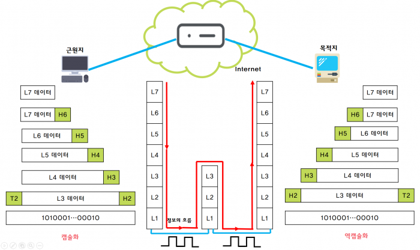

# 19. 네트워크 개요

- 의문
- 19.1 개요
  - 데이터 통신
    - 프로토콜
    - c.f) 통신
- 19.2 OSI 모델과 TCP/IP 프로토콜
  - OSI(Open System Interconnection) 모델
  - TCP/IP 프로토콜 그룹
  - 캡슐화와 역캡슐화
  - 주소 지정
  - 다중화와 역다중화

## 의문

- *source host에서 destination host로 데이터를 전송할 떄, transport 레이어에서만 segment로 데이터를 작게 분해하는가?*
  - *나머지 레이어에서는 데이터 분해 없이 단순히 헤더만 추가하는 것인가?*
- *TLS는 segment와 header와 payload중에 어느것을 암호화 하는것인가? 둘다?*
- *TLS는 MAC을 사용한다고 하는데, 정확히 어느타이밍에 어떻게 사용되는 것인가?*
  - secretkey는 어떻게 생성되는 것인가?

## 19.1 개요

### 데이터 통신

- 프로토콜
  - 기본 개념
    - 정보의 송/수신자 사이의 통신 규약
      - 신뢰성 있고, 효율적이고 안전하게 정보를 주고받기 위함
  - **주요 구성요소**
    - Syntax
      - **데이터의 큰 틀에서의 구조**
      - 데이터의 구조나 형식, 표현되는 순서
        - 비트는 2차원적 데이터이므로, 구조를 2차원적 순서로 나타냄
      - e.g)
        - 간단한 프로토콜에서 처음 8비트는 송신자의 주소를 의미하고, 두 번째 8비트는 수신자의 주소를 의미하며 나머지는 메시지를 의미
    - Semantics
      - **데이터의 각 분리된 영역에서의 의미 해석 방법론**
      - 비트의 영역별 의미
        - 특정 패턴을 어떻게 해석하고, 그를 기반으로 어떻게 동작하는지를 나타냄
    - Timing
      - 데이터를 언제 얼마나 빠른 속도로 전송할 것인가
      - e.g)
        - 송신자가 100Mbps로 데이터를 보내는데, 수신자가 1Mbps로 처리하게 되면 감당할 수 없을 정도로 많은 데이터가 전송되어 대부분의 데이터는 소실됨
- c.f) 코드
  - 정의
  - 종류
    - Unicode
      - 16비트
    - ASCII
      - 8비트

## 19.2 OSI 모델과 TCP/IP 프로토콜

### OSI(Open System Interconnection) 모델

- 개요
  - 개방 시스템 상호연결 모델
    - 서로 다른 특성을 갖는 컴퓨터 혹은 정보처리 기기 끼리도 상호 연결할 수 있는 시스템
    - 시스템 간의 통신을 제공하는 프로토콜의 집합
  - 참고
    - 각 레이어에는 Header가 존재하여 metadata를 명시
  - OSI 모델의 계층 구조
    - Application layer
      - 최상위 계층으로 사용자(사람 또는 소프트웨어)가 네트워크에 접속하는 것을 가능하게 함
        - 전자우편, 원격 파일 접속과 전송, 공유된 데이터베이스 관리, 분산 정보 서비스의 또 다른 유형과 같은 서비스 지원하고 사용자 인터페이스 제공
      - c.f) 소켓 통신
          - **일반적인 TCP 소켓통신을 하는 경우, TCP를 사용하기 때문에, 데이터를 바이너리 형태로 송수신 가능한 단계까지는 이르렀으나, Application layer의 protocol이 정의되지 않았다면, 해당 바이트를 어떻게 읽어야할지에 대한 정보가 없는것과 마찬가지**
          - 따라서 Application layer의 protocol을 정의하여 바이트 스트림에 대한 처리를 고심해야 함
    - Presentational layer
      - 송/수신자가 공통으로 이해할 수 있도록 정보의 데이터 표현방식을 바꾸는 기능
      - application layer로부터 데이터를 받아서 표준 포맷으로 변환
        - 프로토콜x
      - 암호화와 압축을 수행하여 세션 계층으로 내려 보냄
    - Session layer
      - 통신 시스템간에 상호대화를 설정하고 유지하고 동기화 함
    - Transport layer
      - 해당 계층을 기점으로 네트워크 서비스와 사용자 서비스로 구분 가능
      - End-to-End 통신 제어 담당
        - 초기 송신 컴퓨터의 응용프로그램 - 최종 수신 컴퓨터의 응용프로그램
    - Network layer
      - 송신자측에서 수신자측까지의 데이터를 안전하게 전달하기 위해, 논리적 링크를 설정하고, 상위 계층 데이터를 작은 크기의 패킷으로 분할하여 전송
    - Datalink layer
      - 물리 계층의 있는 그대로의 전송 설비를 신뢰할 수 있는 링크로 변환
      - 물리 계층에서 전송하는 비트에 대한 비트 동기 및 식별 기능, 흐름제어 기능, 오류제어 기능
      - MAC Address
        - 총 6바이트(48비트)
        - 24비트 업체코드
        - 24비트 제조번호
    - Physical layer
      - 데이터를 물리 매체상으로 전송하는 역할 담당
      - 물리적, 전기적인 인터페이스 규정에 초점을 둠

### TCP/IP 프로토콜 그룹

- 개요
  - 현재 인터넷에서 사용하는 프로토콜 그룹
- 계층 구조
  - Application layer
  - Transport layer
  - Network layer
  - Datalink layer
  - Physical layer
- 계층적 구조
  - source, destination은 5개의 계층 모두와 관련이 있음
    - source는 application layer에서 메시지를 생성하고, 그것을 아래 계층들에게 보냄으로써, 메시지가 물리적으로 목적지 호스트에 보내지게 함
    - destination은 물리 계층에서 통신을 받고, 그것을 다른 계층을 거쳐 응용 계층으로 전달
    - 라우터는 오직 3개의 계층과 관련됨
    - 스위치는 오직 2개의 계층과 관련됨

### **캡슐화와 역캡슐화**

캡슐화와 역캡슐화

- 개요
  - source host에서는 캡슐화
  - destination host에서는 역캡슐화
  - router에서는 캡슐화, 역캡슐화가 이루어짐

### 주소 지정

- 개요
  - TCP/IP 프로토콜을 이용한 인터넷은 3개의 서로 다른 계층의 주소가 사용됨
- 종류
  - Physical Address
    - datalink layer
    - 48bit
    - 홉에서 홉으로 갈 때마다 변경
  - Logical Address(IP)
    - network layer
    - 32bit
    - 홉에서 홉으로 갈 때마다 변경되지 않음
  - Port Address
    - transport layer
    - 16bit
      - 0 ~ 65535
    - destination host의 어떤 프로세스와 통신할 것인지 명시

### 다중화와 역다중화(Transport layer)

- 다중화
  - 여러 소켓으로부터 데이터를 수집하여 헤더를 붙여 전송
- 역다중화
  - 수신된 세그먼트를 올바른 소켓에 전달하는 것
