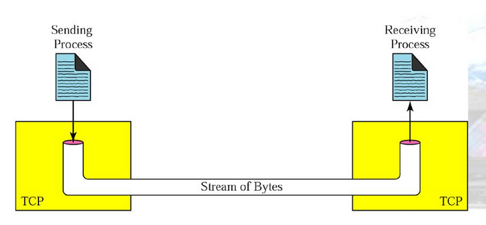
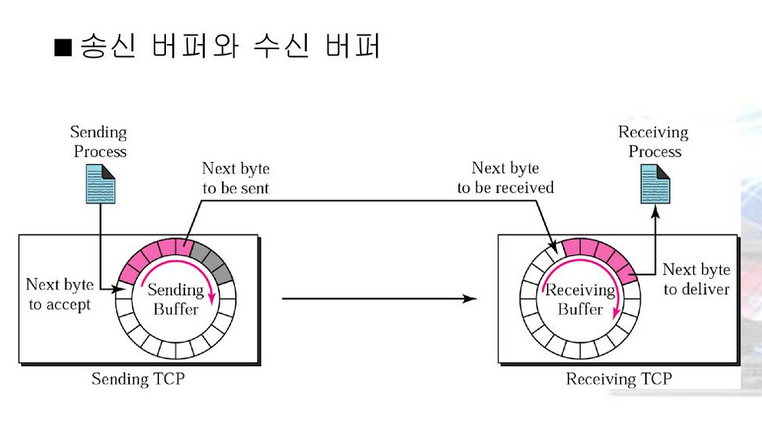

# TCP/IP

- 의문
- 20.1 Physical Layer
- 20.2 Datalink Layer
- 20.3 Network Layer
- 20.4 Transport Layer
- 20.5 Application Layer

## 의문

## 20.1 Physical Layer

### 물리 계층 개요

- 데이터와 신호
  - 개요
    - 데이터와 데이터를 표현하는 신호는 아날로그 또는 디지털 형태일 수 있음
- 아날로그와 디지털 데이터
  - 아날로그 데이터
    - 연속적인 정보
  - 디지털 데이터
    - 이산적 데이터

## 20.2 Datalink Layer

### 데이터링크 계층의 소개

- 노드와 링크
  - 데이터링크 계층에서의 통신은 node-node
    - 인터넷은 LAN과 WAN과 같은 많은 네트워크를 통해 전달
  - 링크는 노드와 노드 사이를 이어주는 네트워크 망
- 서비스
  - Framing
    - 네트워크 계층의 패킷을 프레임으로 캡슐화가 필요
  - Flow Control
    - 프로토콜에 따라 다름
  - Error Control
    - 오류 검출이 필요
    - 오류 검출 이후에 송신자 노드에서 이를 수정하거나 오류를 폐기하고, 재전송을 송신 노드에게 요청해야 함
  - Congestion Control
    - 대부분의 데이터링크 계층의 프로토콜은 혼잡제어를 사용하지 않음
    - 대신 인터넷 계층에서 많이 사용

## 20.3 Network Layer

### 네트워크 계층 개요

#### 네트워크 계층 서비스

- routing
  - 정의
    - 패킷이 source에서 destination으로 갈 수 있도록 경로를 지정해주는 것
- forwarding
  - 정의
    - 라우터상의 하나의 인터페이스에 패킷이 도착했을 때 라우터가 취하는 행동
    - 일반적으로 forwarding(routing) table을 이용해서 의사결정을 함
- IPv4 주소
  - 클래스 기반의 주소 지정
    - 더 이상 사용되지 않음(주소 고갈)
    - 주소 고갈 해결
      - network mask
        - 클래스에 할당된 ip의 마스크
      - subnet mask
        - 클래스의 내부에 할당된 서브넷의 마스크
  - 클래스 없는 주소 지정
    - CIDR
      - 개요
        - 클래스 A, B, C의 개념 무시
      - 특징
        - 주소 클래스가 없기 때문에, `byte.byte.byte.byte/n` 등으로 표현
  - 특수 주소
    - this-host address
      - 정의
        - `0.0.0.0`
        - 호스트가 IP 데이터그램을 보내려고 하지만, 근원지 주소인 자신의 주소를 모를 때 사용
          - ??
      - 특징
        - 서버의 관점에서는, local machine(서버가 동작하는)의 모든 IPv4 주소를 의미
          - `0.0.0.0`에서 서버가 listen하면, local machine이 `192.168.1.1`, `10.1.2.1`의 주소를 가질 때 두 IP주소로 접근 가능함
    - limited-broadcast address
      - 정의
        - `255.255.255.255/32`이며, 호스트나 라우터가 네트워크상의 모든 장치로 데이터그램을 보낼 때 사용됨
        - 네트워크 외부로 패킷을 보낼 수는 없음
    - loopback address
      - 정의
        - `127.0.0.1/8`이며, 이 블록 내의 주소를 가진 패킷은 호스트를 벗어나지 않고 호스트에 남음
        - 소프트웨어 테스트의 용도로 많이 사용됨
    - private addresses
      - 정의
        - 사설 주소에만 사용 가능한 라우팅이 불가능한 특수 주소 집합(public internet에 존재하지 않음)
      - 종류
        - class A
          - 24비트 블록
          - 10.0.0.0 - 10.255.255.255
        - class B
          - 20비트 블록
          - 172.16.0.0 - 172.31.255.255
        - class C
          - 16비트 블록
          - 192.168.0.0 - 192.168.255.255

### 네트워크 계층 프로토콜

- IP
- ARP
- ICMPv4

#### IP

- 개요
  - IPv4는 비신뢰적, 비연결형인 데이터그램 프로토콜로, 최선형 전송 서비스(best-effort delivery service)
    - 최선형의 의미는, IPv4 패킷이 훼손되거나 손실, 순서에 맞지 않게 도착, 지연 도착, 네트워크 혼잡 발생 가능성을 의미
  - 신뢰성이 중요한 경우 TCP 처럼 신뢰성 있는 전송 계층 프로토콜과 함께 사용해야 함
  - TCP/UDP, ICMP, IGMP 데이터는 IP 데이터그램을 사용하여 전송됨
  - **패킷을 도달시키면 장땡**
- IP 데이터그램
  - 정의
    - 패킷 교환망에서 취급되는 패킷의 일종(IP가 사용하는 패킷)
    - 발신 단말에서 수신 단말에 이르는 경로를 결정하기 위한 정보를 내부에 포함하는 패킷
- IPv4 데이터그램 형식
  - header
    - 20~60 bytes
    - source IP address, Destination IP address 등의 많은 필드 포함
  - payload
    - 데이터

#### 논리주소와 물리주소의 변환

- ARP(Address Resolution Protocol)
  - 개요
    - 호스트는 ARP 요청 메시지를 보낼 때 자신의 IP 주소, 자신의 MAC address, 수신자측 IP 주소는 알고 있지만, 물리 주소는 모르기 때문에 물리 계층 브로드캐스트를 통해 모든 호스트에게 패킷 전송
    - ARP 요청 메시지를 수신한 호스트 또는 라우터는 수신 IP 주소와 자신의 IP 주소를 검사하여, 자신에 대해 물리 주소를 요구하는 경우라면 ARP 응답 메시지를 전송
    - 각 시스템은 ARP Cache가 있고, 이 Cache에 정보를 저장해 둠(일정 시간 후 삭제 (보통 1-2분))
      - dynamic, static cache가 존재
  - ARP 메시지 종류
    - ARP 요청 메시지
      - 특정 IP 주소에 대한 물리 주소를 요구
      - 브로드캐스트
    - ARP 응답 메시지
      - 물리 주소 정보를 알림
      - 유니캐스트로 전송
      - 호스트가 라우터를 넘어서 다른 네트워크에 있으면, 라우터가 해당 호스트를 대신하여 응답 메시지 전송
- RARP(Reverse Address Resolution Protocol)
  - 개요
    - 물리주소에 해당하는 IP 주소를 얻고자 할 때 사용
    - 디스크와 같은 저장장치가 없는 호스트에서 주로 사용됨
      - RARP 응답은 RARP 서버에서 생성됨
- GARP(Gratuitous ARP)
  - 개요
    - Sender IP와 Target IP가 동일한 ARP 요청
    - 장비가 ARP 요청 브로드캐스트를 통해 다른 장비에게 네트워크에 있는 자신의 존재를 알리는 목적으로 사용되는 패킷
      - 이 패킷을 수신한 장비는 자신의 ARP Cache에 해당 정보가 있으면 이를 갱신
    - 자신의 MAC 정보를 동일 네트워크상의 다른 장비들에게 알려, ARP Cache를 갱신 하도록 하는 목적
  - 목적
    - IP 충돌 감지
      - 자신과 동일한 IP가 설정되어 있는 호스트가 있다면, 해당 호스트로부터 ARP 응답이 오기 때문에, 충돌 여부 확인 가능
      - 호스트 IP 변경 or 재부팅 시에 GARP 패킷이 생성됨
    - 상대방의 ARP Cache 정보 갱신
      - 이 패킷을 받은 쪽은 Sender IP를 인정하지 않고 Cache 정보를 갱신하게 되므로, MAC 정보가 위 변조가 될 수 있음

#### ICMPv4(Internet Control Message Protocol version 4)

*오류 보고 메시지로서의 ICMP는 실생활에서 어떻게 확인할 수 있으며, 무엇을 뜻하는건지? ping과의 관계는 무엇인지?*

- 개요
  - **호스트가 동작하고 있는지 확인**
  - **다른 호스트나 라우터로부터 정보를 획득하기 위한 프로토콜**
- 메시지
  - 종류
    - 오류 보고 메시지
      - 라우터나 호스트가 IP패킷을 처리하는 도중에 탐지하는 문제 보고
    - 질의 메시지
      - 호스트나 네트워크 관리자가 라우터나 다른 호스트로부터 특정 정보를 획득하기 위해서 사용
- 오류 보고 메시지
  - 개요
    - IP 데이터그램의 프로세싱 동안 발생하는 오류 보고(오류 수정x)
      - 오류 수정은 상위 프로토콜에 맡김
    - 오류 메시지는 source node로 보내짐
  - 중요한 점
    - 어떠한 ICMP 오류 메시지도 ICMP 오류 메시지를 운반하는 데이터그램의 응답으로 생성x
    - 어떠한 ICMP 오류 메시지도 처음 단편이 아닌 단편 데이터그램을 위해서 생성되지 않음
    - 어떠한 ICMP 오류 메시지도 멀티캐스트 주소를 가진 데이터그램을 위해 생성되지 않음
    - 어떠한 ICMP 오류 메시지도 127.0.0.1 혹은 0.0.0.0과 같은 특수한 주소를 가진 데이터그램을 위해서 생성되지 않음
  - 타입별 분류
    - 목적지 도달 불가 - Type 3
    - 근원지 억제 - Type 4
      - 송신자에게 네트워크에 충돌이 발생해서 데이터그램이 폐기됨
    - 재지정 메시지 - Type 5
      - 발신자가 메시지를 전송하기 위해 잘못된 라우터를 사용할 때 사용되는 메시지
    - 시간 경과 메시지 - Type 11
      - 타임아웃이 발생해서(TTL) IP 패킷이 폐기되었음을 알리는 메시지
      - code 0
        - IP 패킷이 최종 목적지에 도달하기 전에 TTL 값이 0이 되어 해당 패킷이 폐기됨
      - code 1
        - 패킷 재조합 과정에서 타임아웃이 발생
    - 매개변수 문제 - Type 12
      - 데이터그램 헤더에 문제가 있거나, 어떤 옵션이 없거나, 옵션의 의미를 알수 없는 경우
- 질의 메시지
  - ping등의 도구를 사용해서, 인터넷에서 호스트나 라우터가 활성화되었는지를 알아보거나, 두 장치 사이의 IP 데이터그램이 단방향 시간인지 왕복시간인지 찾음

### IPv6

- 개요
  - 32비트 주소길이를 4배 확장한 128비트 주소 길이 사용
  - 인터넷 자원 고갈 문제 해결 가능
  - 예시
    - `2001:0db8:0000:0000:0000:8a2e:0370:7334`
      - `(2^4 * 2^4 * 2^4 * 2^4)^8`의 경우의 수
- 특징
  - 확장된 주소 공간
    - IPv4의 주소 부족 문제 해결 가능
    - NAT과 같은 변환 기술 불필요
    - *주소 할당 방식은 유니캐스트, 애니캐스트, 멀티캐스트 주소 형태로 이루어짐*
  - 새로운 헤더 포맷
    - 헤더 고정 길이로 변경
    - 패킷을 보내기 이전에 전송에 적합한 패킷크기를 알아내는 경로 MTU(Maximum Transfer Unit)탐색 기능 추가
    - 체크섬 필드 삭제
      - 이미 데이터링크 계층에서 계산이 행해짐
  - 향상된 서비스 자원
    - 트래픽을 효과적으로 분류 가능(Quality Of Service)
  - 보안 기능
    - IPv4는 IPSec 이라는 보안 관련 프로토콜을 별도로 설치해야 함(add-on)
    - IPv6에서는 프로토콜 내에 보안 관련 기능 탑재
      - 인증 절차, 데이터 무결성 보호, 메시지 발신지 확인기능 제공
    - IPv6의 표준 확장 헤더를 통하여, 네트워크 계층에서의 종단간 암호화 제공하여 패킷에 대한 변조 방지 가능
- 주소 공간
  - 개요
    - 2^128 개의 주소 공간을 갖음
  - address 종류
    - unicast address
      - 단일 인터페이스(컴퓨터, 라우터) 정의
      - 특정 컴퓨터에게만 전송
    - anycast address
      - 단일 주소를 공유하는 컴퓨터의 집합으로 정의하지만, 애니캐스트 그룹 내의 가장 짧은 경로를 가지는 구성원에게만 패킷 전송
    - multicast address
      - 멀티캐스트 컴퓨터 그룹의 모든 구성원에게 패킷 전송(복사본)
      - 브로드캐스트는 존재하지 않고, 멀티캐스트가 그 역할을 대신함

### IPv4에서 IPv6로 변환

- 전략
  - dual stack
    - 모든 호스트가 이중 스택을 사용하여, IPv4, IPv6을 동시에 지원
  - tunneling
    - IPv6을 사용하는 두 호스트가 통신하는 경우, 패킷의 경로에서 IPv4를 사용하는 경우, IPv4헤더를 추가해서 캡슐화하고 그 경로를 빠져나오면 역캡슐화 함
  - header translation
    - 송신자가 IPv6을 사용하고, 수신자가 IPv4를 사용하는 경우, 중간에 IPv6헤더를 아에 IPv4 헤더로 변환해야 함

## 20.4 Transport Layer

### UDP(User Datagram Protocol)

- 개요
  - 비연결형, 신뢰성이 없는 전송 프로토콜
    - 확인응답이 없음
  - 호스트간 통신 대신에, 프로세스 간 통신을 제공하는 것을 제외하고는 IP 서비스에 어떠한 것도 추가하지 않음
  - 최소한의 오버헤드를 가진 매우 간단한 프로토콜
  - user datagram이라고 불리는 UDP 패킷은 각각 2바이트(16비트)인 4개의 필드로 만들어진 고정된 크기의 8바이트 헤더를 갖고 있음
- UDP 서비스
  - 프로세스 대 프로세스 통신
    - 소켓 주소(IP 주소 + 포트 번호)를 이용하여 프로세스 대 프로세스 통신 제공
  - 비연결형 서비스(connectionless service)
    - UDP에 의해 보내지는 각 사용자 데이터그램은 독립된 데이터그램
    - 즉, 소켓 주소로 데이터그램을 계속해서 보내도, 그 데이터그램 끼리는 관련이 없음
  - 흐름 제어(flow control)
    - 정의
      - 송신 측과 수신 측의 데이터 처리 속도 차이를 해결하기 위한 기법(송신측이 수신측보다 더 빠를경우)
        - source throughput, dest throughput
    - 없음
  - 오류 제어(error control)
    - checksum 제외 하고는, 오류 메커니즘 없음
      - checksum에서 오류가 검출되었으면, 사용자 데이터그램이 아무런 동작 없이 제거
  - 혼잡 제어(congestion control)
    - 정의
      - 송신측의 데이터 전달과 네트워크의 처리 속도 차이를 해결하기 위한 기법(특정 라우터에 데이터가 몰릴 경우, 네트워크 혼잡을 피하기 위해서 송신측에서 보내는 데이터 전송 속도 강제로 줄이게함)
        - source throughput, network throughput
    - 비연결 프로토콜이므로, 혼잡 제어 없음
  - *다중화와 역다중화*
    - 호스트에서 단지 1개의 UDP가 있으나, UDP 서비스를 사용하기 원하는 다수의 프로세스가 있을 수 있음
      - 정확히 무슨 의미인지?
- 응용
  - 흐름 및 오류 제어를 하지 않는 간단한 request-response 통신을 요구하는 프로세스에 적당
    - FTP와 같은 대량 데이터를 전송할 필요가 있는 프로세스에는 사용되지 않음
  - 내부 흐름 및 오류 제어 기법을 가진 프로세스에 적당함
  - *UDP는 멀티캐스팅을 위한 전송 프로토콜*
    - 왜죠?
  - SNMP(Simple Network Management Protocol)와 같은 관리 프로세스를 위하여 사용됨
  - RIP(Routing Information Protocol)과 같은 경로 갱신 프로토콜을 위하여 사용됨
  - 수신 메시지의 영역 사이에서 불평등한 지연을 인내할 수 없는 상호작용적 실시간 응용에 사용됨

### TCP(Transmission Control Protocol)

TCP 스트림 전송 서비스

TCP 송신 및 수신 버퍼

- TCP 서비스
  - 프로세스-대-프로세스 통신(process-to-process communication)
    - port번호를 사용하여 프로세스 간 통신을 제공
  - 연결-지향 서비스(순서제어)
    - 논리적(가상적) 연결
    - 데이터의 전송순서 보장
  - 신뢰성 있는 서비스
    - 데이터의 안전하고 확실한 도착을 확인하기 위하여 확인응답 기법사용
      - 전송 실패가 일어난 경우 재전송을 함
    - 특징
      - 패킷이 목적지에 도달될 떄마다 ACK 수신
      - 핸드 셰이킹 과정 수행
      - 패킷 내에 순서번호를 사용하여 각 패킷이 순차적으로 수신되도록 함
  - 스트림 전송 서비스(Stream Delivery Service)
    - TCP에서 송신 프로세스는 바이트의 흐름으로 데이터를 전달하고 수신 프로세스도 바이트의 흐름으로 데이터를 수신하도록 만듬
    - 인터넷으로 데이터를 운반하는 가상의 튜브에 의해 2개의 프로세스가 연결되는 것처럼 보이는 환경을 만듬
  - 송신 및 수신 버퍼
    - 송신 및 수신 프로세스가 똑같은 속도로 데이터를 만들고 처리할 수 없기 때문에, TCP는 저장을 위해서 버퍼가 필요
    - 각 방향을 위해 송신 및 수신 두 가지 버퍼가 존재
      - 버퍼는 TCP 흐름 및 오류 제어 기법에 사용됨
  - 전이중 통신(full-duplex service)
    - 데이터는 동시에 양방향으로 전달 가능
    - 세그먼트는 양방향으로 이동
  - 다중화와 역다중화
    - 각 프로세스 쌍을 위해서 연결을 설정하는 것이 필요

TCP vs UDP

|서비스|TCP|UDP|
|----|---|----|
|신뢰성|패킷이 그들의 목적지에 도달했는지 확인하며, 패킷이 도달될 때 마다 ACK를 수신하기 때문에 신뢰성 있는 프로토콜|ACK를 보내지 않으며, 패킷이 그들의 목적지에 도달되는 것을 보장하지 않기 떄문에 신뢰성이 없는 프로토콜|
|연결|연결지향적, 핸드셰이킹 과정을 수행하고 목적지 컴퓨터와 함꼐 가상연결 형성|비연결지향적, 핸드셰이킹 과정을 수행하지 않으며, 가상연결도 형성하지 않음|
|패킷 순서|패킷 내에 순서번호를 사용하여, 순차적 수신을 보장|순서 번호 없음|
|혼잡 제어|destination node는 source node의 너무 많은 데이터 전송으로 인해 처리가 어렵거나 전송속도가 느려질 경우 이를 통보함|x|
|사용|신뢰성 있는 전송이 필요할 때 사용됨|스트리밍 비디오와 브로드캐스트 등 신뢰성이 있는 전송이 불필요할 때 사용됨|
|속도와 오버헤드|상당한 양의 자원을 사용하여 UDP보다 느림|더 적은 자원을 사용하고 TCP보다 빠름|

### 세그먼트

- 개요
  - TCP에서의 패킷
  - 20 ~ 60 바이트의 헤더와 응용 프로그램으로부터 온 데이터로 구성
    - 선택항목이 있으면 20바이트
    - 선택항목이 없으면 60바이트
- 헤더
  - source port - 16bits
  - destination port - 16bits
  - sequence number - 32bits
  - acknowledgement number - 32bits
    - 세그먼트의 송신자가 다른 쪽으로부터 받기를 기대하는 바이트 번호를 정의함
    - 세그먼트 수신자가 상대방으로부터 바이트 번호 x를 성공적으로 수신하였다면, x+1이 확인응답 번호가 됨
  - header length - 4bits
    - TCP 헤더를 4바이트 단위의 개수로 나타낸 것
  - control
    - 6개의 다른 제어 비트 또는 플래그 비트를 정의함

컨트롤 비트

|플래그|의미|설명|
|-----|----|----|
|URG|긴급|'1'로 설정되면 => 세그먼트에 우선순위가 높은 데이터가 있다는 뜻이며 긴급 포인터 필드값을 활용|
|ACK|승인|'1'로 설정되면 => 세그먼트가 승인을 포함. 승인번호 필드값은 세그먼트의 목적지가 다음에 보내야 할 순서 번호를 가리킴|
|PSH|밀어넣기|세그먼트의 송신 장비가 TCP 밀어넣기 기능을 사용했으므로, 세그먼트를 받는 즉시 애플리케이션으로 송신하라는 뜻|
|RST|초기화|송신 장비에 문제가 발생햇으니 연결을 초기화 해야한다는 뜻|
|SYN|동기화|순서 번호를 동기화하고 연결 수립을 요청하는 세그먼트이다. 순서 번호 필드는 세그먼트를 송신하는 장비의 ISN을 가짐|
|FIN|종료|세그먼트의 송신 장비가 연결 종료를 요청한다는 것|

- 헤더 이어서
  - window size - 16bits
    - 수신버퍼의 여유 공간 크기를 의미(수신측에서 송신측에 보내는 Receiver window size)
  - checksum - 16bits
    - TCP는 UDP와 다르게 필수사항
  - urgent pointer - 16bits
    - 긴급 플래그 값이 설정된 경우에만 유효

### TCP 연결

- 개요
  - TCP는 연결 지향 전송 프로토콜로 source와 destination node 사이에 가상 경로를 설정. 한 메시지에 속하는 모든 세그먼트는 이 가상 경로를 통해서 전송됨
  - 연결 설정, 데이터 전송, 연결 종료 3단계를 필요로 함
- 연결 설정
  - 과정(3way handshaking)
    - Client가 SYN 플래그만 설정되어 있는 첫 번째 세그먼트인 SYN 세그먼트 전송(순서 번호 동기화)
      - 순서 번호 1개 소비
    - Server는 2개의 플래그 비터가 설정된 SYN + ACK 세그먼트를 전송
      - 데이터 운반(x)
    - Client가 세 번째 ACK 세그먼트 전송
      - ACK 플래그와 확인응답 번호 필드를 사용하여 두 번째 세그먼트를 수신한 것에 대한 확인 응답. 데이터를 운반하지 않으면 ACK 세그먼트는 순서번호 소비x
- 데이터 전송
  - 연결이 설정된 후에 양방향으로 데이터 전송이 발생. 클라이언트와 서버 모두 데이터 확인 응답을 보낼 수 있음
  - 클라이언트에 의해 보내진 데이터 세그먼트에는 서버 TCP가 데이터가 수신되자마자 서버 프로세스에게 데이터를 전달하는 것을 알도록 PSH 플래그가 설정되어 있음
  - 서버로부터 온 세그먼트는 밀어넣기 플래그를 설정하지 않음
- 연결 종료
  - 3way handshaking or 4way handshaking
    - 데이터를 교환하는데 참여한 양쪽(클라이언트 or 서버) 중 어느 한쪽에서 연결 종료 가능
  - 과정(three-way handshaking)
    - 클라이언트 TCP는 클라이언트 프로세스로부터 종료 명령을 수신한 후에, FIN 플래그가 설정된 첫 번째 FIN 세그먼트 전송
    - FIN 세그먼트를 수신한 후에 서버 TCP는 상황에 대한 처리를 알리고 클라이언트로부터 온 FIN 세그먼트 수신에 대하여 확인하며, 동시에 다른 방향으로는 연결 종료를 알리기 위하여 두 번쨰 세그먼트(FIN+ACK)를 송신
    - 클라이언트 TCP는 TCP 서버로부터 FIN 세그먼트 수신에 대한 확인으로 마지막 세그먼트인 ACK 세그먼트 전송
- 절반-폐쇄
  - 정의
    - TCP에서 데이터를 받고 있는 도중에도 한쪽 끝은 데이터 전송을 중단하는 것
  - 과정
    - 클라이언트는 FIN 세그먼트를 전송함으로써 연결을 절반-폐쇄 함.
    - 서버는 ACK 세그먼트를 송신함으로써 절반-폐쇄를 받아들임
      - 여전히 서버는 데이터를 송신 가능
    - 서버가 처리된 모든 데이터를 보냈을 때, ACK에 의해 확인 응답되는 FIN 세그먼트가 전송
    - 연결에 대한 절반-폐쇄 후에 데이터는 서버에서 클라이언트로 이동할 수 있고, 확인응답은 클라이언트에서 서버로 이동할 수 있음
      - 클라이언트는 더 이상 어떠한 데이터도 서버로 전송 불가능
- 연결 재설정
  - 한 종단의 TCP가 연결 요구를 거부할 수도 있고, 현재 연결을 중지하거나 혹은 유휴 연결을 종료할 수도 있음
  - 이런 모든 것은 RST(재설정) 플래그를 가지고 수행됨

## 20.5 Application Layer
