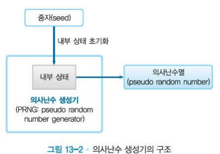

# ch7 키, 난수

- 의문
- 7.1 키
  - 개요
  - 종류
  - 패스워드를 기초로 한 암호
- 7.2 난수
  - 용도
  - 성질
  - 의사 난수 생성기

## 의문

## 7.1 키

### 개요

- 정의
  - 암호기술(대칭키 암호, 공개키 암호, 메시지 인증 코드, 전자서명)에 사용되는 대단히 큰 수
- 특징
  - key-space의 크기가 클 수록 무차별 공격에 강함
    - 키 공간의 크기는 키의 비트 길이로 정해짐
  - 키 == 평문
    - 키가 넘어가는 것은 평문이 넘어가는 것과 같음

### 종류

- 세션키와 마스터키
  - 세션키
    - 통신 때마다 한 번만 사용되는 키
      - 세션이 개시될 때 할당되고, 세션이 종료되면 폐기되는 동적인 대칭키
    - e.g) https의 평문을 암호화 하는 키
  - 마스터 키
    - 통신 때마다 반복적으로 사용되는 키
- CEK와 KEK
  - CEK(Contents Encrypting Key)
    - 콘텐츠를 암호화 할 때 사용되는 키
  - KEK(Key Encrypting Key)
    - 키를 암호화하는 키

### 패스워드를 기초로 한 암호(PBE - Password Based Encryption)

- salt
  - 정의
    - 의사 난수 생성기를 통해 만들어지는 랜덤한 수로, 키(KEK)를 만들 때, 패스워드와 함께 일방향 해시함수에 입력됨
  - 특징
    - 사전공격 또는, 레인보 테이블을 이용한 공격을 막기 위해 존재
  - *서버에서 패스워드 관리할때, salt를 사용하는 경우, 그럼 salt는 서버 단위로 동일한 값인가? 단지 그것을 생성할때 의사 난수를 사용하는 것이고*
    - 아니다. 각 계정마다 다른 salt값이 사용자 계정 테이블에 해시와 같이 저장되어야 한다.

## 7.2 난수

### 용도

*각 내용 마다 정확히 난수가 어떤 타이밍에 어떤 이유로 사용되는지?*

- 키의 생성
  - 대칭키 암호, 메시지 인증 코드
- 키쌍의 생성
  - 공개키 암호, 전자서명
- 초기화 벡터의 생성
  - 블록 암호 모드인 CBC, CFB, OFB
- nonce(비표)의 생성
  - 재전송 공격방지나 블록 암호의 CTR모드
- salt 생성
  - 패스워드 기초 암호화(PBE)
- 일회용 패드
  - 패딩에 사용되는 열을 생성

### 성질

- 무작위성
  - 통계적 편중(x)
- 예측 불가능성
  - 과거의 수열로 다음 수를 예측(x)
- 재현 불가능성
  - 같은 수열을 재현할 수 없고, 재현하기 위해서는 수열 그 자체를 보존해두는 수밖에 없음

엄격한 조건

재현 불가능성 > 예측 불가능성 > 무작위성

- 예측 불가능성은 재현 불가능성의 필요 조건
- 무작위성은 예측 불가능성의 필요 조건

### 의사난수 생성기

의사난수 생성기의 구조

- 개요
  - 소프트웨어만으로는 진정한 난수를 생성할 수 없기 때문에 의사 난수 생성기라 부름(PRNG, Pseudo Random Number Generator)
- 구조
  - Seed
    - state initializing에 사용되는 외부 값
  - State
    - 의사난수 생성기가 관리하고 있는 메모리값
