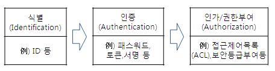

# ch8 접근통제 개요

- 의문
- 8.1 접근통제 개요
  - 정의
  - 절차
  - 요구사항

## 의문

## 8.1 접근통제 개요

### 정의

- 정의
  - **주체(외부에서 접근하는 사람, 시스템)가 객체(시스템)에 접근할 때 보안상의 위협, 변조 등과 같은 위험으로부터 객체와 제반 환경을 보호하기 위한 보안대책**
    - 대부분의 조직에서는 identification, authentication, authorization의 3단계 원칙으로 시스템 구성
      - 최근에는 accountability(책임 추적성)도 추가됨
        - 시스템에 접근한 주체가 시스템에 어떤 행위를 하고 있는지를 기록함으로써, 문제 발생시 원인 및 책임 소재를 파악하기 위한 목적으로 개발
  - 주체 별 대응
    - 비인가된 사용자
      - 정보 사용 방지
    - 인가된 사용자
      - 비인가된 방식으로 정보 자산을 접근하는 행위 방지
      - 인가된 방식으로 정보 자산을 실수로, 의도적으로 잘못 접근하여 훼손하는 행위도 방지
- 용어
  - 주체(행위자 - subject)
    - **객체나 객체 내의 데이터에 대한 접근을 요청하는 능동적인 개체**
      - 사용자, 프로그램 혹은 프로세스 등
        - 작업 수행을 위해 객체에 접근
  - 객체(제공자 - object)
    - **접근대상이 될 수동적인 개체 혹은 행위 일어날 아이템**
      - 컴퓨터, 데이터베이스, 파일,, 컴퓨터 프로그램, 디렉터리 등
  - 접근
    - **주체와 객체 사이의 정보 흐름**
      - 읽고, 만들고, 삭제하거나 수정하는 등의 행위를 하는 주체의 활동

### 절차

접근통제 절차

- Identification(식별)
  - 설명
    - 본인이 누구라는 것을 시스템에 밝히는 것
      - 책임 추적성 분석에 중요한 자료가 됨
  - 접근 매체
    - 사용자명
    - 계정번호
    - 메모리카드
- Authentication(인증)
  - 설명
    - 주체의 신원 검증을 위한 증명 활동
    - 본인임을 주장하는 사용자가 그 본인이 맞다고 시스템이 인정해주는 것
  - 접근 매체
    - 패스워드, PIN
    - 토큰, 스마트카드
    - 생체인증(지문 등)
- Authorization(인가)
  - 설명
    - 인증된 주체에게 접근을 허용하고, 특정 업무를 수행할 권리를 부여하는 과정
      - Need-to-know: 주체에게 어떤 정보가 유용할지 여부와 관계가 있는 공인된 형식상의 접근 수준
  - 접근 매체
    - ACL(접근 제어 목록 - Access Control List)
    - 보안 등급
- 최근에는 Accountability도 추가

### 요구사항

- Input reliability(입력의 신뢰성)
  - 접근 제어 시스템은 입력되는 사용자 정보를 신뢰할 수 있어야 함
    - 사용자 인증 기능이 전단에 존재함을 전제
- Least Privilege(최소 권한 부여 = need to know)
  - 접근 제어 시스템은 사용자가 작업을 수행하는데 필요한 최소한의 자원과 자원에 대한 최소한의 접근 권한을 부여하도록 구현되어야 함
- Separation of Duty(직무 분리)
  - 한 개인이 전체 업무를 파괴하는 사고를 방지하기 위해 시스템 기능의 단계를 다수의 개인들에게 나누어야 함
  - 업무의 발생부터 승인, 수정, 확인, 완료 등이 처음부터 끝까지 한 사람에 의해 처리될 수 없게 하는 보안 정책
    - 공모를 하면 깨지나, 직무순환을 통해 해결 가능
