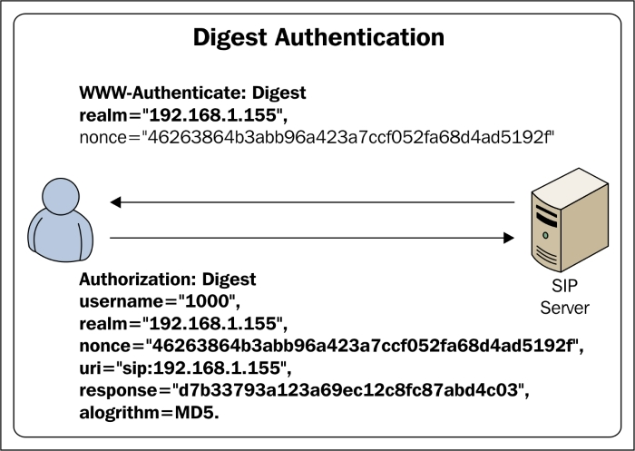
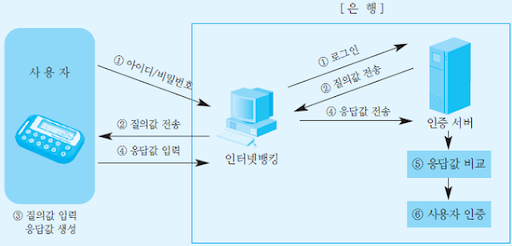
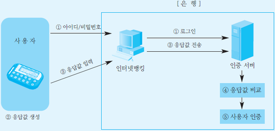

# 9. 사용자 인증

- 의문
- 9.1 인증
- 9.2 사용자 인증 기법
  - 9.2.1 지식 기반 인증
  - 9.2.2 소유 기반 인증
  - 9.2.3 생물학적 기반 인증
- 9.3 통합 인증 체계

## 의문

## 9.1 인증

### 메시지 인증

- 정의
  - 전달되는 메시지의 integrity 보호하기 위한 보안 기법
    - 메시지 CUD 여부 확인
- 방식
  - 암호화
  - MAC
  - 해시 함수 이용 방식

### 사용자 인증

- 정의
  - 사용자 간에 상대의 신분을 검증하는 것(정말 그 ID가 맞는지)
- c.f) 개인 식별
    - 사용자 A가 사용자 B와 협조하여 사용자 A가 본인임을 확인할 수 있으나, 제3자 C가 A로 가장하거나, B가 다른 제3자 D에게 사용자 A로 가장할 수 없는 경우
      - 사용자 인증은 B가 A로 가장할 수 있음
      - *이 케이스에서 B는 웹 서버라고 할 수 있는가?*
- 유형
  - Type1: 지식
    - Something you know
    - e.g)
      - password
      - PIN
  - Type2: (물리적)소유
    - Something you have
    - e.g)
      - token
      - smart card
  - Type3
    - 존재
      - Something you are
      - e.g)
        - 지문
    - 행위
      - Something you do
      - e.g)
        - 서명, 움직임
  - Two Factor
    - 위 타입 중에서 두 가지 인증 메커니즘을 결합하여 구현
  - Multi Factor
    - 위 타입 중에서 세 가지 이상의 인증 메커니즘 사용
  - 최근에는 위치기반 인증도 늘어남
- 강한 인증을 위한 혼합 인증
  - 많은 액세스 제어 제품은 두 가지 이상의 인증 기법 사용
  - e.g)
    - ATM: 카드 + PIN
    - 신용카드: 카드 + 수기

## 9.2 사용자 인증 기법

### 9.2.1 지식 기반 인증

- 정의
  - 사용자가 알고 있는 어떤 것에 의존하는 인증기법
- 보안성
  - 비밀번호의 크기
  - 랜덤성
- 장점
  - 다양한 분야에서 사용 가능
  - 검증 확실성
    - 검증시 애매모호함이 없음
  - 관리비용의 저렴함
- 단점
  - 소유자가 패스워드를 망각할 수 있음
  - 공격자에 의한 추측 가능
  - 사회 공학적 공격에 취약

#### 패스워드(비밀번호 직접 인증)

- 개요
  - 시스템의 자원을 활용하기 위해 시스템에 접속할 때 사용
  - 가장 널리 사용되면서, 가장 안정성이 떨어짐
- 분류
  - **고정된 패스워드**
    - 정의
      - 접속 시에 반복해서 사용되는 패스워드
    - 방법
      - ① 평문 저장
      - ② 해시화 후 저장
      - ③ 솔팅 추가
        - 비밀번호 파일에서 중복되는 비밀 번호 방지
        - 오프라인 사전 공격을 통한 공격을 어렵게 만듬
        - 둘 혹은 그 이상의 시스템에서 한 사람에 의해 사용되는 같은 비밀번호를 발견하기 거의 불가능
  - **일회용 패스워드(OTP - One Time Password) == 동적 패스워드**
    - 정의
      - 인증 목적을 위해 사용되며 오직 한 번만 유효함
    - 특징
      - 패스워드가 사용되고 나면, OTP는 더 이상 유효하지 않음
        - replay attack방어
    - 방법
      - ① 사용자와 시스템은 패스워드 목록에 대해 합의를 함. 목록상의 각 패스워드는 한 번만 사용하도록 함
      - ② 사용자와 시스템은 패스워드를 순차적으로 업데이트하기로 합의
        - Pi를 이용해서 Pi+1을 생성
      - ③ 사용자와 시스템은 해시함수를 이용하여 순차적으로 업데이트된 패스워드 생성
        - 원래 패스워드 P0와 카운터 n에 동의 함
        - 클라이언트에서는 `h^(n-1)(P0)`를 서버로 전송
        - 서버는 기존의 `h^n(P0)`과, 클라이언트에서 보내진 `h^(n-1)(P0)` 에 `h(n-1)(P0)`를 곱한 값을 비교
          - *근데 이렇게 하면, 시간이 지날때마다 계속 해시값이 바뀌는 OTP의 경우 서버에서는 일정 시간마다 모든 유저에 대해서 해시값을 갱신해줘야 하는가? 근데 사실, 사용자가 몇십억명 되어도 O(n)이므로 괜찮아 보이기도 한다. 다만, 서버와 클라이언트의 싱크가 언제나 맞다는 것을 보장해야하는데, 그것이 좀 어려울듯. 아니면 OTP를 관리해주는 제3자가 존재?*
- 유형
  - Cognitive Password
    - 비밀 코드로 사용되는 사실 혹은 개념에 바탕을 두는 패스워드
    - 개인적인 경험과 관련된 질문에 대한 답으로 구성
  - OTP
    - 주체의 신원을 증명하기 위해 한 번만 사용될 수 있는 문자의 조합
    - 엄격한 보안이 요구되는 곳에서 사용
    - 사전공격, 재생공격, 스니핑 등에 가장 안전한 인증방법
    - 전용 기기 필요
  - Passphrase
    - 패스프레이즈 프로그램을 이용하여 가상 패스워드로 변환하는 방법
    - 23개의 문자 길이를 권장
    - 패스워드에 비해 강력한 보안을 지원
- 문제점
  - 개인정보 등을 사용하면 패스워드 추측이 쉬움
  - 크래킹 툴(NTCrack & John the ripper)와 같은 소프트웨어로 크랙하기가 쉽다
  - 무작위로 만든 패스워드 사용 시 기억하기 어렵다
- 보안 정책
  - 최소한 8자리 이상의 문자와 4개지 유형의 문자(대/소문자, 숫자, 특수문자의 조화)로 구성된다
  - 동일한 패스워드를 재사용하면 안 되며, 공유되어서도 안 됨
  - 시스템은 실패한 로그인 시도 횟수를 제한하도록 임계치를 설정해야 함
  - 단기간의 휴면 사용자 계정은 사용 불가능하게 하며, 더 이상 사용되지 않는 사용자 계정은 삭제
  - 마지막에 로그인한 시간 / 일자를 보여줌
- 패스워드 안전성
  - `P = (L x R) / S` 패스워드 추측 확률
    - L: 사용 기간
    - R: 사용 빈도
    - S: 패스워드 길이

#### Challenge-Response 개인 식별 프로토콜(비밀번호 간접 인증)

Challenge-Response authentication protocol 예시

- 정의
  - 대칭형 암호화, 공개키 암호에 기반을 두어, 어떤 실체가 자신의 신분을 다른 실체에게 증명하기 위하여, 자기 자신만이 소유하고 있는 어떤 비밀 정보를 자신이 알고 있다는 사실을 간접적으로 보여주는 프로토콜
- 종류
  - 일방향 개인 식별 프로토콜
    - 예시
      - HTTP Digest Authentication
  - 상호 개인 식별 프로토콜
    - 서버가 클라이언트 확인 + 클라이언트가 서버를 확인

#### Zero-knowledge identification protocol

- 정의
  - 자신의 비밀 정보를 서버에게 제공하지 않고 자신의 신분을 증명하는 방식
  - prover - verifier
- 알고리즘
  - 적당한 집합이 정해짐
  - 증명자는 정해진 집합 내에서 임의로 선정된 난수에 대한 증거를 계산하여 검증자에게 제시
  - 검증자는 증거를 이용하여 여러 개의 질문을 증명자에게 제시
  - 증명자는 제시하는 모든 질문에 대답함으로써 정당한 클라이언트임을 확인받음
    - 비밀 정보를 유추할 수 있는 어떤 정보도 포함되지 않아야 함

#### i-PIN(Internet Personal Identification Number)

- 정의
  - 인터넷상에서 주민번호 대신에 아이디와 패스워드를 이용하여 본인 확인을 하는 수단
- 효과
  - 주민등록번호 유출 예방
- i-PIN vs 주민등록번호
  - 검증방법
    - i-PIN
      - 주민등록번호 실명확인 + 신원확인
    - 주민등록번호
      - 주민등록번호 + 이름 일치여부 확인
  - 주민등록번호 저장
    - i-PIN
      - 웹사이트 저장 안됨
    - 주민등록번호
      - 개별 웹사이트에 저장
  - 유출 위험
    - i-PIN
      - 주민등록번호 외부노출 가능성 적음
      - i-PIN 노출 시 폐지/신규발급 가능
    - 주민등록번호
      - 주민등록번호 외부노출 가능성 많음
  - 사용 방법
    - i-PIN
      - 신원확인 후 본인 확인기관에서 i-PIN 발급
      - i-PIN 아이디/비밀번호 사용
    - 주민등록번호
      - 웹사이트에서 본인 확인 시 주민번호 사용
- i-PIN 발급기관(본인확인기관)
  - i-PIN을 발급해 주는 기관을 본인확인기관이라 하고, 현재 3개의 민간 본인확인기관과 공공i-PIN센터에서 i-PIN을 발급받을 수 있음

### 9.2.2 소유 기반 인증

- 정의
  - 실생활에서 사용하는 다양한 매체를 사용자를 인증하는 방안으로 활용
  - 신분증은, 얼굴을 대조하므로, 소유 기반 + 생물학적 기반 인증
- 특징
  - 쉽게 도용당할 수 있기 때문에, 지식 기반 인증이나, 생물학적 기반 인증과 같이 쓰임
- 장점
  - 일반적으로 다양한 수단에 사용 가능
  - 신뢰성과 편리성 인정
  - 생체 인식 방법보다 경제적
- 단점
  - 소유물이 없을 경우 인증(x)
  - 복제 가능
  - 자산 관리 기능이 요구됨
    - 물리적 리더 장치 구입
    - 사용자의 적절한 정보를 삽입하여 카드를 발행
    - 손실 / 도난 시에 대체해야 하는 관리 기능이 요구
- 종류
  - 메모리 카드(토큰)
    - 개요
      - 데이터를 저장할 수 있으나, 마그네틱선은 오직 간단한 보안 코드를 저장할 수 있음
  - 스마트 카드
    - 개요
      - 메모리카드 기능 + 실질적으로 정보를 처리할 수 있음
      - CPU, 카드OS, 보안 모듈, 메모리 등으로 구성
      - 집적 회로가 내장된 신용카드 크기의 플라스틱 카드로서, 접촉 카드 혹은 비접촉 카드가 존재
    - 예시
      - GSM(Global System for Mobile)에 SIM(Subscriber Identity Module)을 적용하여 인증기능 수행

OTP challenge-Response 비동기화 방식 얘시

OTP 시간과 이벤트 동기화 방식

- OTP
  - 정의
    - 일회용 패스워드를 생성하는 사용자 인증 방법
      - OTP용 프로그램에서 사용자 비밀번호와 일회용 비밀번호 생성용 입력값을 입력하면, 암호 알고리즘을 사용해서 일회용 패스워드 생성
  - 특징
    - 도청, Replay공격에 대비하여 일정시간마다 비밀번호 변경
    - 휴대폰을 통한 인증으로 사용자의 편리성 및 안전성 확보
    - OTP가 토큰을 발행하는 유형에는 질의응답, 시간 및 이벤트 동기화, S/Key 방법이 존재
  - OTP 생성 및 인증 방식
    - ① Challenge-Response 비동기화 방식
      - nonce이용
    - ② 시간과 이벤트 동기화 방식
      - 시간 or 이벤트 동기화(OTP 비밀번호 생성 버튼 누르기)를 이용
    - ③ S/Key 방식
      - 클라이언트에서 정한 임의의 비밀키를 서버로 전송
      - 서버는 받은 비밀키를 첫 번째 값으로 사용하여, 해시 체인 방ㅅ힉으로, 이전 결과값에 대한 해시값을 구하는 작업을 n번 반복
      - 그렇게 생성된 n개의 OTP를 서버에 저장
  - 단점
    - 사용자가 자신의 식별정보를 공유하거나, 토큰장치를 공유 혹은 분실 했을 경우 악용될 소지가 존재
    - 토큰장치의 배터리 방전 혹은 오류로 성공적인 인증이 어려울 수 있음

### 9.2.3 생물학적 특성 기반 인증

- 개요
  - 개체의 생체적 특성에 기반을 둔 인증기법
  - e.g)
    - 지문, 홍채, 장문, 성문, 얼굴 이미지
- 특징
  - 사용자는 사전에 생체정보 리더기를 이용하여 생체 템플릿(biometric template)이라고 불리는 자신의 생체정보를 데이터베이스에 등록해야 함
  - 인증을 위한 생체 데이터와 저장된 생체 템플릿을 비교함으로써 생체인증이 수행됨
    - verification, identification을 위해서 사용
- 장점
  - 사용하기 쉬움
  - 잊어버리거나, 도난(x)
  - 위조 어려움
- 단점
  - 판단 모호성 존재
  - 관리가 어려움
    - 자신의 생체 정보를 미리 저장소에 등록해야 하고, 저장소는 사용자의 생체 템플릿을 비밀스럽게 보관해야 함
  - 인증을 위한 임계치 설정이 어려움

#### 생체인증(Biometrics)

- 개요
  - 생체적 혹은 행동적 특성을 측정하여 신원을 인증하는 방법(개인의 고유한 특성)
  - 추측하거나 훔치거나 공유할 수 없는 특성 측정
- 분류
  - 생리학적(physiological)
    - 나 자체
    - e.g) 지문
  - 행태론적(behavioral)
    - 나의 행동
    - e.g) 서명 역학
- 평가 항목
  - 보편성(Universality)
  - 유일성(Uniqueness)
  - 지속성(Permanance)
    - 시간에 따른 변화(x)
  - 획득성(Collectability)
    - 정량적으로 측정 가능한가
  - 성능(Performance)
    - 환경변화와 무관하게 높은 정확성 얻을 수 있는가
  - 수용성(Acceptability)
    - 사용자의 거부감은 없는가
  - 반기만성(Anti-Circumvention)
    - 고의적인 부정사용으로부터 안전한가
- 기술 유형 비교
  - 지문
    - 안전성 우수 / 비용 저렴
    - 훼손된 지문 인식 곤란
    - 범죄수사, 일반 산업
  - 얼굴
    - 거부감 적음 / 비용 저렴
    - 조명에 민감 / 표정 변화에 민감
    - 출입 통제
  - 망막/홍채
    - 타인에 의한 복제 불가능
    - 사용 불편 / 이용에 따른 거부감
    - 핵시설, 의료시설, 교도소
  - 음성
    - 원격지 사용 가능 / 비용 저렴
    - 정확도 낮음 / 타인에 의한 도용 가능
    - 원격 은행업무, 증권, ARS
  - 서명
    - 거부감 적음 / 비용 저렴
    - 서명 습관에 따라 인식률 차이가 큼
    - 원격 은행업무 / PDA
- 생체인증 정확도
  - Sensitivity, Error rate
  - Sensitivity가 지나치게 높음
    - FRR(False Rejection Rate - 오거부율) 증가
  - Sensitivity가 지나치게 낮음
    - FAR(False Acceptance Rate - 오인식률) 증가
  - CER(Cross Error Rate - 교차 오류율)
    - FRR과 FAR이 일치하는 지점
    - 낮으면 낮을 수록 정확

## 9.3 통합 인증 체계
