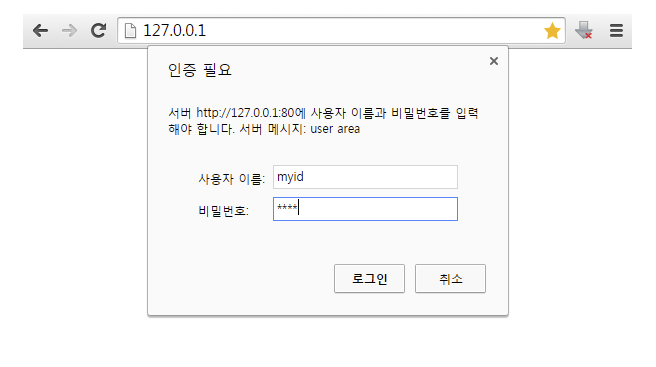
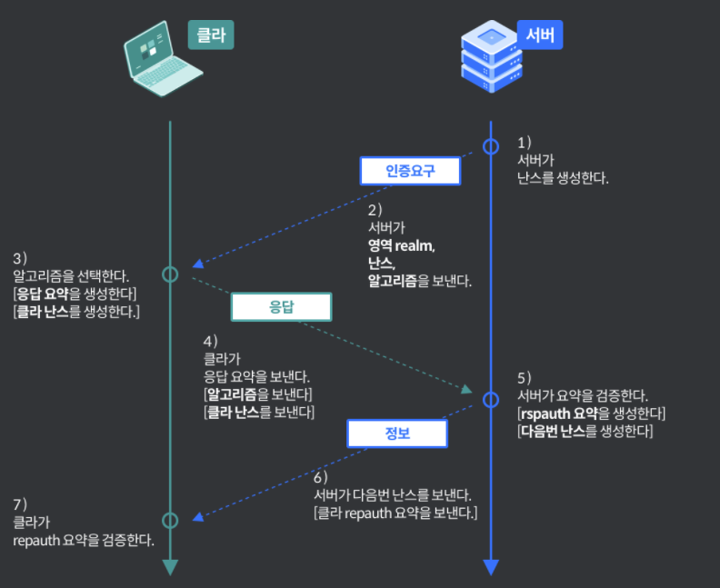
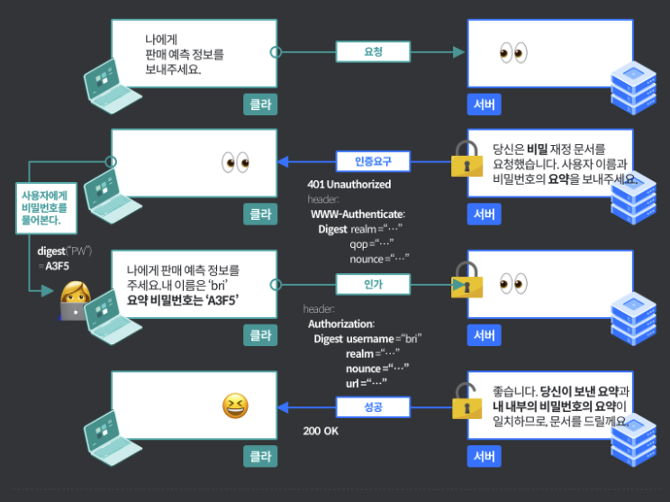

# Digest 보안

- 의문
- 개요
  - Digest handshake
  - Digest Real-world example

## 의문

- *서버는 어떻게 nonce가 설정된 유효 기간이 지났다는 것을 파악할 수 있는가?*
  - 무엇을 기준으로 서버는 request를 기억하고 있는가?
    - 그렇게 구현할 수도 있음
    - For applications where no possibility of replay attack can be tolerated, the server can use one-time nonce values that will not be honored for a second use. This requires the overhead of the server remembering which nonce values have been used until the nonce timestamp (and hence the digest built with it) has expired,
  - (만약 기억하는 것이 아니라면) nonce자체를 decode할 수 있는가?
    - AES암호와 같은 대칭키 암호를 사용하면 되지 않을까?

## 개요

https://tools.ietf.org/html/rfc7616

Digest 인증의 예시



- 개요
  - simple challenge-response 인증 매커니즘
  - basic 인증보다 발전된 형태
    - username과 비밀번호는 이미 서버쪽에 데이터가 등록되어있음
  - 반드시 HTTPS 상에서 이루어져야 함
  - server는 password file에 username 과 password를 저장해두어야 함

### Digest handshake



- nonce활용

```
// first response of request
HTTP/1.1 401 Unauthorized
WWW-Authenticate: Digest
    realm="http-auth@example.org",
    qop="auth, auth-int",
    algorithm=SHA-256,
    nonce="7ypf/xlj9XXwfDPEoM4URrv/xwf94BcCAzFZH4GiTo0v",
    opaque="FQhe/qaU925kfnzjCev0ciny7QMkPqMAFRtzCUYo5tdS"

// authorization request
Authorization: Digest username="Mufasa",
    realm="http-auth@example.org",
    uri="/dir/index.html",
    algorithm=MD5,
    nonce="7ypf/xlj9XXwfDPEoM4URrv/xwf94BcCAzFZH4GiTo0v",
    nc=00000001,
    cnonce="f2/wE4q74E6zIJEtWaHKaf5wv/H5QzzpXusqGemxURZJ",
    qop=auth,
    response="8ca523f5e9506fed4657c9700eebdbec", // made with cnonce, nonce, password, ...
    opaque="FQhe/qaU925kfnzjCev0ciny7QMkPqMAFRtzCUYo5tdS"
```

### Digest Real-world example


