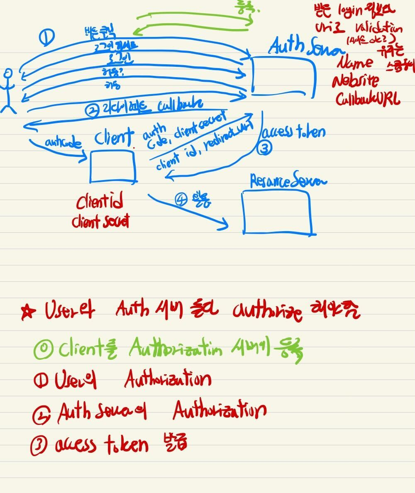
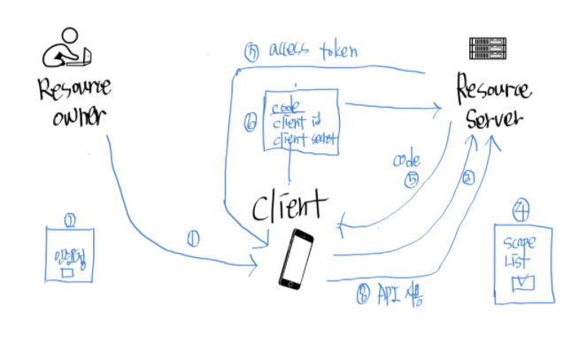

# OAuth2

- 의문
- 개요
- 실전예시: OAuth2 login

## 의문

## 개요

RFC 6750

- 개요
  - 클라이언트가 protected resource에 접근하려 할 때, access token을 획득할 수 있게 하므로써 그것을 가능하게 함
  - access token
    - 클라이언트에게 발행된 access authorization을 나타내는 문자열
  - token은 resource owner로부터 동의를 받아 authorization server로부터 생성됨

## OAuth의 구성 및 순서

- 용어
  - User
    - Resource에 대한 접근 권한을 갖고 있는 유저
  - Client
    - 접근 권한을 요청하는 주체(대개 서버)
  - Resource Server
    - Authorization Server
      - Client에게 인증 및 권한을 주는 서버
      - 인증이 완료되면 client에 access token을 발급해준다
    - Resource Server
      - 실제 리소스를 갖고 있는 서버
      - access token으로 client가 리소스를 접근할 수 있게 해준다
- 본질
  - Client는 User와 Authorization server둘 다 로부터 인가(authorize)를 받아야 함
- 순서
  - 0 Client를 Authorization 서버에 등록
  - 1 User가 Client를 Authorize
  - 2 Authorization Server가 Client를 Authorize
  - 3 access token의 발급

## 실전예시: OAuth2 login

OAuth2 login 예시

0. client는 resource server에 미리 자기자신의 oauth2 client로 등록하여, id와 secret key를 부여 받음
1. 유저는 client(나만의 웹 서비스)가 제공하는 웹 페이지에서 resource server(fb, google, ...) login 버튼을 누름
2. resource server의 oauth2 login페이지로 redirect시킴. 거기서 이미 로그인이 되어있지 않는다면 login
3. client에게 resource server에서 접근할 수 있는 정보들의 scope list를 보고, 허용하는 버튼 클릭
4. client는 해당 권한에 대한 code를 redirect url을 통해서 부여받음
5. client는 code와 0에서 미리발급받은 id, secret key를 resource server에 전달
6. 5의 response로 access token을 전달받음(offline mode를 사용해서 refresh token도 발급받을 수 있음)
7. access token을 내부에 저장
8. 저장한 access token을 기반으로 유저가 허락한 데이터가 필요한 경우 resource server로부터 받아옴
9. access token이 만료되면, 6에서 저장한 refresh token으로 resource server에 다시 access token을 발급받거나, 다시 유저로부터 access 권한을 얻어야 함(1로 회귀)

참고

https://developers.google.com/identity/protocols/oauth2/web-server
