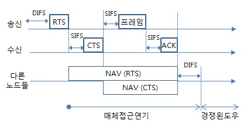
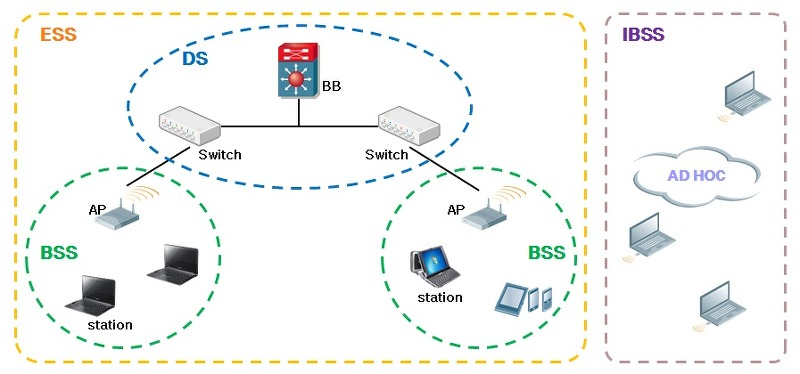

# 무선 랜 통신

## Wi-Fi

802.11계열의 기술

## CSMA/CA

- Listen before talk
- idle이어도 일단은 ifs동안 기다림(ifs가 짧을 수록 우선순위)
- Contention-window에서 채널이 바쁘면 쉰다(임의의 time slot동안)

RTS : 송신측이 링크내의 모든 노드에게 송신 금지 요청
CTS : 수신측이 ~~
ACK : 확인 응답

## 무선랜의 고속화

최대 600Mbps

### 1. 11a(5GHz)와 11g(2.4GHz)동시 이용
### 2. 채널 바운딩

인접 채널을 한꺼번에 사용한다.

### 3. MIMO

복수의 안테나

## 무선랜의 특성

의외로 도달하지 않는다. e.g. 흡수, 노이즈

의외로 먼곳 까지 도달한다. e.g. 조건만 좋으면 수백 미터까지 도달 **(도청의 위험)**

## SSID와 ESSID

### SSID

무선 랜에서 AP를 구별하기 위한 유니크한 식별자

32문자 임의 영숫자

**패스워드가 아니다**

특정한 무선랜을 사용하려는 모든 AP와 모든 Station 장비들은 모두 같은 SSID를 사용한다.

### ESSID

복수의 AP를 설치한 네트워크에서 로밍이 가능하도록 SSID를 확장시킨 것.

e.g) Eduroam

### BSSID

그렇다면 AP를 구분하기 위한 ID 는 무엇일까요?

바로 BSSID 입니다. Station들은 SSID를 통해 이 AP들이 같은 ESS 에 있다고 판단하며 같은 ESS 내에 인접한 AP들 끼리는 바로 BSSID 를 통해

AP를 구분하고 통신을 하게 되는 것입니다. ^-^

참조: [하루사리 보급창](http://haru21.tistory.com/entry/무선네트워크-이해-5-Chapter4-WLAN-1)
