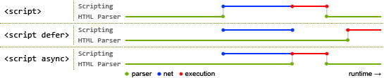

# script태그의 async와 defer속성

## 참조

[script 태그의 asnyc와 defer속성](https://appletree.or.kr/blog/web-development/javascript/script-%ED%83%9C%EA%B7%B8%EC%9D%98-async%EC%99%80-defer-%EC%86%8D%EC%84%B1/)

## 개요

기본적으로 웹 브라우저가 script태그를 만나면

스크립트 다운로드 => 실행

의 과정을 거치나, 그동안 HTML parsing작업은 뒤로 미룬다.

그러므로 **용량이 큰 스크립트**를 문서 해석 초기에 만나면 해당 페이지를 불러오는 속도마저 지체된다.

그래서 문제를 해결하기 위해서 등장한 것이 `async`와 `defer`속성이다.

## 사용 예

```html
<script async src="myAsyncScript.js" onload="myInit()"></script>
<script defer src="myDeferScript.js" onload="myInit()"></script>
```

둘의 차이는 **스크립트가 실행되는 시점이 다르다**는 점이다.

async: 내려받은 즉시 실행

defer: 문서의 aparsing이 끝나고 DOMContentLoaded event전에 삽입된 순서에 따라서 실행된다.


