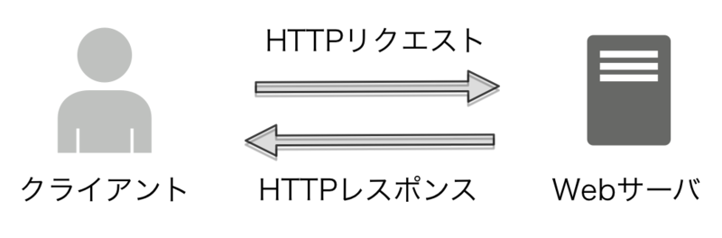
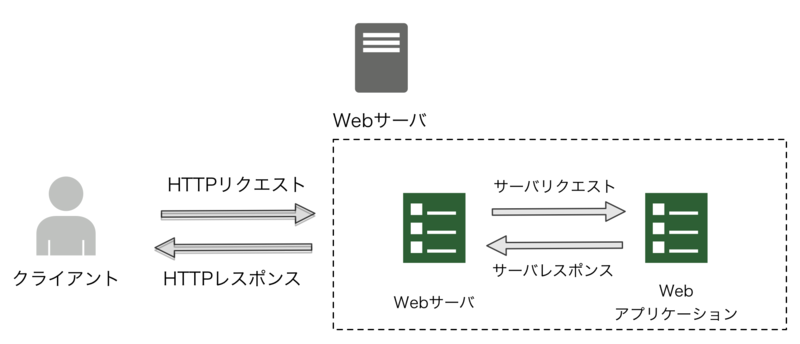
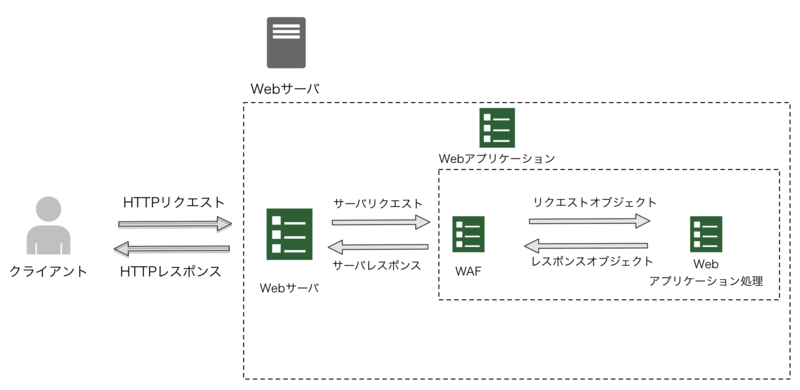
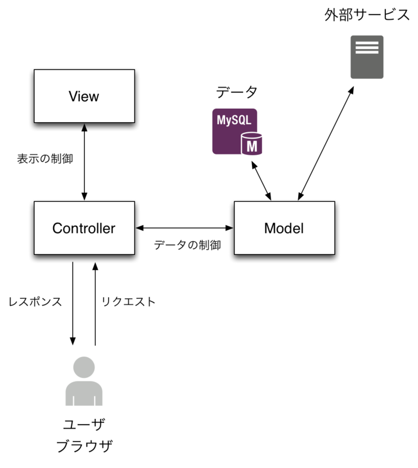

# 웹 앱 기초

출처: 하테나 교과서

1. HTTP와 URI
2. 웹 애플리케이션 개요
3. MVC

## HTTP와 URI

### HTTP(Hypertext Transfer Protocol)

- 내용은 텍스트 파일에 쓰여있는 헤더(존재한다면)와 바디
- 요청(request)과 응답(response)

#### 요청과 응답의 예

```
curl -v http://hatenablog.com/
```

요청

```
> GET / HTTP/1.1
> User-Agent: curl/7.35.0
> Host: hatenablog.com
> Accept: */*
```

응답

```
< HTTP/1.1 200 OK
< Cache-Control: private
< Content-Type: text/html; charset=utf-8
< Date: Fri, 17 Jul 2015 10:03:42 GMT
< P3P: CP="OTI CUR OUR BUS STA"
< Server: nginx
< Vary: Accept-Encoding
< Vary: Accept-Language, Cookie, User-Agent
< X-Content-Type-Options: nosniff
< X-Dispatch: Hatena::Epic::Global::Index#index
< X-Frame-Options: DENY
< X-Page-Cache: hit
< X-Revision: b4418f9710e3db5110634da7c553c907
< X-Runtime: 0.026343
< X-XSS-Protection: 1
< transfer-encoding: chunked
< Connection: keep-alive
<
<!DOCTYPE html>
<html
  lang="ja"
  data-avail-langs="ja en"

...以下略
```

- 스테이트리스(stateless)
  - 기본적으로 서버는 클라이언트의 상태를 갖고 있지 않음
- 메소드가 10개 정도 밖에 없어서 심플한 프로토콜
  - 심플해서 쉽게 적용 가능
  - 심플해서 널리 보급
- 메소드 `GET`, `HEAD`, `PUT`, `POST`, `DELETE`, `OPTIONS`, `TRACE`, `CONNECT`, `PATCH`, `LINK`, `UNLINK`
- 웹 앱에서는 `GET`, `HEAD`, `PUT`, `POST`, `DELETE` 주로 사용

#### 그 중에서도

- 일상적으로 자주 사용하는 것은 `GET`, `POST`
- `GET`
  - 리소스의 취득
  - 인자(parameter)는 URI에 넣음
    - http://example.com/bookmark?id=1
- `POST`
  - 리소스의 작성, 변경, 삭제
  - 변경, 삭제는 원래 `PUT`, `DELETE`메소드가 담당해야 함
  - 하지만 HTML의 폼(form)이 `GET/POST`밖에 지원하지 않으므로 `POST`로 대체하는 것도 일반적임
  - 인자는 URI와는 별개로 body에 넣는다.
    - URI길이의 제한을 받지 않음

#### 스테이터스 코드

- HTTP응답은 스테이터스 코드를 반환해야만 한다.
- 리다이렉트, 에러핸들링 등을 제대로 행하기 위해서는, 올바른 스테이터스 코드를 반환해야함.

**대표적인 스테이터스 코드**

- 200 OK
- 301 Moved Permanently
  - 영구적 리다이렉트
- 302 Found
  - 일시적 리다이렉트
- 400 Bad Request
  - 리퀘스트가 잘못됨
  - 클라이언트쪽 문제
- 404 Not Found
  - 리소스가 없음
- 500 Internal Server Error
  - 애플리케이션 에러
- 503 Service Unavailable
  - 서버가 다운

### URI

- URI(Uniform Resource Identifier)
  - 통일적인 리소스를 나타내는 것
- URI리소스. `명사`로 되어있으면 무엇을 지칭하는지 알기 쉽다.
  - http://example.com/users <- 유저 집합을 나타냄
  - http://example.com/users/1 <- 유저 집합중에서 1번째를 나타냄
- 리소스에 관한 처리는 HTTP메소드(GET, PUT, POST, DELETE)로 지정하여, URI에는 포함하지 않는 것이 낫다
  - GET http://example.com/users/1 <- 유저 집합에서 1번째를 취득
  - POST http://example.com/users <- 유저 집합에 요소를 추가
  - PUT http://example.com/users/1 <- 유저 집합에서 1번째를 갱신
  - DELETE http://example.com/users/1 <- 유저 집합에서 1번쨰를 삭제
- 안티패턴:
  - http://example.com/bookmarks/1/update
    - 나타내고 있는 리소스는 http://example.com/bookmarks/1 과 같지만, URI가 다르다.
  - http://example.com/bookmark?action=update&id=1
- 이상적으로 처리하기 힘든 케이스
  - html의 form에서는 GET/POST밖에 쓸 수 없음.
    - POST http://example.com/users/1/update
    - POST http://exmaple.com/users/1/delete
    - 어쩔 수 없이 위와 같이 쓸 때도 있음
  - 여러 리소스를 한번에 취득 하고 싶을 때
    - GET http://example.com/users?id=1&id=123&id=999
  - 제대로 http메소드랑 연결되지 않을때
    - GET http://example.com/users/search
    - GET으로 '리소스의 취득'을 지정하고 있으나, 단순히 리스트를 취득하는 것 뿐 아니라, 검색할때
- 상황에 맞는 좋은 URI를 설계하는 것이 중요

#### 좋은 URI의 은혜

- 검색, 소셜 북마크 등의 URI가 분산되지 않는다.
  - 계속 변하지 않고 통일적인 리소스를 나타낸다.
  - PV나 수익적으로도 좋음
- 유저체험이 향상됨
  - 사이트의 구조를 의식하게 만들 수 있음

### 결론

- HTTP
  - 텍스트베이스의 심플한 프로토콜
  - GET으로 리소스 취득
  - POST로 리소스 작성/삭제/갱신
- URI
  - 리소스를 나타내는 것
  - 쿨한 URI는 변하지 않음
- URI는 명사, HTTP는 동사

## 웹 애플리케이션 개요

### 웹 애플리케이션 기본

- 동적으로 웹 페이지를 생성
  - 유저에 맞는 페이지
  - 유저가 컨텐츠를 작성할 수 있음
  - 등등
- 기본적인 동작
  - 리퀘스트로부터 어떠한 표현(HTML등)을 동적으로 만들어서 응답으로 반환

### 웹 애플리케이션의 구성요소

- 구성요소
  - 웹 서버(nginx)
  - 웹 애플리케이션 프레임워크 (WAF)
  - 웹 애플리케이션 (실제 코드)
- 이러한 것을 조합해서 하나의 웹 애플리케이션이 만들어진다.

### 웹 애플리케이션의 동작

#### 1. 가장 간단한 예



- 동작
  - 서버가 클라이언트로부터 HTTP리퀘스트를 받음
  - 서버가 클라이언트로부터 HTTP응답을 돌려줌

#### 2. 서버와 애플리케이션을 분리한 예



- 추가된 동작
  - 애플리케이션이 서버로부터 서버 리퀘스트를 받음
  - 애플리케이션이 서버에 서버리퀘스트를 보내줌
- 웹 서버 프로그램
  - Apache, nginx, lighttpd, Tomcat, Jetty, Starlet, Unicorn, ...
- 서버요청, 서버응답은 서버 인터페이스에 의존
  - 이전에는 mod_perl, FastCGI 등
  - 최근에는 언어마다 서버 애플리케이션의 명세가 있다.
    - Java: Java Servlet
    - Perl: PSGI
    - Python: WSGI
    - Ruby: Rack
  - 인터페이스가 일치하면 애플리케이션은 그대로 서버의 코드를 바꿀 수 있다.

#### 3. WAF(웹 앱 프레임워크)와 웹 애플리케이션을 분리한 예



- 추가된 동작
  - WAF이 서버로부터 서버 요청을 받음
  - 웹 애플리케이션 처리가 WAF로부터 요청(리퀘스트) 오브젝트를 받음
  - 웹 애플리케이션 처리가 WAF에 응답(리스폰스) 오브젝트를 돌려줌
  - WAF가 서버에 서버 응답을 돌려줌
- WAF
  - 서버와의 대화를 중계, 추상화 함
  - 웹 애플리케이션을 기술하기위한 편리한 툴을 제공
- 웹 애플리케이션 처리
  - 비지니스로직, 데이터베이스 액세스, HTML생성 등
  - **WAF가 있으므로 요청에 대한 처리에 전념 가능**

### 결론

- 웹 애플리케이션은 HTTP요청에 대해서, 동적으로 HTTP응답을 돌려줌
- 서버쪽은 웹 서버, WAF, 웹 애플리케이션 처리로 분리됨
- WAF를 사용하면 Web애플리케이션 처리에 집중 할 수 있음

## MVC

- 앞서 설명한 웹 애플리케이션 처리의 코드 작성 패턴 설명

### MVC

- 모델, 뷰, 컨트롤러
  - 표현과 로직의 분리
    - 테스트 하기 쉬워짐
  - GUI프로그래밍, 웹 애플리케이션

### 웹 애플리케이션의 MVC



- 모델
  - 정의: 추상화된 데이터와 처리
  - 웹에서는: OR맵퍼나 비즈니스로직 등
  - 대규모가 되면 더더욱 계층화가 되는 경우도 많음
    - 애플리케이션층, 도메인층 등(참고: MMVC)
  - 하테나에서는
    - "모델"이라는 단어는 단순히 데이터 모델을 의미할때 사용하는 것이 많으니 주의
  - 하테나에서는(Perl)
    - `Service`, `Model`, `App`등으로 구성되는 경우가 많음
  - 하테나에서는(Scala)
    - `service`, `model`, `repository`, `application`등으로 구성되는 경우가 많음
- 뷰
  - 정의: 리소스의 표현
  - 웹에서는: HTML, JSON, XML, 사진 등을 생성하는 것
  - 하테나에서는(Perl)
    - `Text::Xslate`, `JSON::XS`등
  - 하테나에서는(Scala)
    - Twirl, JSON4S등
- 컨트롤러
  - 정의
    - 유저 입력에 의해서 처리의 흐름을 결정
    - 모델의 API를 부름
    - View에 필요한 데이터를 넘김
  - 웹에서는: 웹 애플리케이션 프레임워크(의 일부)
  - 하테나에서는(Perl)
    - `Router::Simple`등
  - 하테나에서는(Scala)
    - Scalatra, Play등

### 결론

- MVC란 모델, 뷰, 컨트롤러에의해서 표현과 로직을 분리한것
- 표현과 로직의 분리에 의해서, 디자이너와 엔지니어의 작업 분담이 가능

## 웹 애플리케이션 보안 기본

### 왜 보안인가?

- 애플리케이션에 취약점이 있으면, 악의를 품은 공격을 받을 수 있다.
  - 유저가 사적으로 생각하는 것에 타인이 접근할 수 있게 됨
  - 특정 유저만 편집 불가능한 정보를 타자로부터 마음대로 편집할 수 있게 됨
  - 등
- 서비스와 비즈니스에 큰 데미지

### 의식해야할 것

- 앱 애플리케이션은 다양한 유저 입력이 전제됨
  - 다양한 엔드포인트에 다양한 리퀘스트가 올 가능성이 있음
- 유저 입력의 인풋과 그 아웃풋에 조심해야함
  - 적절한 입력값의 validation
  - 적절한 출력 이스케이프
    - 무엇이 유저(외부)입력인가를 의식함

### 이번에 다룰 것

- 공격 방법의 다양성
  - 더 자세히는 '体系的に学ぶ 安全なWebアプリケーションの作り方　脆弱性が生まれる原理と対策の実践(체계적으로 배우는 안전한 웹 애플리케이션 만드는 법, 취약점이 생기는 원인과 대책의 실천)'을 읽어보자
  - 이번에는 예로 XSS에 대해서 간단히 소개

### XSS

- XSS란 Cross Site Scripting의 약어
- 유저가 보낸 스크립트를 페이지 안에서 실행하는 취약점
- 다양한 문제
  - 특정 유저의 로그인 정보를 훔쳐감
  - 사이트의 페이지가 악의적으로 변경됨

예시: 어떤 사람이 다음과 같은 글을 씀

```html
<div>
<script>alert('XSS')</script>
</div>
```

글을 읽는 사람들은 위의 코드가 유효하므로 메시지박스가 뜸. 악의적인 공격은 다른 프로그램과 통신을 시키거나, 쿠키를 변조하거나, 유저가 특정 행동을 하도록 함

- 근본적인 대책
  - 출력할때 적절한 이스케이프를 하도록 함
  - 템플릿 엔진에 따라서는 자동적으로 이스케이프 해주는 경우도
  - 명시적으로 이스케이프 하지 않은 경우는 주의가 필요

#### 무엇이 외부에서의 입력인가

- html폼 입력
- 주위의 Wi-Fi액세스 포인트 목록을 보여주는 웹 사이트
  - 와이파이 액세스 포인트 이름에 `<script>...`등을 넣을 가능성
- 업로드한 그림 Exif안에 `<script>`태그를 넣음
  - Exif의 내용을 이스케이프 하지 않은 채로 사이트에 표시하면 안된다.

### 주의

- 외부 입력의 데이터에 조심하자
  - 템플릿의 자동 이스케이프 기능에 의존
  - SQL의 작성은 플레이스홀더(placeholder)가 필수
- 이중 이스케이프 해서 `&lt;`등이 나오는 것이 나음
  - 거기서부터 대응을 생각해도 됨

### 보충: validation은 보안 대책인가?

유저의 입력값이 적절한지만 확인하므로 보안 대책은 아님. 하지만 올바르지 않은 값이 애플리케이션 안으로 들어오는 것을 막으므로 견고한 애플리케이션을 만드는데에 도움이 된다.
