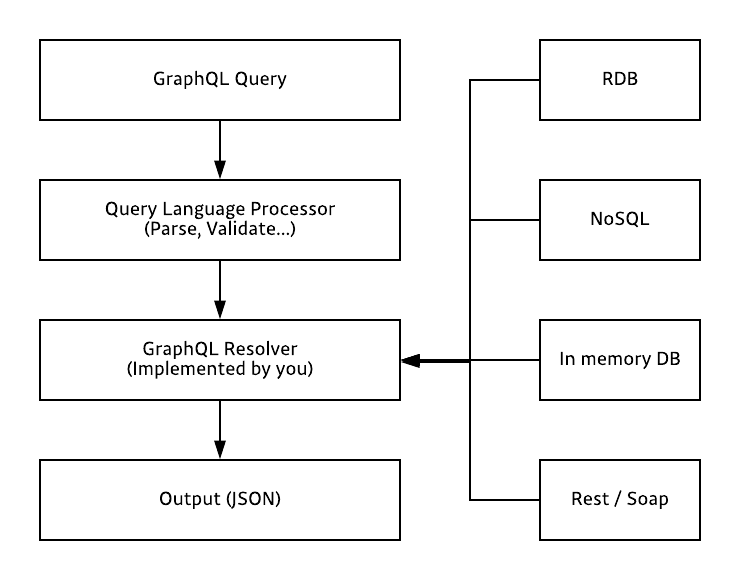
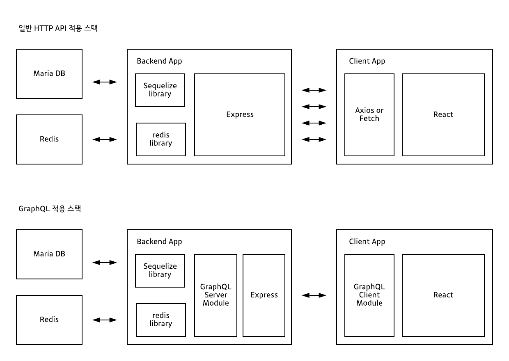

# GraphQL 기초

- 의문
- 개요
  - 기본 개념
  - GraphQL을 활용 할 수 있게 도와주는 다양한 라이브러리들
- 쿼리와 변형
- 스키마와 타입
- Validation
- Execution

## 의문

- 쿼리에 필요한 함수는 서버사이드에 코드로 존재하는 것이겠지?
  - 리졸버는 서버사이드에 코드로 존재
- 클라이언트 사이드에서 데이터의 일부 필드만 질의하고, 서버사이드에서 데이터를 해당 질의의 구조에 맞춰서 데이터를 가져오는 것은, 설령 서버사이드에서 리졸버 안에서 모든 property를 반환한다고 하더라도, graphQL serverside engine이 알아서 질의한 필드만 json으로 반환해주는 원리인가?
  - 그게 아니고, resolver가 각 필드마다 존재하므로, query로 들어온 데이터 구조와 같이 resolver를 재귀적으로 호출해나가면서 질의한 필드만 반환하는 원리
  - 그런데 이렇게 하면, 재귀적으로 IO가 많은 필드들을 가져올 때에는 어떻게 최적화를 하지?
    - query와 같은 경우에는 병렬적으로 필드에 대한 리졸버를 실행하고, mutation과 같은 경우에는 순차적으로 실행하는 방식으로 최적화
    - 그리고 resolver의 parameter의 하나로 `parent`가 있는데, 부모로부터 데이터를 물려받을 수 있으므로 그것을 이용해서 질의 가능할듯
      - e.g) hero의 spaceship을 가져오기 위해서는, parent resolver에서 hero를 가져오고 해당 hero를 spaceship resolver로 넘겨주면서 그것을 이용해서 쿼리하면 될 듯

## 개요

GraphQL 파이프라인



REST API와 비교



- 개요
  - API를 위한 query language
  - **API layer만 담당**
  - 사용자(서버)가 자신의 데이터에 대해서 정의한 타입 시스템을 사용하여 쿼리를 실행하는 server-side 런타임
  - 웹 클라이언트가 데이터를 서버로부터 효율적으로 가져오게 하는 것이 목적
    - 일반적으로 HTTP POST 메서드와 웹소켓 프로토콜 활용
- 구성
  - 타입
  - 필드
  - 각각의 필드에 대한 함수 데이터 load함수
    - resolver
- 흐름
  - GraphQL service를 기동
  - GraphQL query를 전송
  - 정의된 타입과 필드만 참조하는지 확인(validate)
  - 결과를 얻기 위해 제공된 함수 실행
- 협업
  - REST API 에서는 프론트앤드 프로그래머는 백앤드 프로그래머가 작성하여 전달하는 API의 request / response의 형식에 의존하나, gql 에서는 의존도가 많이 사라짐. 대신 schema에 대한 협업 의존성은 존재.
- 느낀점
  - 서버는 정말 데이터만 반환하게 해서 역할을 최대한 축소시키고, 클라이언트에서 도메인 로직을 구축하고 뷰까지 구축해서 역할을 확대 할 수도 있고, 아니면 그냥 단순히 서버에서 도메인 로직을 구축하고 Adapter의 역할으로만 graphQL을 사용할 수도 있고...

### 기본 개념

- 쿼리
  - 데이터를 읽어오는데에 사용
- 뮤테이션
  - 데이터를 변조하는데에 사용
- 스키마/타입
  - 데이터 구조 및 오브젝트 타입과 필드 정의
- 리졸버(resolver)
  - 데이터를 가져오는 구체적인 과정을 직접 구현해야 함(resolver)
    - 데이터의 source에 의존하지 않고 데이터를 가져오기만 하면 됨
  - 각각의 필드마다 구현해야 함
    - *리졸버 호출은 DFS로 되어있다?*
  - parameter
    - `parent`
      - 연쇄 리졸버 호출에서 부모 리졸버가 리턴한 객체
    - `args`
      - 쿼리에서 입력으로 넣은 인자
    - `context`
      - 모든 리졸버에게 전달
      - 미들웨어를 통해 입력된 값들이 들어 있음
        - 로그인 정보 혹은 권한과 같은 정보들이 들어있음
    - `info`
      - 스키마 정보와 더불어 현재 쿼리의 특정 필드 정보를 가지고 있음
- 인트로스펙션(introspection)
  - 서버 자체에서 현재 서버에 정의된 스키마의 실시간 정보를 공유할 수 있게 함
  - 인트로스펙션을 통하여 클라이언트 사이드에서는 실시간으로 현재 서버에서 정의하고 있는 스키마를 의심 할 필요 없이 받아들이고, 그에 맞게 쿼리문을 작성

### GraphQL을 활용 할 수 있게 도와주는 다양한 라이브러리들

gql 자체는 쿼리 언어일 뿐. 그것을 구체적으로 활용 할 수 있도록 도와주는 라이브러리들이 필요.

- frontend with react
  - Relay
- graphql Server
  - Graphql-yoga
- full-stack
  - Apollo
- utils
  - schema constructor
    - graphql-js
      - Nexus
  - ORM + utils with graphQL
    - prisma

## 쿼리와 변형(Quries and Mutations)

```
// 스키마
{
  paymentsByUser(userId: 10) {
    id
    amount
    user {
      name
      phoneNumber
    }
  }
}

// resolver function example
Query: {
  paymentsByUser: async (parent, { userId }, context, info) => {
      const limit = await Limit.findOne({ where: { UserId: userId } })
      const payments = await Payment.findAll({ where: { LimitId: limit.id } })
      return payments
  },
},
Payment: {
  limit: async (payment, args, context, info) => {
    return await Limit.findOne({ where: { id: payment.LimitId } })
  }
}
```

### Fields

- 쿼리의 형태에 맞는 데이터만 그대로 반환

```
{
  hero {
    name
    # Queries can have comments!
    friends {
      name
    }
  }
}

{
  "data": {
    "hero": {
      "name": "R2-D2",
      "friends": [
        {
          "name": "Luke Skywalker"
        },
        {
          "name": "Han Solo"
        },
        {
          "name": "Leia Organa"
        }
      ]
    }
  }
}
```

### Arguments

- field에 대한 arguments를 넘겨줘서 데이터 필터링 / 변형 가능
- GraphQL 서버는 custom type을 선언할 수 있음

```
{
  human(id: "1002") {
    id
    name
    height(unit: FOOT)
  }
}

{
  "data": {
    "human": {
      "id": "1002",
      "name": "Han Solo",
      "height": 5.905512
    }
  }
}
```

### Aliases

- 같은 필드이름이 겹치는 것을 막기 위해서 alias를 사용해서 쿼리를 할 수 있음

```
{
  empireHero: hero(episode: EMPIRE) {
    name
  }
  jediHero: hero(episode: JEDI) {
    name
  }
}

{
  "data": {
    "empireHero": {
      "name": "Luke Skywalker"
    },
    "jediHero": {
      "name": "R2-D2"
    }
  }
}
```

### Fragments

- 쿼리에서 원하는 구조가 반복되는 경우 원하는 구조의 데이터를 질의할 때 재사용하기 위한 기능
- fragments안에서 변수 사용 가능

```
query HeroComparison($first: Int = 3) {
  leftComparison: hero(episode: EMPIRE) {
    ...comparisonFields
  }
  rightComparison: hero(episode: JEDI) {
    ...comparisonFields
  }
}
​
fragment comparisonFields on Character {
  name
  friendsConnection(first: $first) {
    totalCount
    edges {
      node {
        name
      }
    }
  }
}


{
  "data": {
    "leftComparison": {
      "name": "Luke Skywalker",
      "friendsConnection": {
        "totalCount": 4,
        "edges": [
          {
            "node": {
              "name": "Han Solo"
            }
          },
          {
            "node": {
              "name": "Leia Organa"
            }
          },
          {
            "node": {
              "name": "C-3PO"
            }
          }
        ]
      }
    },
    "rightComparison": {
      "name": "R2-D2",
      "friendsConnection": {
        "totalCount": 3,
        "edges": [
          {
            "node": {
              "name": "Luke Skywalker"
            }
          },
          {
            "node": {
              "name": "Han Solo"
            }
          },
          {
            "node": {
              "name": "Leia Organa"
            }
          }
        ]
      }
    }
  }
}
```

### Operation name

- `query`키워드(operation type - query, mutation, subscription)와 query name을 작성하는 것이 production환경에서 권장됨
  - 디버깅에 용이
- operation type
  - 개요
    - 사용자가 어떠한 동작을 하려고 하는지 묘사
  - 종류
    - query
    - mutation
    - subscription

```
query HeroNameAndFriends {
  hero {
    name
    friends {
      name
    }
  }
}

{
  "data": {
    "hero": {
      "name": "R2-D2",
      "friends": [
        {
          "name": "Luke Skywalker"
        },
        {
          "name": "Han Solo"
        },
        {
          "name": "Leia Organa"
        }
      ]
    }
  }
}
```

### Variables

- 쿼리로부터 동적인 값들을 factor하는 first-class 방식이 존재
  - 그리고 별도의 딕셔너리로 패스함
- 필요한 동작
  - ① static value를 `$variableName`으로 대체
  - ② `$variableName`을 쿼리에 의해서 수용받는 변수의 하나로 선언
  - ③ JSON과 같은 변수 딕셔너리를 갖는 `variableName: value`를 넘겨줌
- !가 있으면 required 인 것을 나타냄

```
{
  "episode": "JEDI"
}

query HeroNameAndFriends($episode: Episode) {
  hero(episode: $episode) {
    name
    friends {
      name
    }
  }
}

{
  "data": {
    "hero": {
      "name": "R2-D2",
      "friends": [
        {
          "name": "Luke Skywalker"
        },
        {
          "name": "Han Solo"
        },
        {
          "name": "Leia Organa"
        }
      ]
    }
  }
}
```

### Directives

- UI의 컴포넌트 상태에 따라서 데이터의 detail한 부분도 렌더링해야하는 경우와 하지 않아도 되는 경우가 나뉠때
  - 데이터가 detail한 부분이 필요 없을 때에는 단순한 데이터만 서버로부터 가져오게 하면 됨

```
{
  "episode": "JEDI",
  "withFriends": false
}

query Hero($episode: Episode, $withFriends: Boolean!) {
  hero(episode: $episode) {
    name
    friends @include(if: $withFriends) {
      name
    }
  }
}

{
  "data": {
    "hero": {
      "name": "R2-D2"
    }
  }
}
```

### Mutations

- Server-side 데이터를 변경하는 경우에 사용
- `mutation`이라는 키워드 활용
  - 아래의 review는 input object type임
- query 필드는 병렬적으로 실행되는데에 반하여, mutation 필드는 연속적으로 하나하나 실행됨

```
{
  "ep": "JEDI",
  "review": {
    "stars": 5,
    "commentary": "This is a great movie!"
  }
}

mutation CreateReviewForEpisode($ep: Episode!, $review: ReviewInput!) {
  createReview(episode: $ep, review: $review) {
    stars
    commentary
  }
}

{
  "data": {
    "createReview": {
      "stars": 5,
      "commentary": "This is a great movie!"
    }
  }
}
```

### Inline Fragments

필요해지면 공부하자

## Schemas and Types

- 스키마
  - 어떤 필드를 선택할 수 있는가?
  - 어떤 종류의 오브젝트가 반환되는가?
  - sub-object로 어떠한 필드가 사용가능한가?
- 타입 시스템
  - 사용 가능한 데이터의 집합을 기술

### Type language

- GraphQL Schema language
  - 스키마 정의할 때 사용하는 언어

### Object types and fields

```
type Character { // GraphQL Object Type
  name: String! // Character type의 필드, String type, non-nullable
  appearsIn: [Episode!]! // Array of Episode 오브젝트, non-nullable(배열이 항상 존재), 배열 속에 Episode 원소가 적어도 하나 존재
}

// Arguments
type Starship {
  id: ID!
  name: String!
  length(unit: LnegthUnit = METER): Float
}

// Query & Mutation types
// 일반 GraphQL object Type과 취급이 같으나, Query 타입임(클라이언트가 사용할 수 있는)
type Query {
  hero(episode: Episode): Character
  droid(id: ID!): Droid
}
```

### Types

- default
  - Int
    - signed 32-bit
  - Float
    - double-precision floating-point value
  - String
    - UTF-8 character sequence
  - Boolean
    - true or false
  - ID
    - unique identifier
    - serialized in the same way as a String
      - not intended to be human readable
  - Enumeration
    - 허가된 값들의 특정 집합에서 하나만 선택할 수 있게 함
  - Lists and Non-Null
    - Non-Null
      - !(argument 지정에서도 쓰임)
- custom
  - 데이터를 어떻게 serialize하고 deserialize하고 validate하는 것을 정해줘야 함
  - e.g
    - `scalar Date`

### Interfaces

- interface를 implement한 타입은 반드시 인터페이스에 정의된 구현을 포함해야 함
- 서로 다른 타입의 오브젝트나 오브젝트의 집합을 반환하고 싶을 때 유용

```
interface Character {
  id: ID!
  name: String!
  friends: [Character]
  appearsIn: [Episode]!
}

type Human implements Character {
  id: ID!
  name: String!
  friends: [Character]
  appearsIn: [Episode]!
  starships: [Starship]
  totalCredits: Int
}
```

### Union types

- `union SearchResult = Human | Droid | Starship`
  - `SearchResult`타입을 반환할 때, `Human`, `Droid`, `Starship`을 반환받을 수 있음

### Input types

- This is particularly valuable in the case of mutations, where you might want to pass in a whole object to be created

```
input ReviewInput {
  stars: Int!
  commentary: String
}

{
  "ep": "JEDI",
  "review": {
    "stars": 5,
    "commentary": "This is a great movie!"
  }
}

mutation CreateReviewForEpisode($ep: Episode!, $review: ReviewInput!) {
  createReview(episode: $ep, review: $review) {
    stars
    commentary
  }
}

{
  "data": {
    "createReview": {
      "stars": 5,
      "commentary": "This is a great movie!"
    }
  }
}
```

## Validation

- 타입 시스템을 이용하여, GraphQL 쿼리가 valid인지 아닌지 확인 가능

## Execution

- 그래프 큐엘의 쿼리의 각각의 필드를 함수나 메서드라고 생각할 수 있음
  - resolver
- scalar value를 반환할 때 까지 계속 재귀적으로 반복함

### Root fields & resolvers

```js
Query: {
  human(obj, args, context, info) {
    // obj: 이전 resolver 오브젝트
    // args: GraphQL 쿼리에 제공된 인자
    // context: 모든 resolver가 공유하는 데이터, 로그인 된 유저 정보, 데이터베이스 접속 등
    // info: field-specific 정보(스키마에 관한)
    return context.db.loadHumanByID(args.id).then(
      userData => new Human(userData)
    )
  }
}

Human: {
  name(obj, args, context, info) {
    return obj.name
  }

  // n+1문제?
  // domain로직에서 데이터 스트럭쳐를 전부 구현해두고, 단순 프로퍼티만 반환하기?
  starships(obj, args, context, info) {
    return obj.starshipIDs.map(
      id => context.db.loadStarshipByID(id).then(
        shipData => new Starship(shipData)
      )
    )
  }
}
```

- Root type(Query type)
