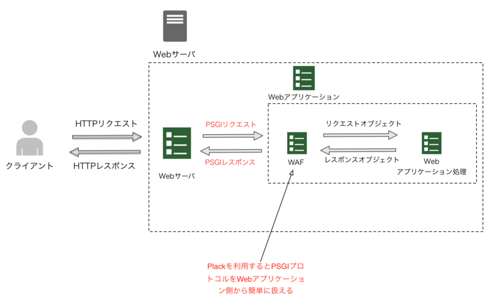
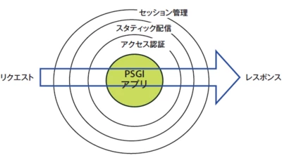

# Psgi를 이용한 웹 애플리케이션

참고

- [第1回　PSGI/Plack―フレームワークとサーバをつなぐエンジン - Perl Hackers Hub](http://gihyo.jp/dev/serial/01/perl-hackers-hub/000102)
- [NginxでPSGI/Plack(Starlet)でHello world](http://belhb.hateblo.jp/entry/2017/06/11/172048)

## Perl은 물론이거니와 Ruby나 Python은 웹 프레임웍이 난립했었음

문제

- 프레임워크 마다 웹 서버에 연결하는 방법이 다 달랐음

해결

- WSGI, Rack에 의한 해결
  - 프로토콜에 의한 해결
  - 파이선: WSGI(Web Server Gateway Interface)
  - 루비: Rack
    - 깊이가 1인 해시로 모든 데이터를 받고
    - 돌려줄 때는 요소수가 3인 배열로
      - status code, header, body
  - 펄: PSGI
    - 웹 애플리케이션 쪽에서 PSGI인터페이스를 만들고, 각종 서버와 연결하는 어댑터를 작성
    - 혹은 PSGI를 직접 실행하는 웹 서버를 Perl로 만듬
    - 새로운 웹 서버의 서포트를 추가할 때에도, PSGI에의 어댑터만 쓰면 프레임워크가 실행 가능하게 됨

## PSGI 애플리케이션의 예시

```perl
# hello.psgi
my $app = sub {
  my $env = shift;
  return [
    200,
    [ 'Content-Type' => 'text/plain' ],
    [ "Hello World" ],
  ];
};
```

- 구현
  - 애플리케이션은 코드 참조(code reference)로 표현
  - 인자로 `$env`가 넘겨짐
    - 애플리케이션 실행 환경을 나타나는 해시 참조
    - 메서드 정보나 바디정보등을 포함
  - 결과 값으로 status code, headeer, body를 요소로 갖는 배열의 참조를 반환
- 장점
  - PSGI를 구현하기 위해서 다른 모듈에 의존하지 않아도 됨
  - 이미 기존의 프레임웍이 CGI에 대응하고 있었으므로, `$env`가 CGI환경변수에 닮아서 서포트 하기 쉬움
- c.f `HTTP::Engine`의 경우
  - `$env`, 응답 배열의 대신에 요청 / 응답을 API로 정의
  - 프레임워크로 서비스를 만드는 유저는 사용하기 쉬움
  - 프레임워크를 제작하는 유저는 만들어야할 것들이 많아짐
  - 다른 HTTP엔진에 의존해버림

### psgi방식 vs 내장엔진 방식

- psgi방식
  - 프로토콜과 어댑터를 이용한 방식
  - Plack이 어댑터가 되어서 CGI앱과 mod_perl앱도 연결 해줌
  - 자체 서버도 갖고 있음
- 내장엔진 방식
  - 웹 애플리케이션 처리와 웹 서버가 일체화된 방식
  - 웹 프레임워크

## Plack - PSGI 유틸리티



실제로 어떻게 하면 애플리케이션을 동작시킬 수 있는가.

**즉, PSGI를 구현한 소프트웨어**

- (Python의 경우, WSGI의 사양에 맞춘 Paste, Pylons, WebOb 등이 있음)
- (Ruby의 경우, 인터페이스 사양도, 그것을 구현한 소프트웨어도 같은 이름의 Rack임)

- 문제
  - Apache등 기존의 웹 서버로 PSGI 애플리케이션을 동작시키기 위해서는, CGI, FastCGI, mod_perl등의 인터페이스를 PSGI로 변환할 필요
  - PSGI를 네이티브로 실행 가능한 펄 베이스의 HTTP서버의 구현
- Plack
  - 위의 요건을 만족하는 유틸리티
    - PSGI서버, 어댑터, 주변 라이브러리, 미들웨어 포함

### plackup커맨드

Plack은 매우 빠른 속도로 간단히 사용할 수 있는 독자(standalone) PSGI서버(HTTP::Server::PSGI)와 커맨드라인 툴을 갖고 있음

#### 독자 서버

먼저, cpan에서 Plack을 설치한 후, hello.psgi를 다음과 같은 커맨드로 실행해보자:

```
> plackup hello.psgi
HTTP::Server::PSGI: Accepting connections at http://0:5000/
# 브라우저에 http://localhost:5000에 접속하면 Hello World가 표시됨
```

마찬가지로 FastCGI로 애플리케이션을 실행하려면 다음과 같이 함:

```
plackup -s FCGI --listen /tmp/fastcgi.sock hello.psgi
```

- FastCGI의 경우
  - 유닉스 도메인 소켓으로 FastCGI데몬이 실행됨
  - Apache, lighttpd, nginx등에서 FastCGI로 접속하면 됨
  - --port 옵션을 사용해서 TCP/IP 통신도 가능

- CGI/mod_perl의 경우
  - 독자 서버(x), 웹 서버로부터 불리는 형식
  - .psgi의 경로를 웹 서버에 설정
  - .cgi파일로부터 불러들임

#### Stack Trace / Access Log

```
plackup -e 'sub { die "Foo" }'
```

- 개발시
  - 위의 코드는 `sub { die "Foo" }`를 평가(eval)해서 독자 서버를 가동함
  - 로컬호스트에 접속: 스택트레이스(stack trace)를 보여줌.
  - 터미널: 액세스 로그가 표시.
  - -r 옵션은 애플리케이션이 변경되면 자동으로 다시 시작된다.
- 배포시
  - `plackup -E production app.psgi`
  - -E 옵션으로 development이외의 값을 설정

### Plack::App - 편리한 애프릴케이션 군

- 다양한 기능
  - 스타팅 파일의 송신
  - 기존 CGI 스크립트를PSGI화

```
plackup -MPlack::App::Directory \
  -e 'Plack::App::Directory->new->to_app'
```

위의 스크립트는 현재 디렉토리를 도큐멘트 루트로 하는 정적인 웹 서버 시작

- Plack을 설치하면 다른 웹 서버를 설치하지 않고 이용가능하므로, 개발환경에 편리함
- Plack::App에 포함되는 모듈은 유저가 개발하는 애플리케이션에 넣어두는 것도 편함

### PSGI 미들웨어



- PSGI 애플리케이션은 코드 참조이며, 서버는 HTTP리퀘스트를 `$env`형태로 변환해주는 코드를 넘겨주고, 애플리케이션은 받은 `$env`를 이용해서 요청을 처리해서, 응답을 배열의 참조로 반환함.
  - 작성이 간단함
  - 모듈 의존x
- PSGI 미들웨어
  - 런타임에, 애플리케이션이나 환경(`$env`), 응답을 동적으로 바꿔서 기술하는 프록시적 코드를 넣는 것이 가능
  - 위의 그림처럼 다양한 부가 기능을 추가할 수 있음

다음은 HTTP클라이언트의 IP주소를 `REMOTE_ADDR`로부터 취득해서 표시하는 간단한 애플리케이션이다. 그 다음 코드는 `$app`은 앞서의 코드와 같은 코드이나, `$mw`에서는 `$env`를 받아서, 그 `REMOTE_ADDR`를 임의로 1/2의 확률로 1.2.3.4로 변경한 뒤에 $app을 실행하고 있음

```perl
my $mw = sub {
  my $env = shift;
  $env->{REMOTE_ADDR} = '1.2.3.4' if rand(1) > 0.5;
  print "hello world!\n";
  $app->($env);
};
```

- 모든 PSGI를 따르는 서버, 프레임워크에서 공유가능
- Plack::Middleware 라는 네임스페이스에서 번들 되고 있음

### PSGI 서버

어떠한 웹 서버 환경에서 PSGI가 서포트 되고 있는가?

- CGI, FastCGI
  - 일반적인 웹 서버인 Apache, nginx등에서부터 PSGI를 실행하려면 CGI나 FastCGI를 이용하는 것이 일반적.
  - Plack에는 그러한 환경에서 실행되는 어댑터가 포함되어있음
- mod_perl
  - Perl 애플리케이션을 영구적으로 계속되는 환경에서 실행하는 일반적인 방법
  - Plack에서 mod_perl 1.x, 2.x에 대앙한 핸들러가 포함되어있음
- HTTP::Server::PSGI
  - Plack에 표준적으로 번들된 단독 서버
  - 순수 Perl로 쓰여짐(windows에서도 돌아감)
  - 병행 처리도 가능
- Starman
  - Unix베이스 웹 서버
  - Net::Server::PreFork에 기반한 HTTP서버
  - 핫 리로딩, 유닉스 소켓 바인딩, HTTP 1.1대응 등이 가능
- AnyEvent, POE, Coro
  - Perl의 비동기 프로그래밍, 이벤트루프 라이브러리
  - 각각을 이용한 서버도 Plack에서 이용 가능

### 미들웨어 예시

```perl
use strict;
use warnings;
use utf8;

my $app = sub {
  my $env = shift;
  use Data::Dumper;
  print Dumper $env;
  return [
    200,
    [ 'Content-Type' => 'text/plain' ],
    [ "Hello $env->{REMOTE_ADDR}" ],
  ];
};

my $mw = sub {
  my $app = shift;
  return sub {
    my $env = shift;
    my $temp = (rand(1) > 0.5) ? '1.2.3.4' : $env->{REMOTE_ADDR};
    $env->{REMOTE_ADDR} = $temp;
    $env->{DEF} = 'hihihihi';
    $app->($env);
  };
};

my $mw_query_string = sub {
  my $app = shift;
  return sub {
    my $env = shift;
    $env->{ABC} = 'so much fun';
    $app->($env);
  };
};

$app = $mw->($mw_query_string->($app));
# $env안에
# 'DEF' => 'hihihihi'
# 'ABC' => 'so much fun'
# 포함
```
