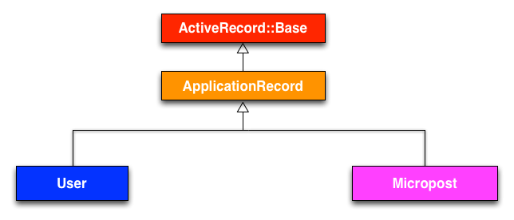

# Model

## Structure



## model생성 + 적용하기

```ruby
# model 생성 / migrate파일 생성
rails g model User name:string email:string
```

```ruby
# migration 실행 + db/development.sqlite3 생성
rails db:migrate
```

c.f)
```ruby
# migration을 rollback한다.
rails db:rollback
```

## model살펴보기

```ruby
class User < ApplicationRecord # < ActiveRecord:Base
end
```

ActiveRecord model objets는 `validation`이 매우 중요함.

```ruby
user.valid?
```

### 1. 모델에 데이터 저장하기

```ruby
user = User.new(name: "abc", email: "hello@world.com")
user.save # => ture if succeed false if not

## or

user = User.create(name: "abc", email: "hello@world.com") # => user row itself
```

### 2. 모델에 데이터 삭제하기

```ruby
user.destroy # => user row
User.all # => check whether it is deleted or not
```

### 3. 모델에서 user objects 검색하기

```ruby
# find method
User.find(1) # => id = 1 row from User table
User.find(3) # => id = 3 row form User table

# find_by method
User.find_by(email: "example@example.com")

# first
User.first

# last
User.last

# all
User.all

# name (legacy)
User.find_by_name("name")
```

### 4. 모델에서 user objects 갱신하기(update)

```ruby
# update user email
user.email = "changed mail"
user.save

# not saved at db if it is not saved on console
user.email = "hi"
user.reload.email # => "changed mail"

# directly user update
user.update_attributes(name: "The Dude", email: "dude@example.com") # => true or false
user.update_attribute(:name, "El Duderino")
```

## Validation

type : presence, length, format, uniqueness, confirmation

### 1. presence

```ruby
# model
class User < ApplicationRecord
  validates :name, presence: true
end

# console
user = User.new(name: "", email: "mhartl@example.com")
user.valid? # => false
user.errors.full_messages # => ["Name can't be blank"]
user.save # => false
```

### 2. length - maximum minimum

```ruby
# validates는 함수이다.

class Micropost < ApplicationRecord
  belongs_to :user
  validates :content, length: { maximum: 140 }
end

class User < ApplicationRecord
  has_many :microposts
  validates :name, presence: true
  validates :email, presence: true
end

```

### 3. format - with

[rubular - regex reference](http://www.rubular.com/)

### 4. uniqueness

## Password

### 1. bcrypt gem설치

해쉬화 하기 위한 재료.

그리고 bundle install잊지 말자

### 2. has_secure_password를 모델에 추가

```ruby
# 이 메소드를 model.rb에 추가
has_secure_password

```

기능
- db table의 password_digest열에 해쉬화 한 비밀번호를 넣을 수 있다.
- password와 password_confirmation이라는 가상 속성을 presence validation과 match validation과 함께 사용가능
- authenticate method사용 가능(유저의 password가 맞으면 user객체를 반환)

### 3. password_digest column을 table에 추가

```
rails generate migration add_password_digest_to_users password_digest:string

rails db:migrate
```

## User model

```ruby
class User < ApplicationRecord
  before_save { self.email = email.downcase }
  validates :name, presence: true, length: { maximum: 50 }
  VALID_EMAIL_REGEX = /\A[\w+\-.]+@[a-z\d\-]+(\.[a-z\d\-]+)*\.[a-z]+\z/i
  validates :email,
    presence: true,
    length: { maximum: 25 },
    format: { with: VALID_EMAIL_REGEX },
    uniqueness: { case_sensitive: false }
  has_secure_password
  validates :password,
    presence: true,
    length: { minimum: 6 }
end
```
