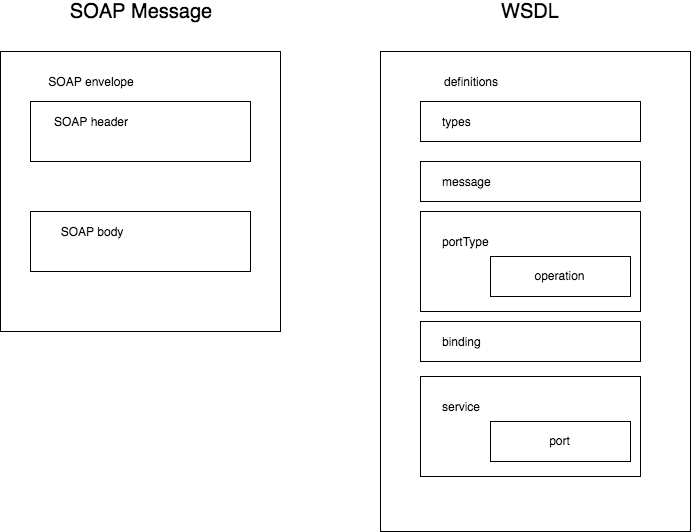

# Web Service

## 참조

- [SOAP란 무엇인가??](http://lonelycat.tistory.com/256)

## 정의

- 웹 표준기술을 사용하여 웹상에 있는 서비스와 컴포넌트를 이용하기 위한 구조
- XML, SOAP, WSDL, UDDI를 베이스로한 웹 어플리케이션
  - XML을 인터페이스 기술로 채용
  - SOA(Service Oriented Architecture)의 기술기반으로서 급속하게 주목받고 있다.

c.f) soa는 service(고차원 비지니스 개념의 캡슐화)기반의 웹 아키텍쳐로서, 서비스는 `user`, `provider`, `registry`로 구성된다.

## 웹 서비스 기술의 구성

### 1. SOAP(Simple Objet Access Protocol)

네트워크상에 존재하는 각종 컴퍼넌트간의 호출을 효율적으로 실현하기 위한 프로토콜

하위 프로토콜로서 HTTP를 이용(단순하면서 가볍기때문, **방화벽에 구애받지 않는다**)

XML메시지에 의하여 RPC(Remote Procedure Call)이나 Object Access가 가능하다.

**프로그램에 독립적, 프로그래밍 언어에도 독립적!**

**방식**

1. 서버의 method를 정의 `getPrice`
2. 그 메소드를 WSDL기술에 따라서 메소드 호출에 관한 정보를 XML형식으로 변환
3. 클라이언트가 WSDL기술을 보고 메소드를 부를 수 있게된다.

**구성**



- SOAP envelope
  - Message에 무엇이 있는가, 누가 무엇을 다루는가, 어떤것이 Optional이고 Mandatory인가를 나타내기 위한 전체적인 framework제공

- SOAP encoding rules
  - Application에 정의된 data type들의 instance를 교환하는데에 사용되는 메커니즘

- SOAP RPC Expression
  - RPC와 response들을 나타내는데에 사용되는 규약의 정의

- SOAP binding
  - 두 peer간의 전송프로토콜을 사용하여 SOAP envelope교환에 대한 규약을 정의한다.


**동작방식**

1. Client가 어떤 Service Provider의 Service가 어떤 것이 있는지를 파악하기 위해 제공하는 Service의 목록을 HTTP를 통해 XML형태로 요청한다. 이미 목록을 알고있으면 생략 가능하다.
2. Server는 자신이 제공하는 Service의 목록을 XML로 응답한다.
3. 응답을 받은 Client는 그 중 자신이 원하는 Service를 알아내어 다시 Provider에 요청을 한다.
4. Provider는 받은 요청에 대한 처리르 한 후 결과를 되돌려 준다.

**메세지 구조**

```XML
### Request ###

HTTP Header

POST/...
Host:...
Content-Type: text/xml: charset="utf-8"
Content-Length: nnnn
SOAPAction: "..."

<env:Envelope xmlns:env="http: ...">
  <env:Body>
    <m:GetLastTradePrice
      env:encodingStyle="..."
      xmln:m="http://..."
    >
    <symbol>DIS</symbol>
  </env:Body>
</env:Envelope>

### Response ###

HTTP Header

HTTP/1.1 200 OK
Content-Type: text/xml: charset="utf-8"
Content-Length: nnnn

<env:Envelope xmlns:env="http: ...">
  <env:Header xmlns:env="http: ..."> ## authentication도 구현가능
    <t:Transaction xmls: ... >
      5
    </t:Transcation
  </env:Header>
  <env:Body> ## 필수 정보 교환을 위한 간단한 메커니즘
    <m:GetLastTradePriceResponse
      env:encodingStyle="..."
      xmln:m="http://..."
    >
    <Price>34.5</Price>
  </env:Body>
</env:Envelope>

### Response Fault ###

HTTP/1.1 200 OK
Content-Type: text/xml: charset="utf-8"
Content-Length: nnnn

<env:Envelope xmlns:env="http: ...">
  <env:Header xmlns:env="http: ..."> ## authentication도 구현가능
    <t:Transaction xmls: ... >
      5
    </t:Transcation
  </env:Header>
  <env:Body> ## 필수 정보 교환을 위한 간단한 메커니즘
    <env:Fault>
      <faultcode>MustUnderstand</faultcode>
      <faultstring>ONe or more mandatory headers not understood</faultstring>
    </env:Fault>
  </env:Body>
</env:Envelope>

```

c.f) grpc

### 2. WSDL(Web Service Description Language)

웹 서비스 인터페이스 기술언어.

XML형식으로 기술.

RPC의 내용, input output데이터형식 등 웹 서비스의 사용 방법을 정의

#### 구성


types -> message -> portType -> binding -> service

위와 같은 순으로 순차적으로 구성.

요소요소를 결합시키는 느낌

**types**

메시지 안에서 사용하는 type의 정의(어떠한 요소는 어떠한 type인가)

데이터 타입의 정의

**message**

메세지 포멧 정의(어떤 구조로 작성되는가)

교환되는 메시지의 포멧을 추상적으로 정의(어떠한 구조로 request나 response가 돌아오는가)

**portType**

추상적 operation정의(input메세지 -> output메세지는 어떻게 구성되는가)

operation의 집합. 각 operation은 입출력과 fault메시지의 출력으로 구성된다.

**binding**

portType(추상적 operation) + protocol(구체적 통신 프로토콜)

portType의 각 operation에 대하여, 구체적인 통신 프로토콜(SOAP, HTTP등)과 데이터 포멧을 정의(encodingStyle같은)

**service**

binding + 네트워크 주소

binding요소와 네트워크 주소(URL등)을 대응하는 port요소의 집합

### 3. UDDI(Universal Description, Discovery and Integration)

Web서비스의 디렉토리.

서비스의 검색/ 등록이 가능하다.

1. White pages: 名前、サービスを検索。
2. Yellow pages: サービス内容やカテゴリ、型情報でサービスを検索する。
3. Green pages: 個々のサービスに関する詳細な技術情報を用いてサービスを検索する。

UDDI디렉토리에 등록되는 구체적인 서비스 내용은 WSDL에 의해 기술된다.

### 4. Security

XML Signature, XML Encryption

- 디지털 서명
- 유저 인증데이터의 부가
- 메시지의 암호화

공개키의 교환은 별도 안전한 수단으로 행해야함.

## SOAP, WSDL의 문제점

WSDL, SOAP를 사용해도 통신 할 수 없는 문제가 존재.

SOAP통신의 프로그램 코드는 개발 툴이 자동생성 해준다. 그러나 개발툴의 서포트 범위가 다르고, 기술의 애매함으로 인한 해석의 오해가 있을 수 있다.

## Semantic web

**기계가 웹의 자원을 효율적으로 이해할 수 있도록 한다.**

WSDL이나 BPEL에 메타데이터를 부여한다.

서비스 발견, 합성, 실행, 모니터링의 자동화 목적.

온톨로지

## Mash up

공개된 web서비스를 조합하여 새로운 서비스로서 제공.
