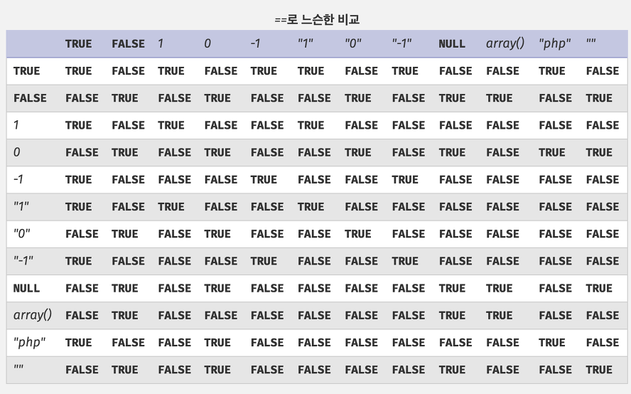

# 워게임에서 배운 것들

- 웹
  - 클라이언트
- PHP
- SQL 인젝션
- 암호

## 웹

### 클라이언트

- uglify 되어있는 스크립트도 beautify로 읽을 수 있게 변환 가능

## PHP

- `==`제발 이거 쓰지말자 `===`쓰자
  - ~~충격과 공포~~

## SQL 인젝션

- 값 추출
  - 개요
    - 기본적으로 escape가 되어있지 않다는 전제로 출발
  - 테크닉
    - union injection
      - 테이블의 필드 개수 알아내기
        - `union select 1,2,3,4,5 #` union 쿼리문을 이용해서 값이 리턴이 되면 해당 필드의 개수가 같게 되는 칼럼선택이 존재하면 그 개수만큼 해당 테이블의 칼럼이 존재하는 것임
        - **앞으로 해당 target table에 대해서 같은 개수의 칼럼만 select injection 해야함에 주의**
      - 테이블 이름 알아내기
        - 인젝션이 가능한 경우
        - `union select 1,2,table_name,4,5 from information_schema.tables`
          - 현재 injection하고 있는 테이블의 칼럼 개수가 5개일 경우
      - 테이블 칼럼 알아내기
        - `union select column_name, 1,2,3,4 from information_schema.columns`
          - `where table_name = "???"` 이 안통하는 경우도 있다.
      - 테이블 칼럼 값 알아내기
        - `union select column_name, 1,2,3,4 from information_schema.columns`
    - where injection
      - where case insensitive
        - MySQL에서는 where에서 값을 찾아줄 때, case insensitive이다.
          - *다른 DB에서는?*
      - 특수문자 처리
        - 특수문자를 많이 넣어보자
          - `/`
      - where 값 필터 주석화
        - `'admin#`
          - sql이 이스케이프가 되어있지 않으면 `#`뒤의 모든 쿼리문이 주석처리됨
      - where 값 조회
        - `'or'값`
          - 이런식으로 WHERE 뒤의 구문을 입력시켜주면 escape되지 않은 경우 모든 row값을 다 돌려줌
          - php md5함수에서 16비트 binary를 TRUE로 설정하면 특정 값을 입력했을 때, `'or'값`이 나타남
- 값 삽입
  - 개요
  - case
    - insert에서 데이터 길이가 `char(36)`과 같이 지정되어있을 때, insert값이 36을 넘어버리면 에러가 아니라, 36글자를 잘라내고 그 잘라낸 값이 삽입이 됨

## 암호

- 해싱
  - MD5의 취약점
    - hash collision이 일어남
